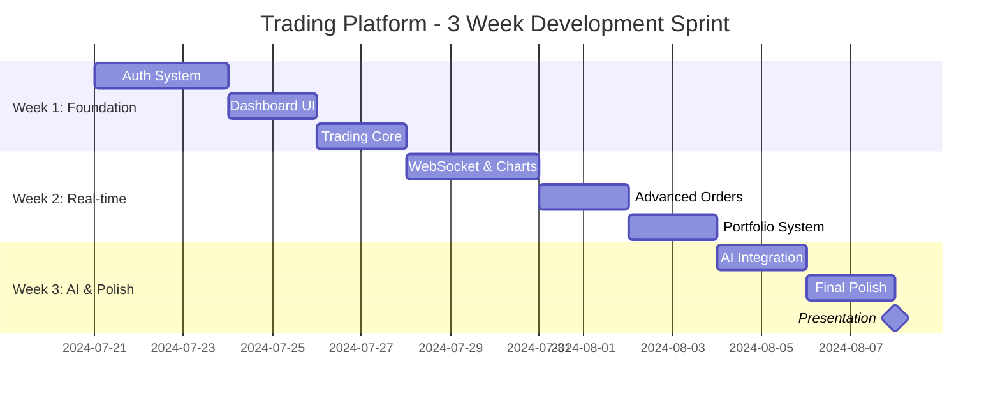
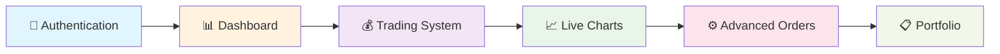

# Trading Platform - 3 Week Sprint Plan
## 🗓️ **Project Timeline: July 21 - August 8, 2024**

**📅 Start Date**: July 21, 2024 (Sunday)  
**📅 Presentation Day**: August 8, 2024 (Thursday)  
**⏱️ Total Duration**: 18 days (3 weeks)  
**🏃‍♂️ Sprint Format**: Weekly sprints  
**👥 Team Size**: 3-4 developers  

---

## 📋 **Week 1: Foundation & Core Features** *(July 21-27)*

### 🎯 **Sprint Goals**
- Setup complete development environment
- Implement authentication system
- Create basic dashboard and trading interface
- Build MVP core functionality

### 📅 **Timeline**
- **July 21 (Sun)**: Sprint planning & setup
- **July 22-26 (Mon-Fri)**: Development sprint
- **July 27 (Sat)**: Sprint review & demo

### 📝 **User Stories (Priority 1 - Must Have)**
- As a user, I want to register and login securely
- As a user, I want to see a trading dashboard
- As a trader, I want to place basic buy/sell orders
- As a trader, I want to view my order history

### ✅ **Daily Breakdown**

#### **Day 1 (July 21) - Setup & Planning**
- [ ] **Project Setup** *(4 hours)*
  - Initialize React + Node.js project
  - Setup MongoDB connection
  - Configure development environment
  - Create basic project structure

#### **Day 2 (July 22) - Authentication Backend**
- [ ] **Authentication System** *(8 hours)*
  - Create user registration API
  - Implement JWT login system
  - Setup password hashing (bcrypt)
  - Create protected route middleware

#### **Day 3 (July 23) - Authentication Frontend**
- [ ] **Auth Pages** *(8 hours)*
  - Create login/register components
  - Implement form validation
  - Connect frontend to auth APIs
  - Setup route protection

#### **Day 4 (July 24) - Dashboard & UI**
- [ ] **Dashboard Foundation** *(8 hours)*
  - Create main dashboard layout
  - Build navigation sidebar
  - Setup UI component library
  - Make responsive design

#### **Day 5 (July 25) - Trading Core Backend**
- [ ] **Trading API** *(8 hours)*
  - Create order placement endpoints
  - Setup orders database schema
  - Implement order validation
  - Create order history API

#### **Day 6 (July 26) - Trading Core Frontend**
- [ ] **Trading Interface** *(8 hours)*
  - Build order placement form
  - Create order history table
  - Connect trading UI to APIs
  - Add basic error handling

#### **Day 7 (July 27) - Integration & Demo**
- [ ] **Integration & Testing** *(4 hours)*
  - End-to-end testing
  - Bug fixes and polish
  - Sprint demo preparation
  - Code review and cleanup

### 📊 **Week 1 Deliverables**
- ✅ Working authentication system
- ✅ Basic trading dashboard
- ✅ Order placement functionality
- ✅ Order history tracking
- ✅ Responsive UI foundation

---

## 📋 **Week 2: Real-time Features & Advanced Trading** *(July 28 - August 3)*

### 🎯 **Sprint Goals**
- Implement real-time price charts
- Add advanced order types (limit, auto-exit)
- Integrate WebSocket communication
- Create portfolio tracking

### 📅 **Timeline**
- **July 28 (Sun)**: Sprint planning
- **July 29-Aug 2 (Mon-Fri)**: Development sprint
- **August 3 (Sat)**: Sprint review & integration

### 📝 **User Stories (Priority 2 - Should Have)**
- As a trader, I want to see live price charts
- As a trader, I want to set limit orders
- As a trader, I want auto-exit (stop-loss/take-profit) orders
- As a trader, I want real-time portfolio updates

### ✅ **Daily Breakdown**

#### **Day 8 (July 28) - Planning & WebSocket Setup**
- [ ] **WebSocket Foundation** *(4 hours)*
  - Setup Socket.io server
  - Configure WebSocket client
  - Plan real-time data flow

#### **Day 9 (July 29) - Live Price Integration**
- [ ] **Price Data System** *(8 hours)*
  - Integrate external price feed API
  - Create price data storage
  - Setup Redis caching
  - Implement price broadcasting

#### **Day 10 (July 30) - Live Charts**
- [ ] **Chart Implementation** *(8 hours)*
  - Integrate TradingView or Chart.js
  - Create candlestick charts
  - Add real-time chart updates
  - Implement basic technical indicators

#### **Day 11 (July 31) - Advanced Orders Backend**
- [ ] **Advanced Order Engine** *(8 hours)*
  - Implement limit order logic
  - Create stop-loss/take-profit system
  - Add order queue processing
  - Setup background job system

#### **Day 12 (August 1) - Advanced Orders Frontend**
- [ ] **Advanced Trading UI** *(8 hours)*
  - Create limit order interface
  - Build stop-loss/take-profit forms
  - Add order type selection
  - Implement advanced order validation

#### **Day 13 (August 2) - Portfolio & Integration**
- [ ] **Portfolio System** *(8 hours)*
  - Create portfolio calculation engine
  - Implement P&L tracking
  - Add portfolio dashboard
  - Connect all real-time features

#### **Day 14 (August 3) - Testing & Polish**
- [ ] **Integration & Testing** *(4 hours)*
  - Full system testing
  - Performance optimization
  - Bug fixes and polish
  - Sprint demo preparation

### 📊 **Week 2 Deliverables**
- ✅ Real-time price charts
- ✅ WebSocket communication
- ✅ Limit orders functionality
- ✅ Stop-loss/take-profit orders
- ✅ Portfolio tracking system

---

## 📋 **Week 3: AI Integration & Final Polish** *(August 4-8)*

### 🎯 **Sprint Goals**
- Integrate AI news analysis
- Add final features and polish
- Complete testing and deployment prep
- Prepare final presentation

### 📅 **Timeline**
- **August 4 (Sun)**: Sprint planning
- **August 5-7 (Mon-Wed)**: Final development
- **August 8 (Thu)**: **PRESENTATION DAY** 🎉

### 📝 **User Stories (Priority 3 - Nice to Have)**
- As a trader, I want AI analysis of financial news
- As a trader, I want sentiment scores for market trends
- As a user, I want a polished, professional interface
- As a stakeholder, I want a compelling demo

### ✅ **Daily Breakdown**

#### **Day 15 (August 4) - AI Integration Planning**
- [ ] **AI Setup** *(4 hours)*
  - Setup OpenAI/GenAI integration
  - Plan news analysis workflow
  - Create AI service architecture

#### **Day 16 (August 5) - AI News Analysis**
- [ ] **AI Implementation** *(8 hours)*
  - Integrate financial news APIs
  - Implement AI sentiment analysis
  - Create news processing pipeline
  - Setup AI response caching

#### **Day 17 (August 6) - AI Dashboard & Features**
- [ ] **AI Features UI** *(8 hours)*
  - Create news analysis dashboard
  - Display sentiment scores
  - Add AI insights to trading interface
  - Implement news alerts

#### **Day 18 (August 7) - Final Polish & Testing**
- [ ] **Final Preparations** *(8 hours)*
  - Complete end-to-end testing
  - UI/UX polish and optimization
  - Performance tuning
  - Demo data preparation
  - Presentation rehearsal

#### **Day 19 (August 8) - PRESENTATION DAY**
- [ ] **Final Demo** *(2 hours)*
  - Last-minute bug fixes
  - Demo environment setup
  - **🎯 FINAL PRESENTATION**

### 📊 **Week 3 Deliverables**
- ✅ AI-powered news analysis
- ✅ Sentiment analysis dashboard
- ✅ Polished user interface
- ✅ Complete system integration
- ✅ **FINAL PRESENTATION READY**

---

## 📊 **3-Week Gantt Chart**

## 🎯 **MVP Definition (End of Week 2)**

### **Core MVP Features**

## 📈 **Daily Velocity & Workload**

### **Work Distribution**
- **Development Days**: 15 days
- **Hours per Day**: 8 hours
- **Total Development Hours**: 120 hours
- **Team Hours** (4 people): 480 hours

### **Feature Priority Matrix**
| Priority | Features | Completion Target |
|----------|----------|------------------|
| **P0 (Must Have)** | Auth, Dashboard, Basic Trading | End of Week 1 |
| **P1 (Should Have)** | Live Charts, Advanced Orders, Portfolio | End of Week 2 |
| **P2 (Nice to Have)** | AI Analysis, Polish, Advanced UI | End of Week 3 |

## 🚨 **Risk Mitigation for 3-Week Timeline**

### **High-Risk Items & Solutions**
| Risk | Mitigation | Contingency |
|------|------------|-------------|
| **API Integration Delays** | Start early, use mock data | Have backup data sources |
| **Complex Features Taking Too Long** | Focus on MVP first | Drop P2 features if needed |
| **Testing Time Shortage** | Test during development | Prioritize critical path testing |
| **Team Availability** | Daily standups to track | Redistribute tasks quickly |

## 🎯 **Success Criteria for August 8 Presentation**

### **Technical Demonstration**
- ✅ User can register/login successfully
- ✅ Live trading interface with real-time charts
- ✅ Advanced order placement (limit, stop-loss)
- ✅ Portfolio tracking with P&L
- ✅ AI news analysis (if time permits)

### **Presentation Goals**
- ✅ 15-minute live demo
- ✅ Show complete user journey
- ✅ Highlight technical achievements
- ✅ Demonstrate real-time capabilities
- ✅ Present AI integration (bonus)

## 📋 **Daily Standup Format**
- **Time**: 9:00 AM daily
- **Duration**: 15 minutes
- **Format**:
  - What did you complete yesterday?
  - What will you work on today?
  - Any blockers or help needed?
  - Risk assessment for timeline

This aggressive 3-week sprint plan focuses on delivering a functional trading platform with AI features by August 8! 🚀