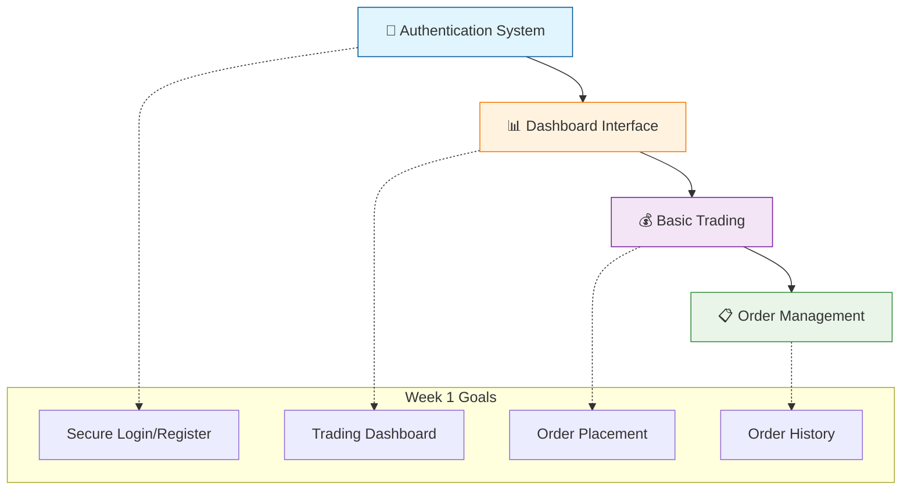
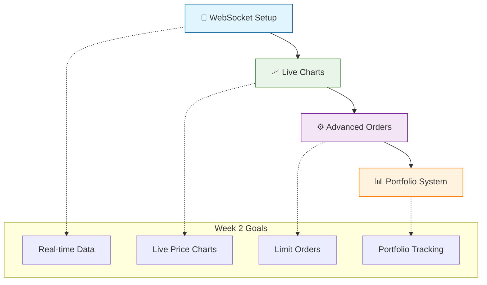
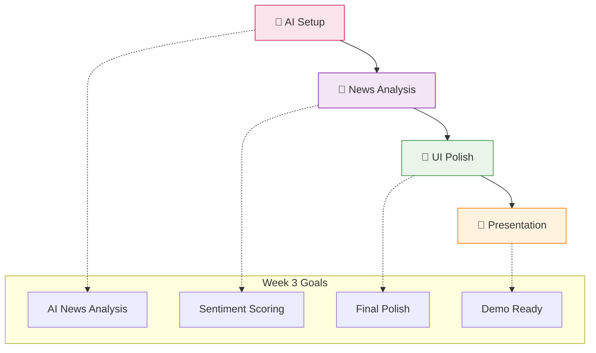
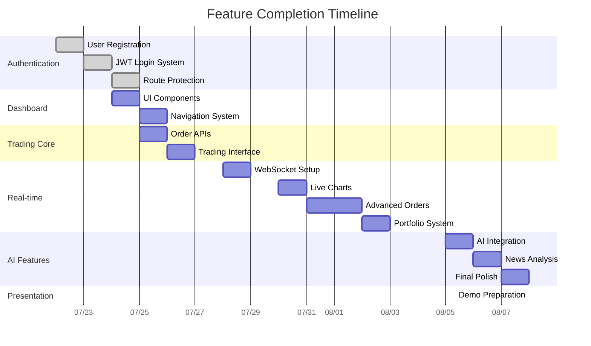
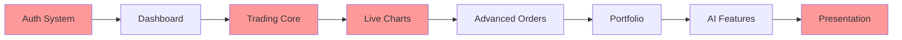
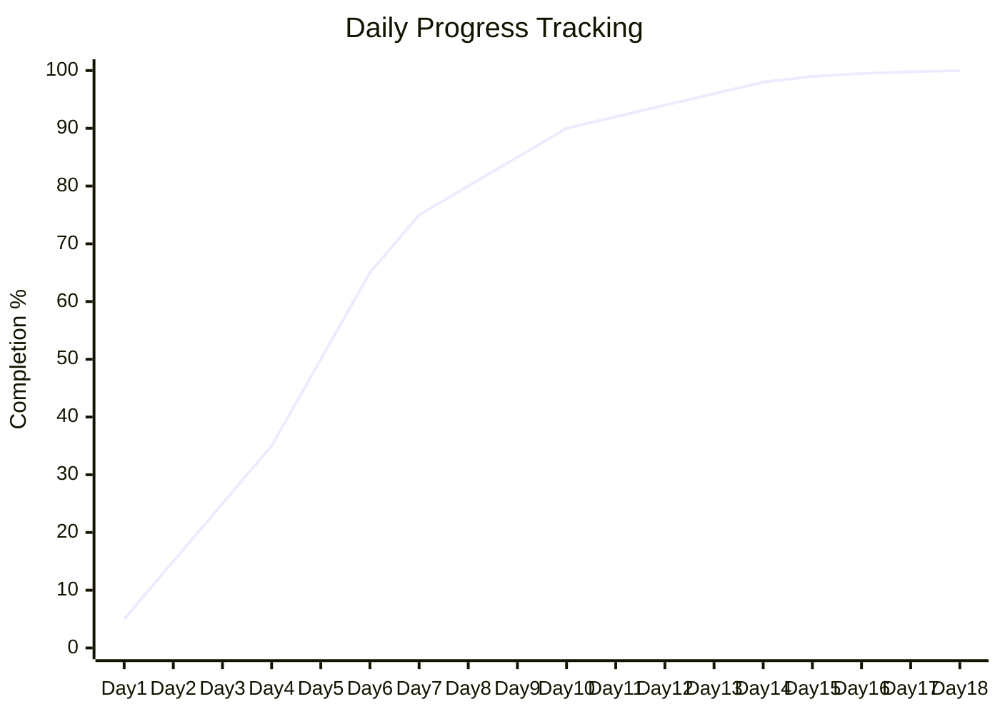

# 3-Week Trading Platform Sprint - Visual Timeline

## 📅 **Project Calendar: July 21 - August 8, 2024**

### **Visual Sprint Calendar**

```mermaid
timeline
    title 3-Week Trading Platform Development
    
    section Week 1: Foundation
        July 21 (Sun)  : Project Setup
                      : Environment Config
                      : Team Planning
        
        July 22 (Mon)  : Backend Auth APIs
                      : JWT Implementation
                      : Database Schema
        
        July 23 (Tue)  : Frontend Auth Pages
                      : Login/Register UI
                      : Form Validation
        
        July 24 (Wed)  : Dashboard Layout
                      : Navigation System
                      : UI Components
        
        July 25 (Thu)  : Trading APIs
                      : Order System
                      : Database Models
        
        July 26 (Fri)  : Trading Interface
                      : Order Forms
                      : History Display
        
        July 27 (Sat)  : Week 1 Demo
                      : Integration Testing
                      : Sprint Review

    section Week 2: Real-time
        July 28 (Sun)  : WebSocket Setup
                      : Planning Session
                      : Architecture Review
        
        July 29 (Mon)  : Price Data APIs
                      : External Integration
                      : Redis Caching
        
        July 30 (Tue)  : Live Charts
                      : TradingView Integration
                      : Real-time Updates
        
        July 31 (Wed)  : Advanced Orders
                      : Limit Order Logic
                      : Stop-loss System
        
        Aug 1 (Thu)    : Advanced Trading UI
                      : Order Type Forms
                      : Validation System
        
        Aug 2 (Fri)    : Portfolio System
                      : P&L Calculations
                      : Real-time Updates
        
        Aug 3 (Sat)    : Week 2 Demo
                      : MVP Testing
                      : Performance Tuning

    section Week 3: AI & Polish
        Aug 4 (Sun)    : AI Planning
                      : OpenAI Setup
                      : News API Research
        
        Aug 5 (Mon)    : AI Implementation
                      : News Analysis
                      : Sentiment Scoring
        
        Aug 6 (Tue)    : AI Dashboard
                      : News UI
                      : Insights Display
        
        Aug 7 (Wed)    : Final Polish
                      : Bug Fixes
                      : Demo Preparation
        
        Aug 8 (Thu)    : 🎯 PRESENTATION DAY
                      : Final Demo
                      : Project Showcase
```

## 🗓️ **Week-by-Week Breakdown**

### **📊 Week 1: Foundation (July 21-27)**


### **📈 Week 2: Real-time Features (July 28 - Aug 3)**


### **🤖 Week 3: AI Integration (Aug 4-8)**


## 🎯 **PowerPoint Ready - Daily Sprint Cards**

### **Week 1 Sprint Card**
```
┌─────────────────────────────────────────────┐
│ 🔐 WEEK 1: FOUNDATION & CORE TRADING        │
├─────────────────────────────────────────────┤
│ 📅 July 21-27, 2024                        │
│ 👥 Team: 4 developers                      │
│ ⏱️ Duration: 7 days                         │
│                                             │
│ 🎯 SPRINT GOALS:                           │
│ ✅ Complete authentication system          │
│ ✅ Build trading dashboard                 │
│ ✅ Implement order placement               │
│ ✅ Create order history tracking           │
│                                             │
│ 📊 DELIVERABLES:                           │
│ • User registration & login                │
│ • JWT-based security                       │
│ • Basic trading interface                  │
│ • Order management system                  │
│                                             │
│ 🚀 END GOAL: Working MVP core              │
└─────────────────────────────────────────────┘
```

### **Week 2 Sprint Card**
```
┌─────────────────────────────────────────────┐
│ 📈 WEEK 2: REAL-TIME & ADVANCED FEATURES    │
├─────────────────────────────────────────────┤
│ 📅 July 28 - August 3, 2024                │
│ 👥 Team: 4 developers                      │
│ ⏱️ Duration: 7 days                         │
│                                             │
│ 🎯 SPRINT GOALS:                           │
│ ✅ Implement real-time price charts        │
│ ✅ Add WebSocket communication             │
│ ✅ Create advanced order types             │
│ ✅ Build portfolio tracking                │
│                                             │
│ 📊 DELIVERABLES:                           │
│ • Live candlestick charts                  │
│ • Limit & stop-loss orders                │
│ • Real-time data feeds                     │
│ • Portfolio P&L tracking                   │
│                                             │
│ 🚀 END GOAL: Full-featured MVP             │
└─────────────────────────────────────────────┘
```

### **Week 3 Sprint Card**
```
┌─────────────────────────────────────────────┐
│ 🤖 WEEK 3: AI INTEGRATION & FINAL POLISH    │
├─────────────────────────────────────────────┤
│ 📅 August 4-8, 2024                        │
│ 👥 Team: 4 developers                      │
│ ⏱️ Duration: 5 days                         │
│                                             │
│ 🎯 SPRINT GOALS:                           │
│ ✅ Integrate AI news analysis              │
│ ✅ Add sentiment scoring                   │
│ ✅ Polish user interface                   │
│ ✅ Prepare final presentation              │
│                                             │
│ 📊 DELIVERABLES:                           │
│ • AI-powered news analysis                 │
│ • Sentiment dashboard                      │
│ • Production-ready platform               │
│ • Demo presentation                        │
│                                             │
│ 🎯 END GOAL: PRESENTATION READY            │
└─────────────────────────────────────────────┘
```

## 📊 **Feature Completion Timeline**



## 🎯 **Risk Assessment & Mitigation**

### **Critical Path Analysis**


### **Risk Matrix**
| Risk Level | Features | Mitigation |
|------------|----------|------------|
| 🔴 **High** | Auth System, Trading Core, Live Charts | Start early, have backup plans |
| 🟡 **Medium** | Advanced Orders, Portfolio | Simplified versions ready |
| 🟢 **Low** | AI Features, Polish | Can be dropped if needed |

## 📈 **Daily Progress Tracking**

### **Velocity Chart Template**


## 🎉 **Presentation Day Schedule - August 8**

### **Final Day Timeline**
```
09:00 AM - 10:00 AM: Final bug fixes & testing
10:00 AM - 11:00 AM: Demo environment setup
11:00 AM - 12:00 PM: Presentation rehearsal
12:00 PM - 01:00 PM: Lunch break
01:00 PM - 02:00 PM: Final preparations
02:00 PM - 03:00 PM: 🎯 FINAL PRESENTATION
03:00 PM - 04:00 PM: Q&A and feedback session
```

### **Presentation Structure (15 minutes)**
1. **Introduction** (2 min) - Project overview
2. **Live Demo** (8 min) - Complete user journey
3. **Technical Highlights** (3 min) - Architecture & AI
4. **Q&A** (2 min) - Questions and wrap-up

This compressed 3-week sprint plan maximizes development efficiency while ensuring a polished presentation on August 8! 🚀