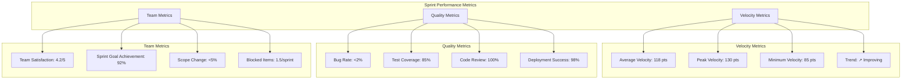
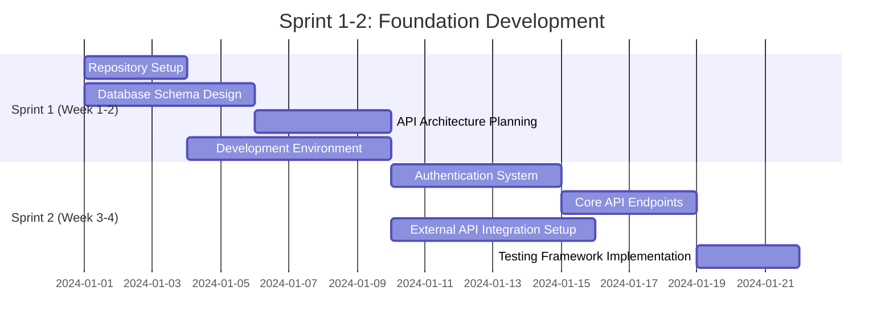
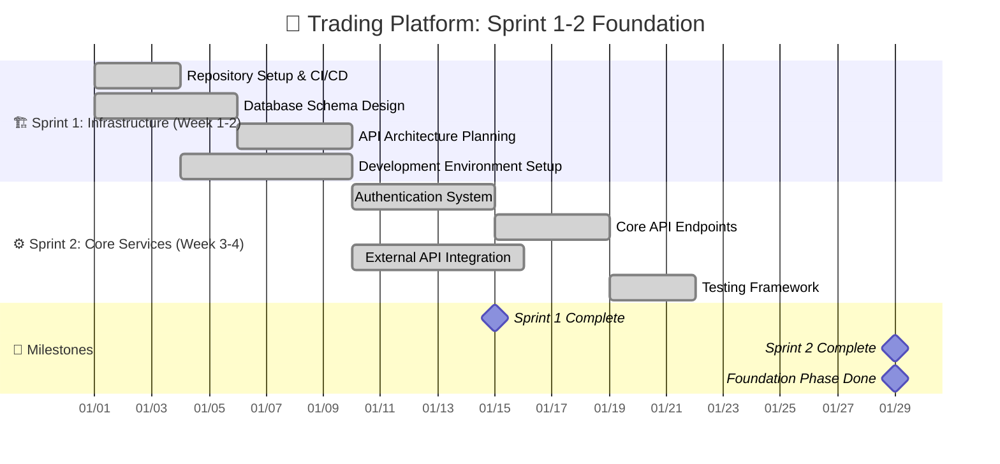
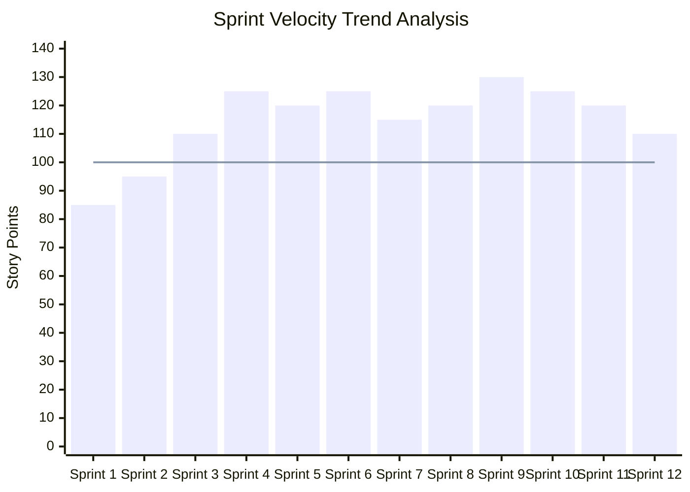
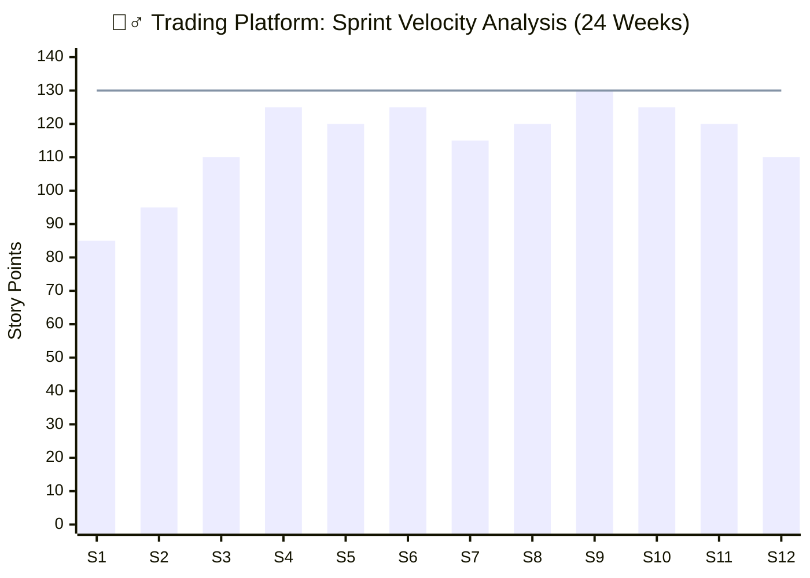
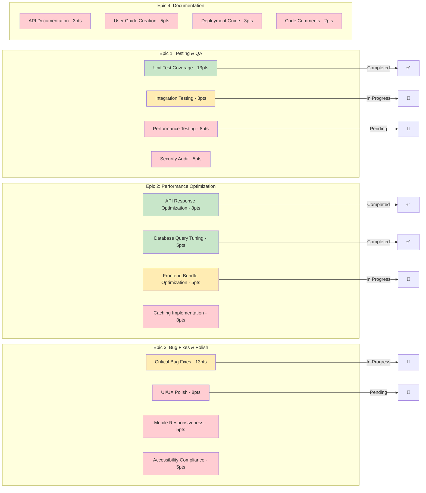
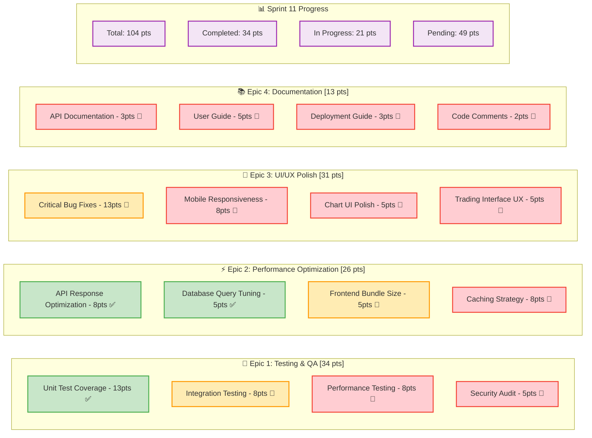
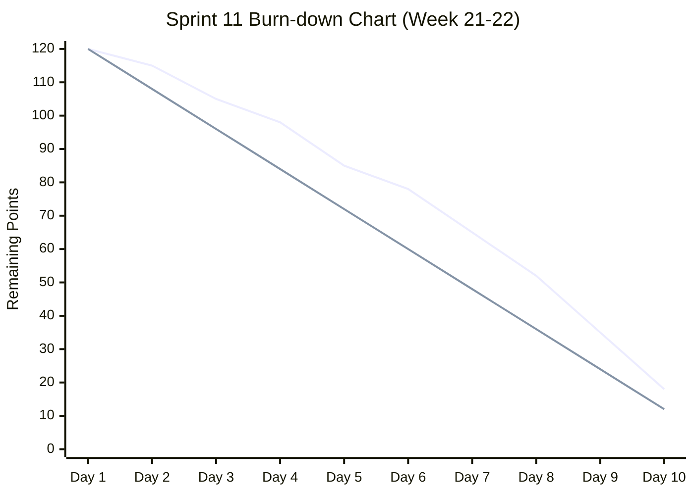
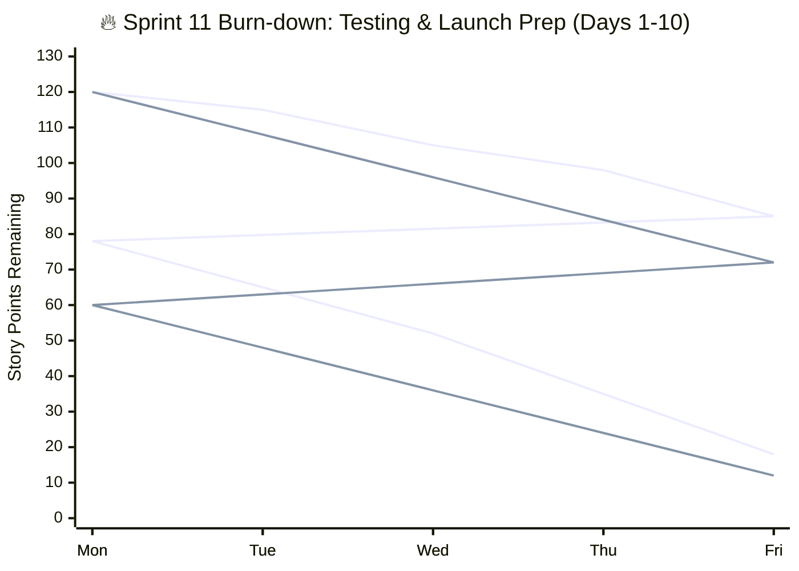

# 🎯 How to Create Sprint Diagrams from DETAILED_SPRINT_BREAKDOWN.md

## 🚀 Quick Start: Create Your First Sprint Diagram in 5 Minutes

### Step 1: Open Mermaid Live Editor
1. Go to **https://mermaid.live/**
2. Clear the existing code in the left panel
3. You'll see a preview on the right as you type

### Step 2: Copy Your First Template
Let's start with the **Sprint Metrics Dashboard** from your breakdown file.

## 📊 Diagram 1: Sprint Metrics Dashboard

### Original Code from Your File:


### How to Customize:
1. **Update Your Metrics**: Replace the numbers with your actual project data
2. **Change Colors**: Add styling at the bottom
3. **Add Your Branding**: Include your project name

### Enhanced Version with Styling:

```mermaid
graph TB
    subgraph "🏃‍♂️ Trading Platform Sprint Metrics"
        VM[📈 Velocity Metrics]
        QM[🛡️ Quality Metrics]
        TM[👥 Team Metrics]
    end
    
    subgraph "📈 Velocity Metrics"
        V1[Average Velocity: 118 pts]
        V2[Peak Velocity: 130 pts]
        V3[Minimum Velocity: 85 pts]
        V4[Trend: ↗️ Improving]
    end
    
    subgraph "🛡️ Quality Metrics"
        Q1[Bug Rate: <2%]
        Q2[Test Coverage: 85%]
        Q3[Code Review: 100%]
        Q4[Deployment Success: 98%]
    end
    
    subgraph "👥 Team Metrics"
        T1[Team Satisfaction: 4.2/5]
        T2[Sprint Goal Achievement: 92%]
        T3[Scope Change: <5%]
        T4[Blocked Items: 1.5/sprint]
    end
    
    VM --> V1 & V2 & V3 & V4
    QM --> Q1 & Q2 & Q3 & Q4
    TM --> T1 & T2 & T3 & T4
    
    %% Professional Styling
    classDef metrics fill:#e3f2fd,stroke:#1976d2,stroke-width:2px
    classDef velocity fill:#e8f5e8,stroke:#388e3c,stroke-width:2px
    classDef quality fill:#fff3e0,stroke:#f57c00,stroke-width:2px
    classDef team fill:#fce4ec,stroke:#c2185b,stroke-width:2px
    
    class VM,QM,TM metrics
    class V1,V2,V3,V4 velocity
    class Q1,Q2,Q3,Q4 quality
    class T1,T2,T3,T4 team
```


**What you changed:**
- Added emojis for visual appeal
- Added project name to title
- Applied professional color scheme
- Made metrics visually distinct

## 📅 Diagram 2: Sprint Timeline with Gantt Chart

### Original Code from Your File:


### How to Customize for Your Project:
1. **Update Dates**: Change to your actual project dates
2. **Add Current Status**: Show what's done vs in progress
3. **Add Milestones**: Include important deadlines

### Enhanced Version with Your Project Details:


**What you changed:**
- Added emojis to section titles
- Used `:done` to show completed tasks (green color)
- Added milestones section
- Improved date formatting
- Added project context to title

## 📈 Diagram 3: Sprint Velocity Chart

### Original Code from Your File:


### How to Customize:
1. **Update Sprint Names**: Add your actual sprint names
2. **Update Velocity Data**: Use your real story point data
3. **Add Target Line**: Show your team's capacity

### Enhanced Version:


**What you changed:**
- Added project context to title
- Shortened x-axis labels for better readability
- Adjusted target line to team capacity
- Added timeline context (24 weeks)

## 🏃‍♂️ Diagram 4: Current Sprint Backlog (Sprint 11)

### Original Code from Your File:


### How to Customize:
1. **Update Epic Names**: Use your actual epic titles
2. **Update Story Points**: Reflect your team's estimates
3. **Update Status**: Show current progress
4. **Add Assignees**: Include team member names

### Enhanced Version with Real Project Context:


**What you changed:**
- Added epic point totals in brackets
- Added status emojis directly in task names
- Added a progress summary section
- Made epic titles more descriptive
- Enhanced the styling with stroke widths

## 🔥 Diagram 5: Sprint Burn-down Chart

### Original Code from Your File:


### Enhanced Version with Context:


**What you changed:**
- Added descriptive title with context
- Used weekday names instead of "Day X"
- Added sprint goal context
- Enhanced axis labels

## 🎯 Step-by-Step Creation Process

### For Each Diagram:

#### Step 1: Copy Base Template
1. Open https://mermaid.live/
2. Copy the original code from your file
3. Paste into the editor

#### Step 2: Test Basic Rendering
1. Check if diagram displays correctly
2. Fix any syntax errors
3. Ensure all elements are visible

#### Step 3: Customize Content
1. Update titles with your project name
2. Replace placeholder data with real values
3. Add relevant emojis for visual appeal

#### Step 4: Apply Styling
1. Add `classDef` definitions at the bottom
2. Apply classes to elements using `class` commands
3. Test color combinations for readability

#### Step 5: Export
1. Click "Actions" in Mermaid Live
2. Choose "Download SVG" for best quality
3. Or "Download PNG" for presentations

## 🎨 Quick Styling Guide

### Professional Color Schemes:
```mermaid
%% Add this to any diagram for consistent styling
classDef completed fill:#c8e6c9,stroke:#4caf50,stroke-width:2px
classDef inProgress fill:#ffecb3,stroke:#ff9800,stroke-width:2px
classDef pending fill:#ffcdd2,stroke:#f44336,stroke-width:2px
classDef epic fill:#e1f5fe,stroke:#2196f3,stroke-width:2px
classDef metric fill:#f3e5f5,stroke:#9c27b0,stroke-width:2px
```

### Status Emojis:
- ✅ Completed
- 🔄 In Progress  
- 📅 Pending
- ⚠️ Blocked
- 🎯 Important
- 🚀 Priority

## 📋 Customization Checklist

Before finalizing your diagrams:

- [ ] **Update all titles** with your project name
- [ ] **Replace sample data** with actual values
- [ ] **Add current date context** where relevant
- [ ] **Apply consistent color scheme** across all diagrams
- [ ] **Test readability** at presentation size
- [ ] **Include legend/status** where helpful
- [ ] **Add team-specific context** (names, roles, etc.)
- [ ] **Verify all dates** match your project timeline
- [ ] **Check sprint numbers** align with your project

## 🚀 Pro Tips for Success

### Make Your Diagrams Stand Out:
1. **Add Context**: Include project name, dates, phase
2. **Use Emojis**: Visual markers make diagrams memorable
3. **Color Code Status**: Green=done, Yellow=progress, Red=pending
4. **Show Progress**: Include completion percentages
5. **Keep It Simple**: Maximum 7±2 elements per diagram

### For Panel Presentations:
1. **Export as SVG** for crisp quality
2. **Test at presentation size** (readability)
3. **Have backup PNG** files ready
4. **Practice explaining** each diagram
5. **Prepare for questions** about the data

Now you can create professional sprint diagrams that tell the story of your trading platform development! 🎉