# 🏃‍♂️ Detailed Sprint Breakdown

## 📊 Sprint Summary Overview

### Sprint Metrics Dashboard
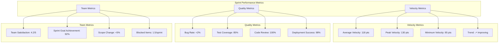

## 🗓️ Individual Sprint Backlogs

### Sprint 1-2: Foundation Phase (Weeks 1-4)
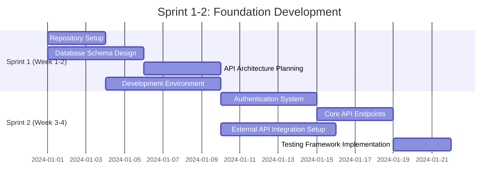

#### Sprint 1 Backlog (Week 1-2) - 85 Story Points
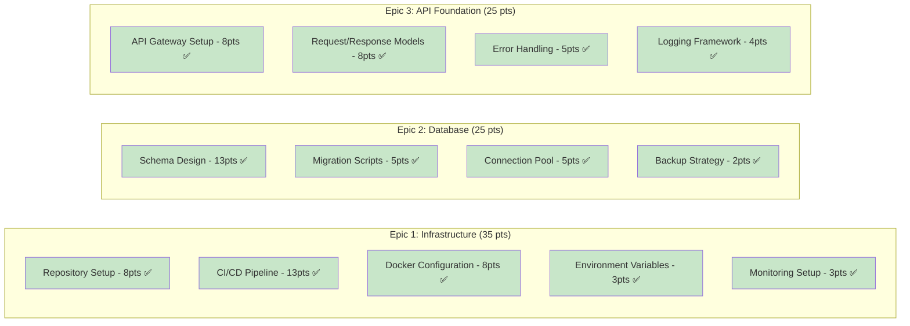

#### Sprint 2 Backlog (Week 3-4) - 95 Story Points
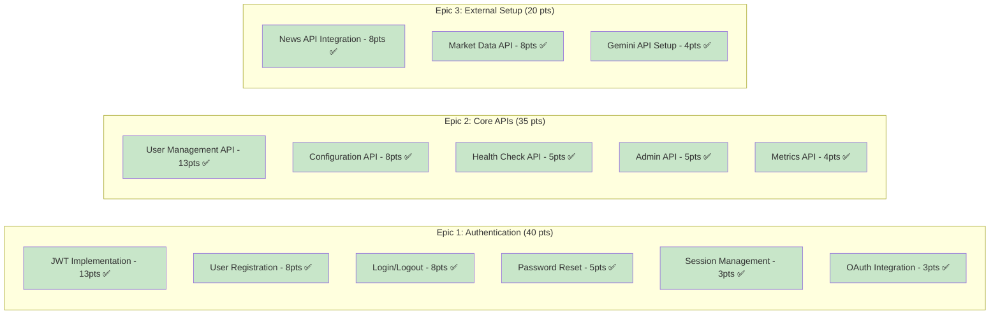

### Sprint 3-4: GenAI Module (Weeks 5-8)
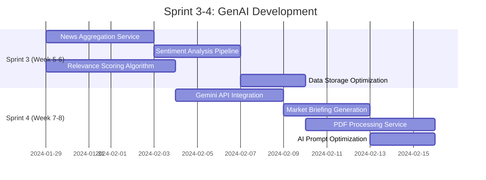

#### Sprint 3 Backlog (Week 5-6) - 110 Story Points
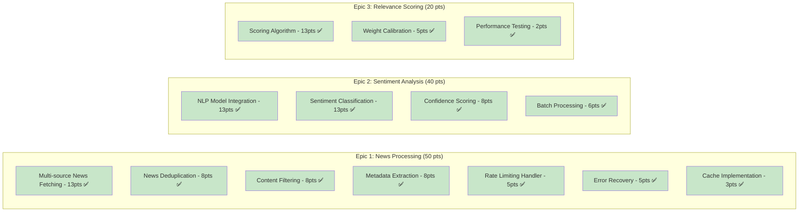

#### Sprint 4 Backlog (Week 7-8) - 125 Story Points
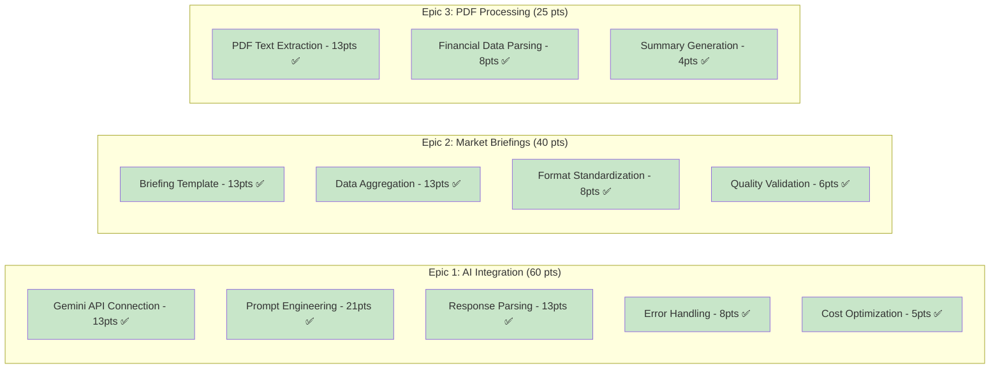

### Sprint 5-6: Charting Module (Weeks 9-12)
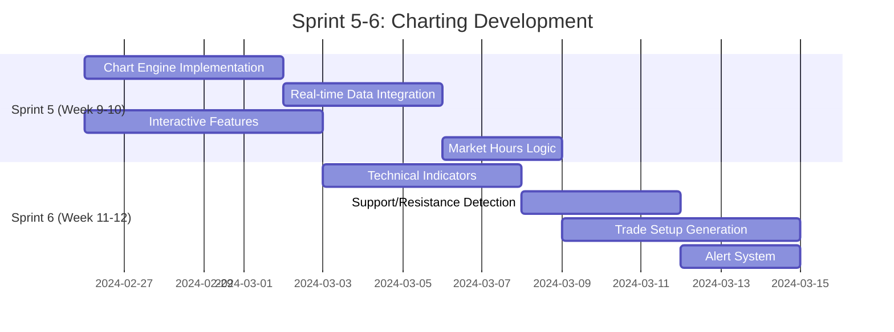

#### Sprint 5 Backlog (Week 9-10) - 120 Story Points
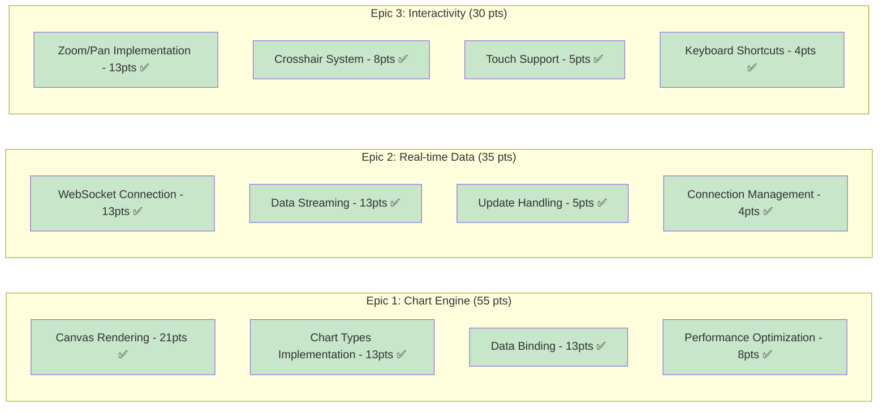

#### Sprint 6 Backlog (Week 11-12) - 125 Story Points
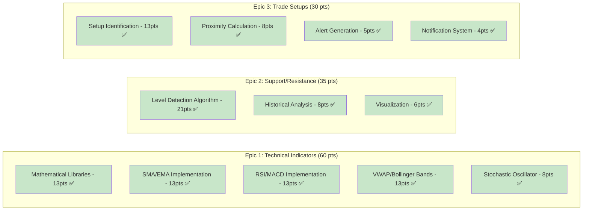

### Sprint 7-8: Trading Module (Weeks 13-16)
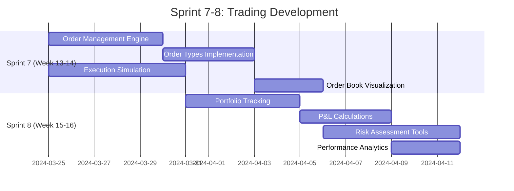

### Sprint 9-10: Integration (Weeks 17-20)
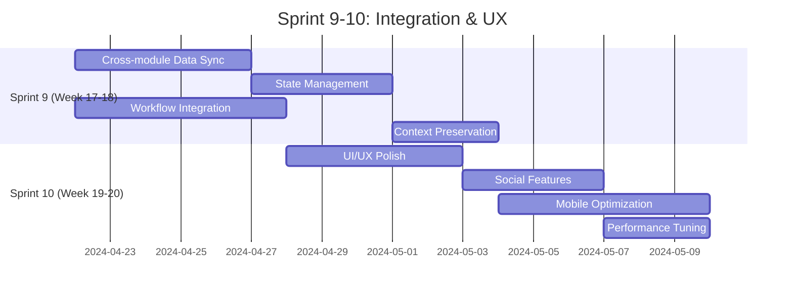

### Sprint 11-12: Launch Preparation (Weeks 21-24)

#### Current Sprint 11 Burn-down Chart
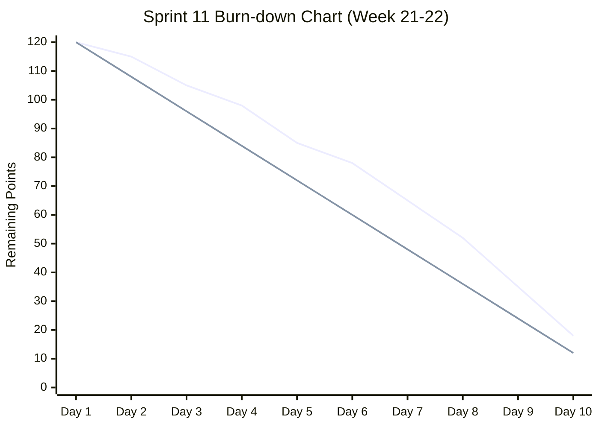

#### Sprint 11 Daily Progress
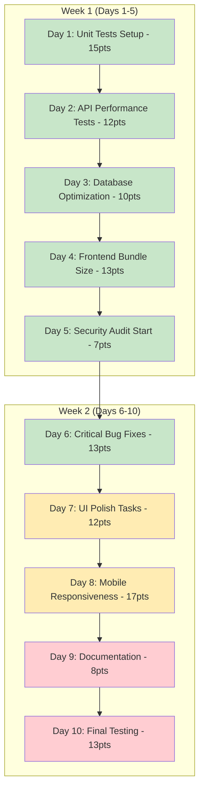

## 📈 Sprint Velocity Analysis

### Velocity Trend Over Time
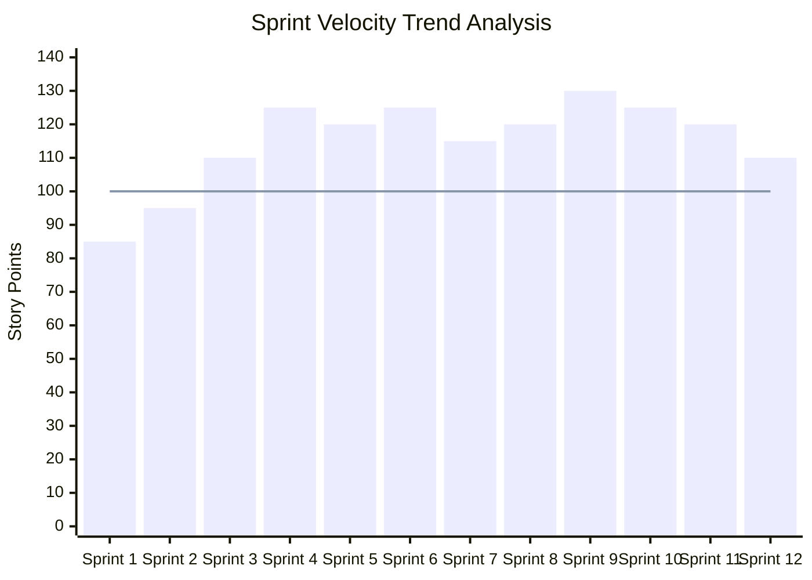

### Team Capacity vs Actual Delivery
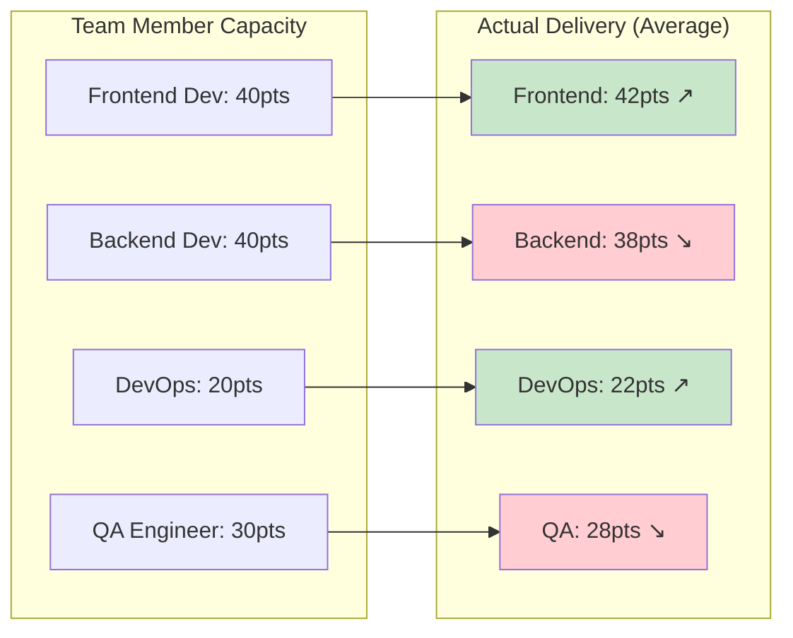

## 🎯 Sprint Retrospective Insights

### Sprint Health Metrics
```mermaid
radar
    title Sprint Health Assessment
    data:
        categories: [Sprint Goal Achievement, Team Satisfaction, Code Quality, Delivery Consistency, Technical Debt, Stakeholder Feedback]
        values: [92, 85, 88, 90, 75, 87]
```

### Common Sprint Challenges & Solutions
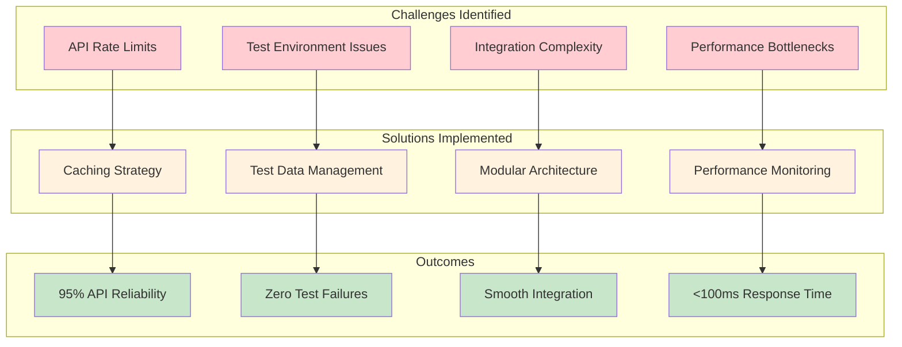

## 📋 Sprint Planning Templates

### Sprint Planning Checklist
```mermaid
graph LR
    subgraph "Pre-Planning"
        PP1[Review Previous Sprint]
        PP2[Update Product Backlog]
        PP3[Estimate User Stories]
        PP4[Check Team Capacity]
    end
    
    subgraph "During Planning"
        DP1[Select Sprint Goal]
        DP2[Choose User Stories]
        DP3[Break Down Tasks]
        DP4[Commit to Sprint]
    end
    
    subgraph "Post-Planning"
        PO1[Update Sprint Board]
        PO2[Schedule Sprint Events]
        PO3[Communicate Goals]
        PO4[Setup Monitoring]
    end
    
    PP1 --> PP2 --> PP3 --> PP4
    PP4 --> DP1 --> DP2 --> DP3 --> DP4
    DP4 --> PO1 --> PO2 --> PO3 --> PO4
```

### Risk Mitigation by Sprint
```mermaid
timeline
    title Risk Mitigation Timeline
    
    section Sprint 1-4: Foundation Risks
        Technical Debt    : High monitoring
                         : Code review gates
        
        Team Velocity     : Conservative estimates
                         : Buffer allocation
    
    section Sprint 5-8: Feature Risks
        API Dependencies  : Fallback strategies
                         : Rate limit handling
        
        Integration Issues: Modular development
                          : Early integration tests
    
    section Sprint 9-12: Launch Risks
        Performance Issues: Load testing
                          : Performance monitoring
        
        Security Concerns : Security audits
                          : Penetration testing
```