# 🎨 Complete Guide to Creating Professional Diagrams

## 🚀 Quick Start: Setting Up Mermaid

### Option 1: Online Editors (Easiest)
1. **Mermaid Live Editor**: https://mermaid.live/
   - Copy/paste code directly
   - Export as PNG, SVG, or PDF
   - Real-time preview

2. **GitHub/GitLab**: Built-in Mermaid support
   ```markdown
   ```mermaid
   graph TD
       A[Start] --> B[Process]
   ```
   ```

3. **VS Code Extension**: "Mermaid Markdown Syntax Highlighting"
   - Install extension
   - Preview with `Ctrl+Shift+V`

### Option 2: Local Setup
```bash
# Install Mermaid CLI
npm install -g @mermaid-js/mermaid-cli

# Create diagram file
echo "graph TD; A-->B" > diagram.mmd

# Generate image
mmdc -i diagram.mmd -o diagram.png
```

## 📊 Diagram Types & Syntax Guide

### 1. 🏗️ System Architecture Diagrams

#### Basic Graph Structure
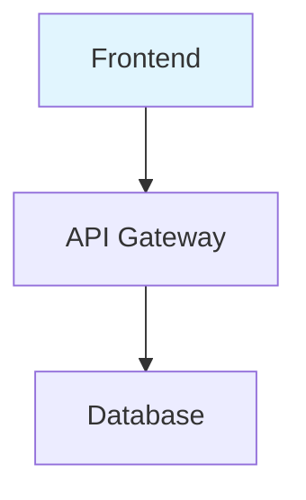

#### Advanced Architecture Example
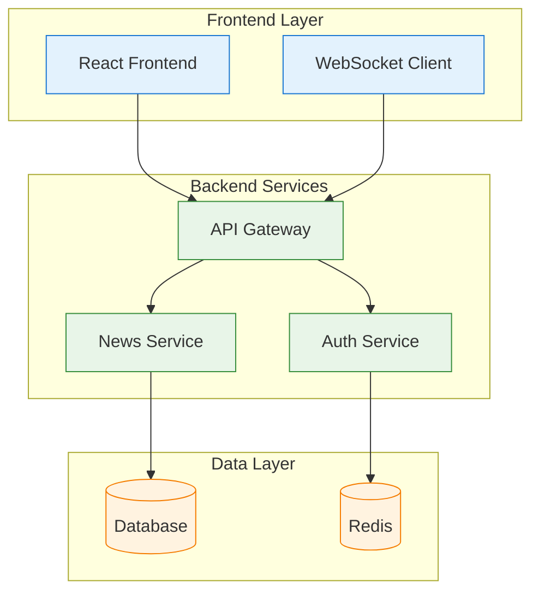

**Pro Tips:**
- Use `subgraph` to group related components
- Apply consistent color coding with `classDef`
- Use descriptive node names in brackets `[Name]`
- Database symbols use `[(Name)]`

### 2. 📅 Gantt Charts for Project Timelines

#### Basic Gantt Chart
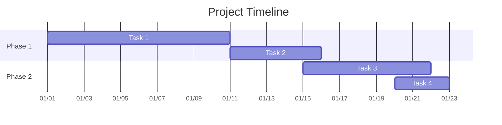

#### Advanced Project Gantt
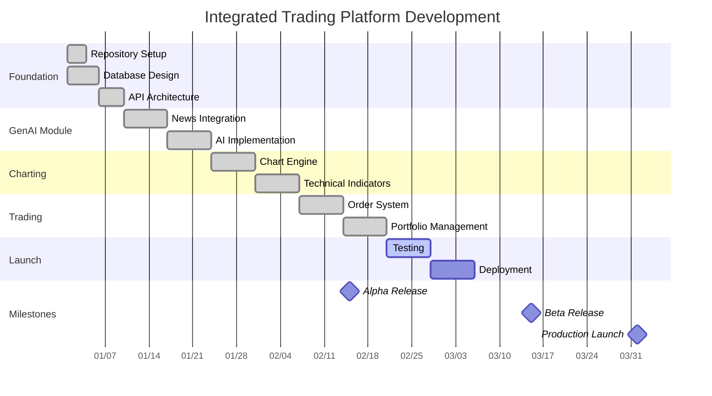

**Key Gantt Features:**
- `done` = completed tasks (green)
- `active` = current tasks (blue)
- `milestone` = important dates (diamond)
- `after taskname` = dependencies

### 3. 📈 Charts and Metrics

#### Velocity Chart
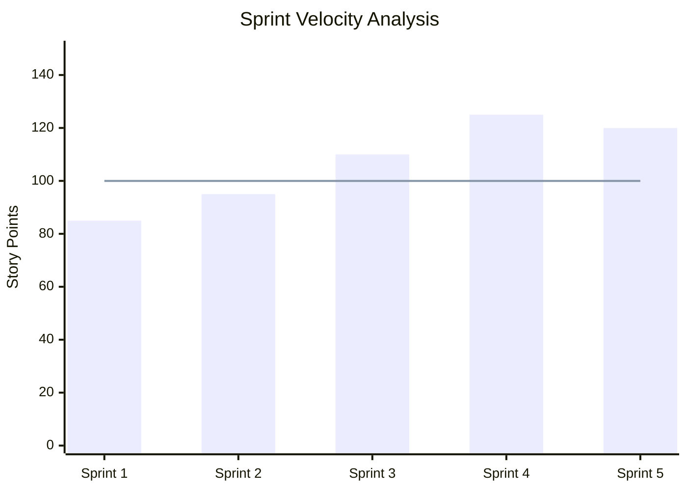

#### Pie Chart for Resource Allocation
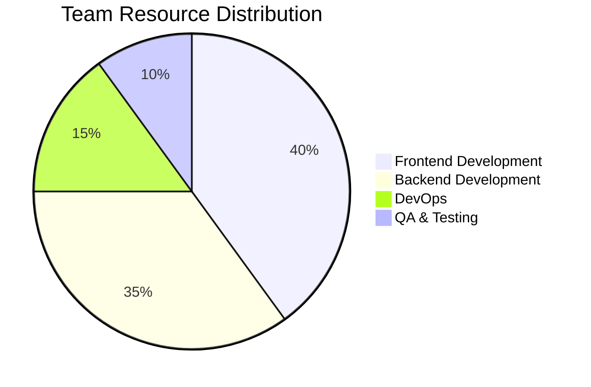

#### Quadrant Chart for Feature Analysis
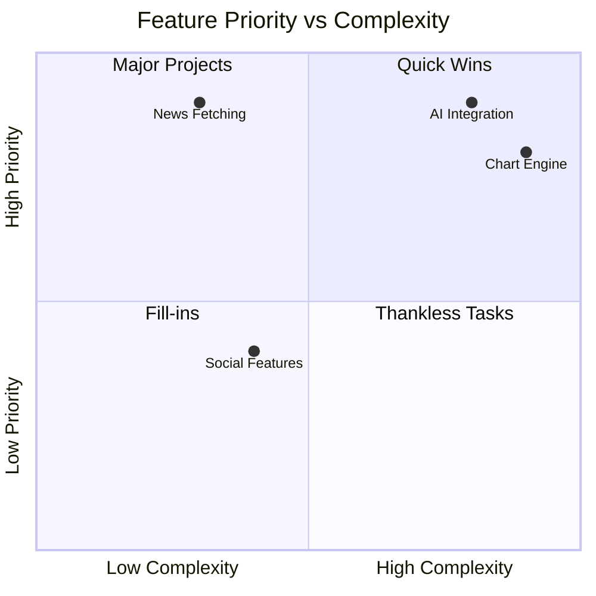

### 4. 🔄 Sequence Diagrams for Workflows

#### Basic Sequence
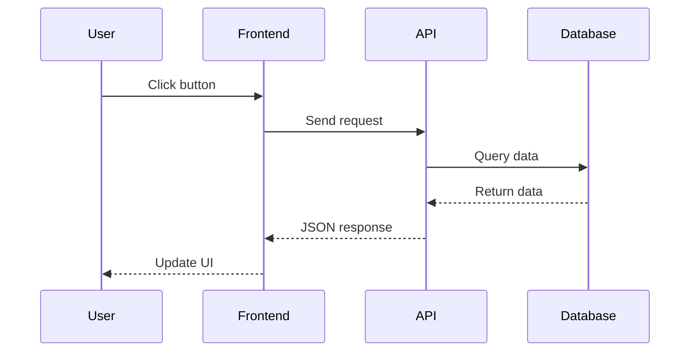

#### Advanced Workflow with Notes
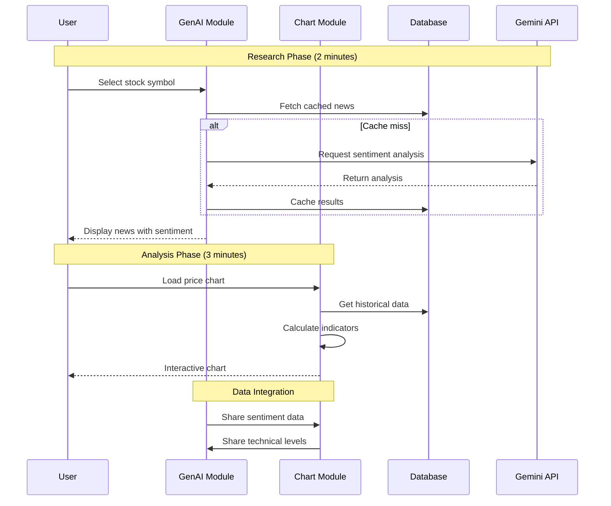

### 5. 🎯 User Journey Maps

#### User Journey Diagram
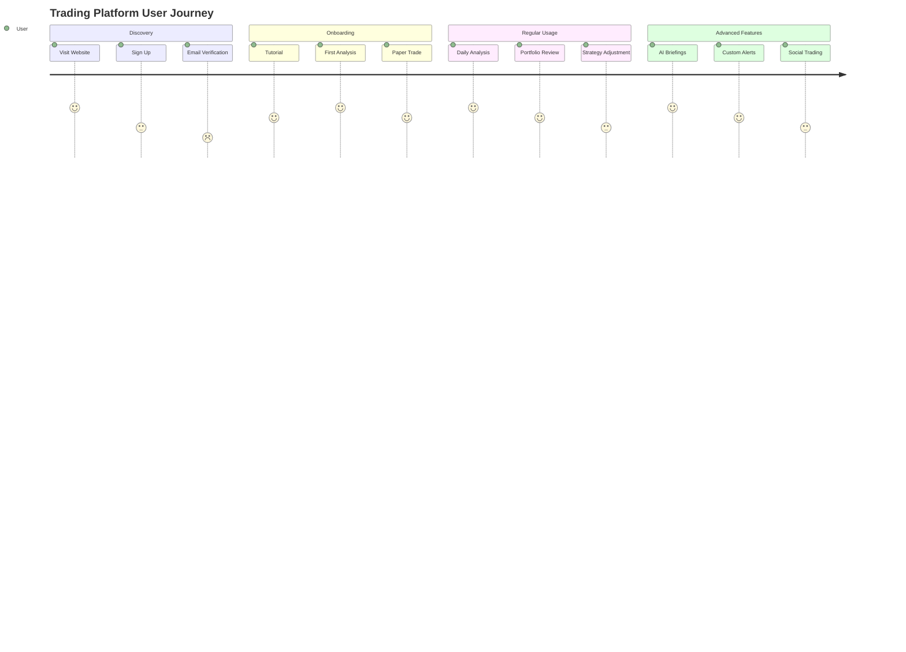

### 6. 🕒 Timeline Diagrams

#### Development Timeline
```mermaid
timeline
    title Project Development Phases
    
    section Phase 1: Foundation
        Week 1-2    : Repository Setup
                    : Database Schema
                    : CI/CD Pipeline
        
        Week 3-4    : Authentication
                    : Core APIs
                    : Basic Frontend
    
    section Phase 2: Core Features
        Week 5-8    : GenAI Module
                    : News Processing
                    : AI Integration
        
        Week 9-12   : Charting Module
                    : Real-time Data
                    : Technical Analysis
    
    section Phase 3: Integration
        Week 13-16  : Trading Module
                    : Order Management
                    : Portfolio Tracking
        
        Week 17-20  : System Integration
                    : Performance Testing
                    : UI/UX Polish
    
    section Phase 4: Launch
        Week 21-24  : Final Testing
                    : Documentation
                    : Production Deployment
```

### 7. 🎛️ Flowcharts for Decision Logic

#### Decision Flow
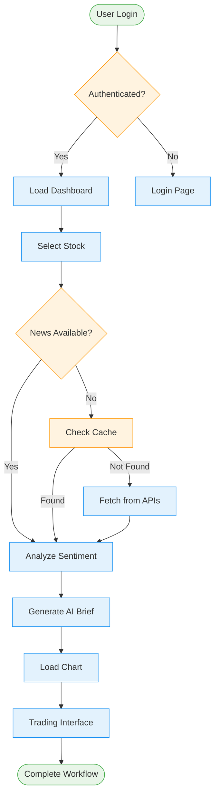

## 🎨 Advanced Styling Techniques

### 1. Color Schemes and Themes

#### Professional Color Palette
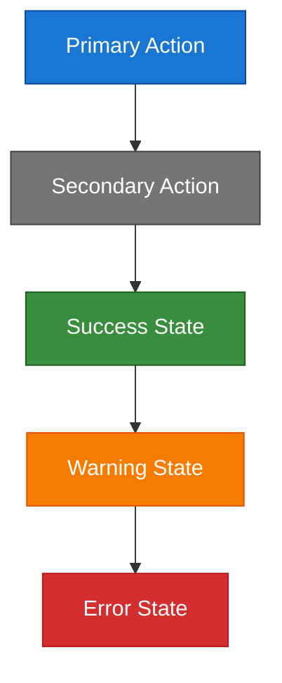

#### Custom Node Shapes
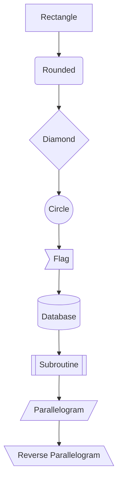

### 2. Icons and Emojis

#### Adding Visual Interest
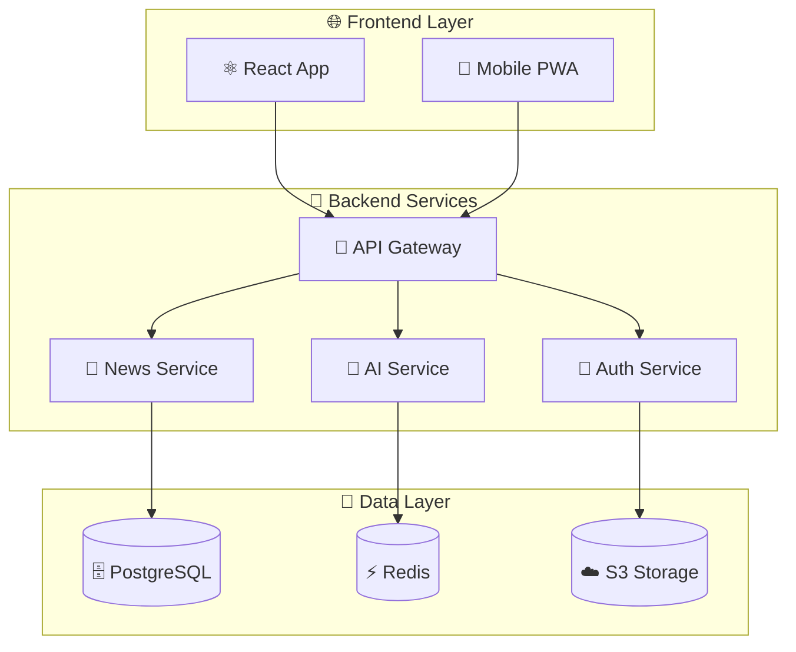

## 🛠️ Tools and Platforms Comparison

### Online Diagram Tools

| Tool | Best For | Pros | Cons | Price |
|------|----------|------|------|-------|
| **Mermaid Live** | Code-based diagrams | Free, version control friendly | Learning curve | Free |
| **Draw.io** | General diagrams | Easy drag-drop, many templates | Not code-based | Free |
| **Lucidchart** | Professional docs | Collaboration, integrations | Expensive | $7.95/mo |
| **Figma** | UI/UX diagrams | Design-focused, real-time collab | Overkill for simple diagrams | Free tier |
| **Visio** | Enterprise diagrams | Microsoft integration | Expensive, Windows only | $5/mo |

### Recommended Workflow

#### For Presentations:
1. **Create in Mermaid Live** - Quick iteration
2. **Export as SVG** - Best quality for slides
3. **Import to PowerPoint/Figma** - Final polish

#### For Documentation:
1. **Write in Markdown** - Version controlled
2. **Use GitHub/GitLab** - Built-in rendering
3. **Export for offline** - PDF generation

## 📝 Step-by-Step Tutorial: Creating Your First Architecture Diagram

### Step 1: Plan Your Diagram
```
Components to show:
- Frontend (React)
- API Gateway  
- 3 Microservices
- Database
- External APIs
```

### Step 2: Basic Structure
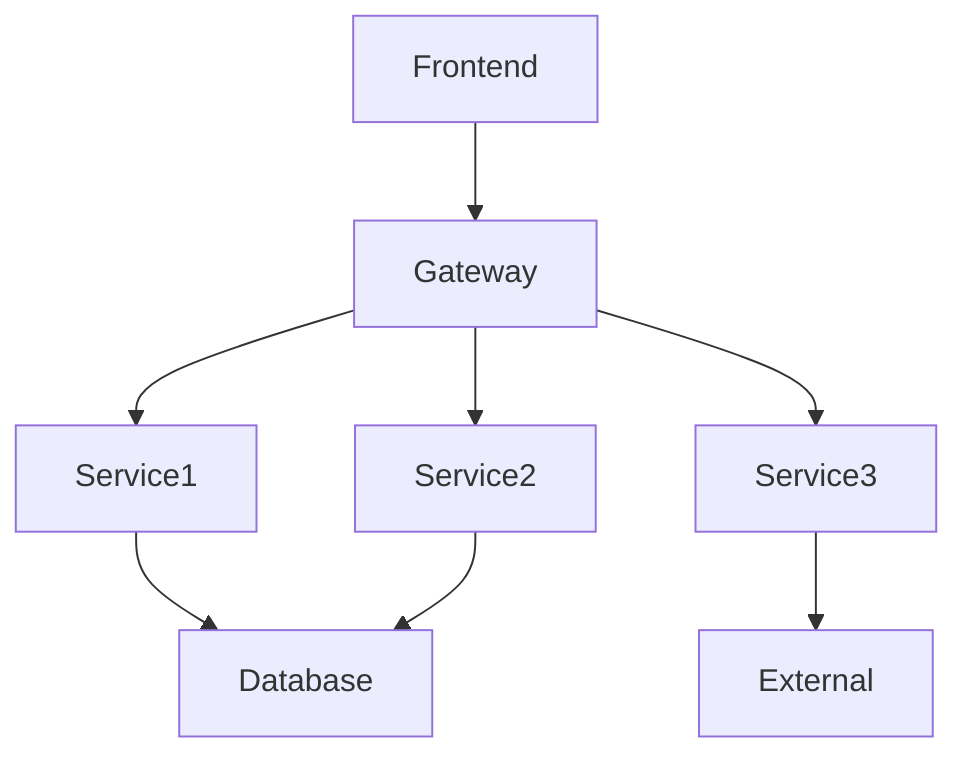

### Step 3: Add Details
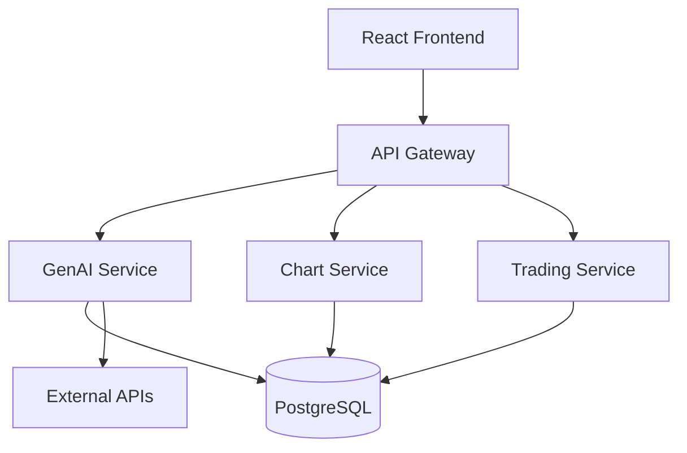

### Step 4: Group with Subgraphs
```mermaid
graph TB
    subgraph "Frontend"
        Frontend[React App]
    end
    
    subgraph "Backend"
        Gateway[API Gateway]
        Service1[GenAI Service]
        Service2[Chart Service]
        Service3[Trading Service]
    end
    
    subgraph "Data"
        Database[(PostgreSQL)]
        External[External APIs]
    end
    
    Frontend --> Gateway
    Gateway --> Service1
    Gateway --> Service2
    Gateway --> Service3
    Service1 --> Database
    Service2 --> Database
    Service3 --> Database
    Service1 --> External
```

### Step 5: Add Styling
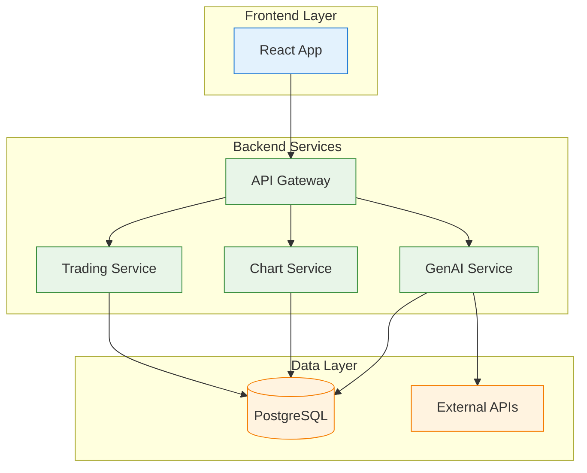

## 🚀 Export and Integration Guide

### Exporting Diagrams

#### From Mermaid Live:
1. Open https://mermaid.live/
2. Paste your code
3. Click "Actions" → "Download SVG"
4. For PNG: Use browser dev tools to screenshot

#### Using CLI:
```bash
# Install CLI
npm install -g @mermaid-js/mermaid-cli

# Create config file (optional)
echo '{"theme": "default", "background": "white"}' > config.json

# Generate diagram
mmdc -i diagram.mmd -o diagram.png -c config.json
```

### Integration Options

#### In Markdown/GitHub:
```markdown

```

#### In HTML:
```html
<script src="https://cdn.jsdelivr.net/npm/mermaid/dist/mermaid.min.js"></script>
<div class="mermaid">
    graph TD
        A --> B
</div>
<script>mermaid.initialize({startOnLoad:true});</script>
```

#### In React:
```bash
npm install @mermaid-js/mermaid
```

```jsx
import mermaid from 'mermaid';

function Diagram({ chart }) {
  useEffect(() => {
    mermaid.initialize({ startOnLoad: true });
  }, []);

  return <div className="mermaid">{chart}</div>;
}
```

## 💡 Pro Tips for Professional Diagrams

### 1. Consistency is Key
- Use same color scheme across all diagrams
- Consistent node shapes for similar concepts
- Standard naming conventions

### 2. Keep it Simple
- Maximum 7±2 elements per diagram
- Use subgraphs to reduce complexity
- Focus on one concept per diagram

### 3. Tell a Story
- Arrange elements left-to-right or top-to-bottom
- Use arrows to show data/process flow
- Add notes for context

### 4. Make it Actionable
- Include metrics where relevant
- Show current state vs future state
- Highlight problems and solutions

### 5. Test Your Audience
- Technical diagrams for developers
- High-level overviews for executives
- Process flows for operations

## 🔧 Troubleshooting Common Issues

### Mermaid Not Rendering
```markdown
<!-- Check syntax -->
```mermaid
graph TD
    A --> B  <!-- No semicolon needed -->
```
<!-- Not this -->
```mermaid
graph TD;
    A --> B;  <!-- Semicolons can cause issues -->
```

### Styling Not Working
```mermaid
graph TD
    A --> B
    
    %% Define class AFTER the graph
    classDef myClass fill:#f9f,stroke:#333
    class A myClass
```

### Complex Layouts
```mermaid
graph TD
    %% Use invisible nodes for layout
    A --> inv1[ ]
    inv1 --> B
    inv1 --> C
    
    %% Hide invisible nodes
    classDef invisible fill:none,stroke:none
    class inv1 invisible
```

## 📚 Resources and Further Learning

### Official Documentation
- [Mermaid Docs](https://mermaid-js.github.io/mermaid/)
- [Mermaid Live Editor](https://mermaid.live/)
- [GitHub Mermaid Support](https://github.blog/2022-02-14-include-diagrams-markdown-files-mermaid/)

### Templates and Examples
- [Mermaid Examples](https://github.com/mermaid-js/mermaid/tree/develop/docs)
- [Architecture Patterns](https://c4model.com/)
- [System Design Primer](https://github.com/donnemartin/system-design-primer)

### Design Principles
- [Information is Beautiful](https://informationisbeautiful.net/)
- [Edward Tufte Principles](https://www.edwardtufte.com/tufte/)
- [Data Visualization Best Practices](https://www.tableau.com/learn/articles/data-visualization)

Now you're ready to create professional, impressive diagrams for your trading platform project! Start with simple graphs and gradually add complexity as you get comfortable with the syntax.