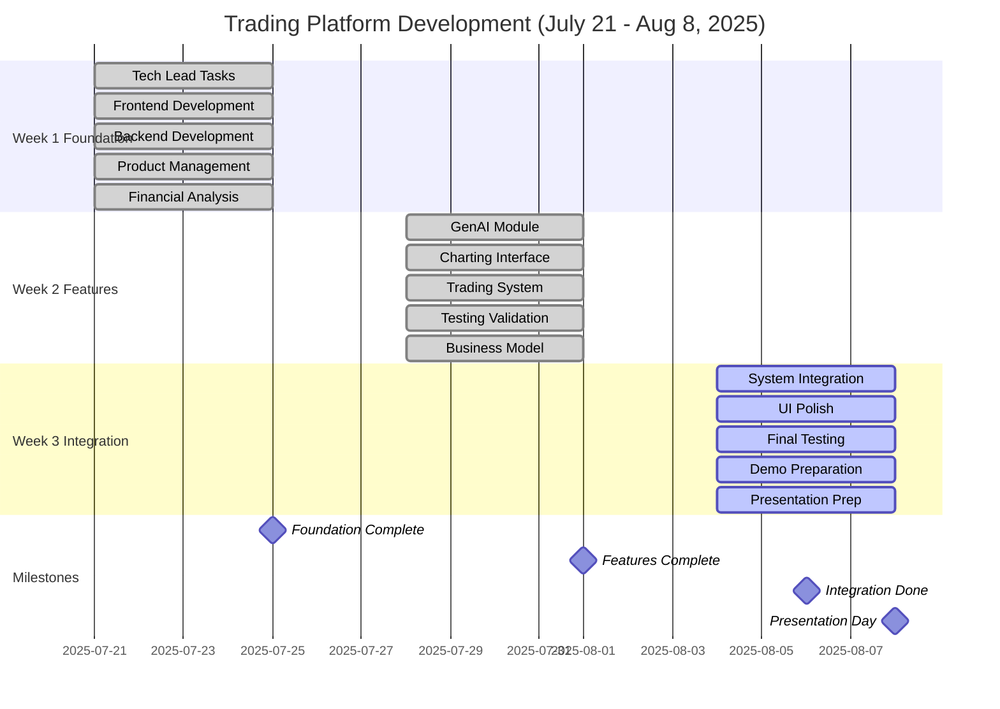
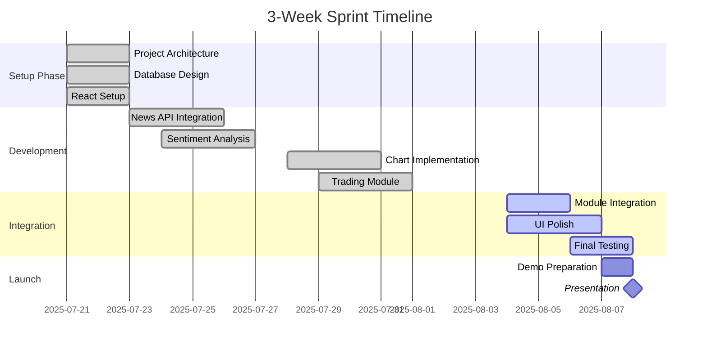
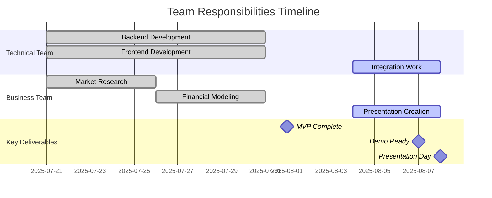
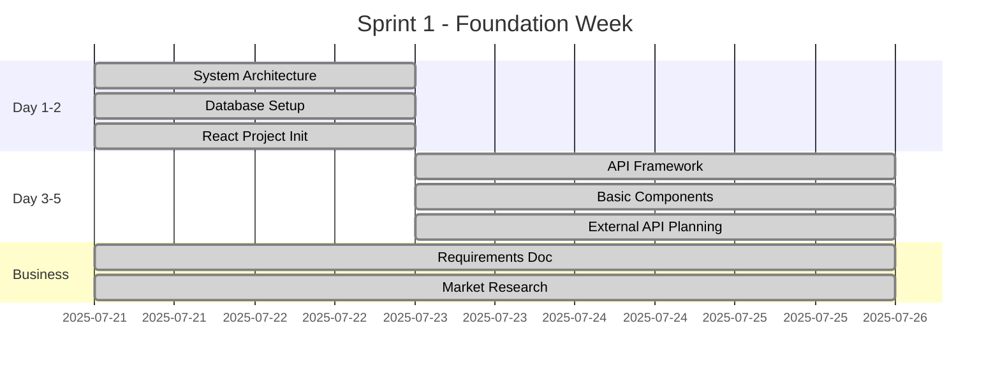
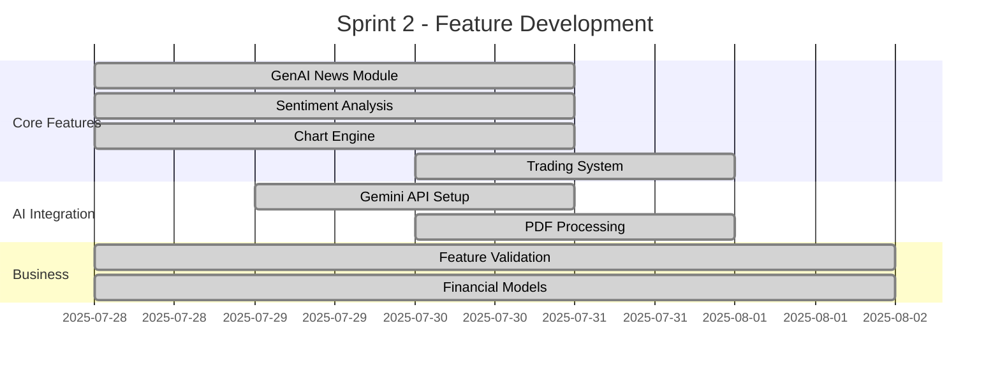
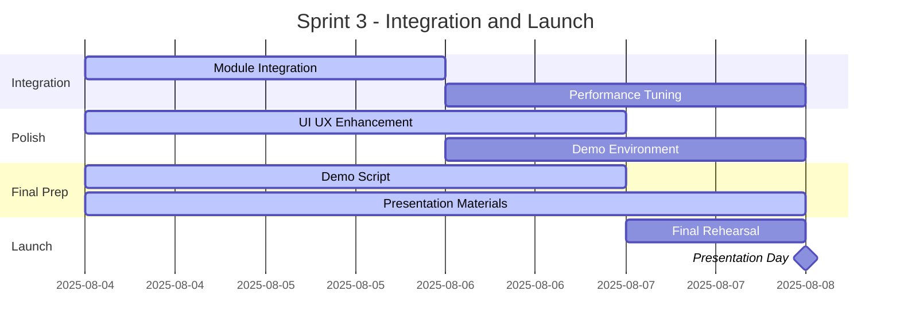
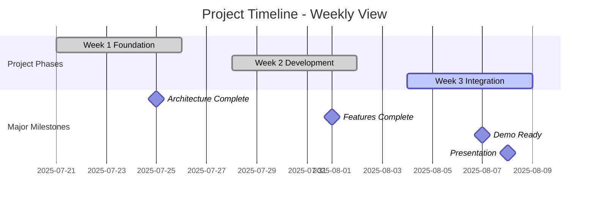
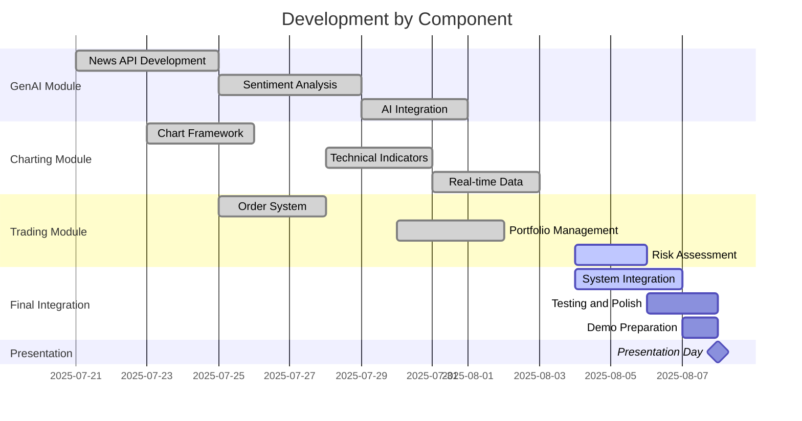
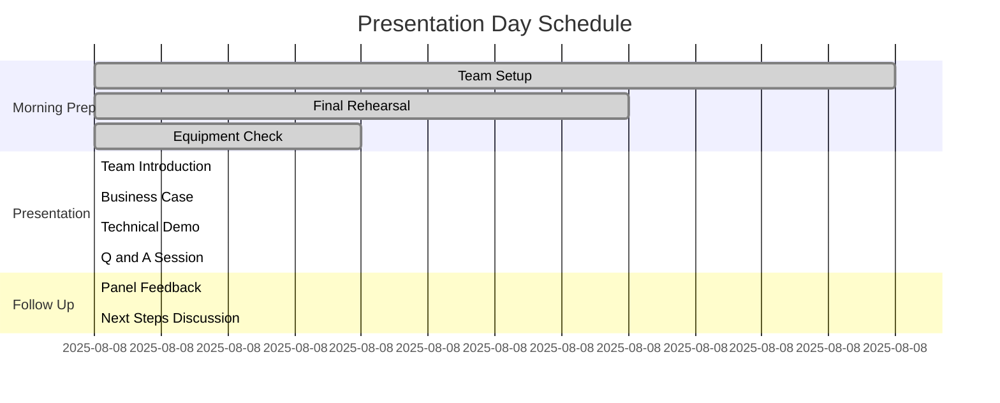

# 🔧 Fixed Gantt Charts - No Syntax Errors

## 🚀 Master Project Timeline (Fixed Version)

### Version 1: Simple Team Timeline

### Version 2: Detailed Daily Breakdown

### Version 3: Team-Based View (Simplified)

## 🏃‍♂️ Sprint-Specific Gantt Charts

### Sprint 1: Foundation (July 21-25)

### Sprint 2: Features (July 28 - August 1)

### Sprint 3: Integration (August 4-8)

## 📊 Alternative Timeline Visualizations

### Version A: Weekly Blocks

### Version B: Component-Based

## 🎯 Presentation Day Timeline

### August 8, 2025 Schedule

## 🔧 Troubleshooting Tips

### Common Gantt Chart Errors:
1. **TypeError: Cannot read properties of undefined**: 
   - Remove special characters from task names
   - Use simple date formats (YYYY-MM-DD)
   - Avoid complex section names

2. **Fix Applied:**
   - Simplified task names
   - Used consistent date format
   - Removed special characters from IDs
   - Used standard Mermaid gantt syntax

### Test These Charts:
1. Copy any chart above to https://mermaid.live/
2. Should render without errors
3. Export as SVG or PNG for presentation

Choose the version that works best for your presentation! 🎯