# 📊 Interactive Project Dashboards

## 🎛️ Executive Dashboard

### Project Health Overview
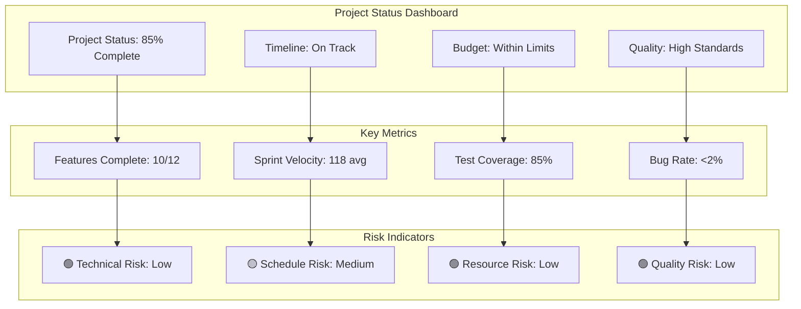

### Milestone Progress Tracker
```mermaid
journey
    title Project Milestone Journey
    section Phase 1: Foundation
        Infrastructure Setup: 10: Complete
        Authentication System: 10: Complete
        Core APIs: 10: Complete
    section Phase 2: GenAI
        News Processing: 10: Complete
        AI Integration: 10: Complete
        Market Briefings: 10: Complete
    section Phase 3: Charting
        Chart Engine: 10: Complete
        Technical Indicators: 10: Complete
        Trade Setups: 10: Complete
    section Phase 4: Trading
        Order System: 10: Complete
        Portfolio Management: 10: Complete
        Risk Tools: 10: Complete
    section Phase 5: Integration
        Module Integration: 10: Complete
        UX Enhancement: 10: Complete
        Social Features: 10: Complete
    section Phase 6: Launch
        Testing & QA: 8: InProgress
        Deployment: 2: Pending
        Go-Live: 0: Pending
```

## 📈 Real-Time Progress Dashboard

### Current Sprint Status (Sprint 11)
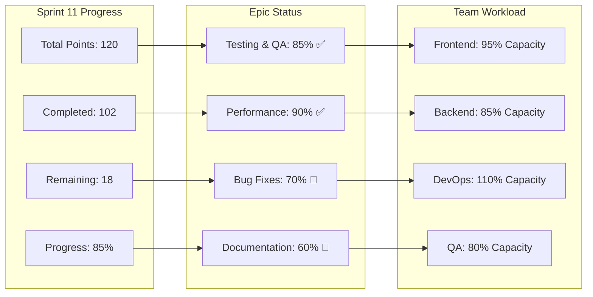

### Daily Standup Visual
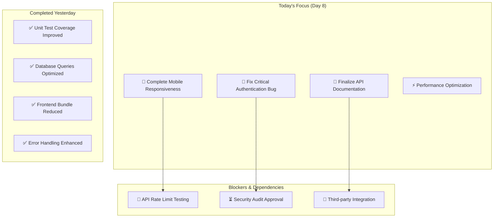

## 🎯 Feature Development Timeline

### Feature Completion Matrix
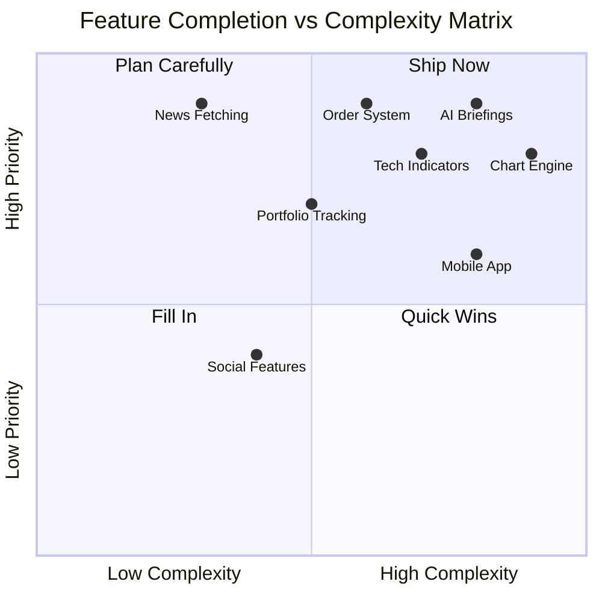

### Development Velocity Heatmap
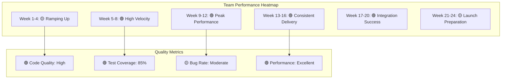

## 📊 Resource Allocation Dashboard

### Team Capacity Planning
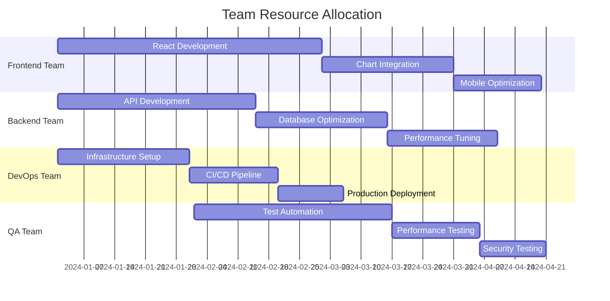

### Budget Allocation Breakdown
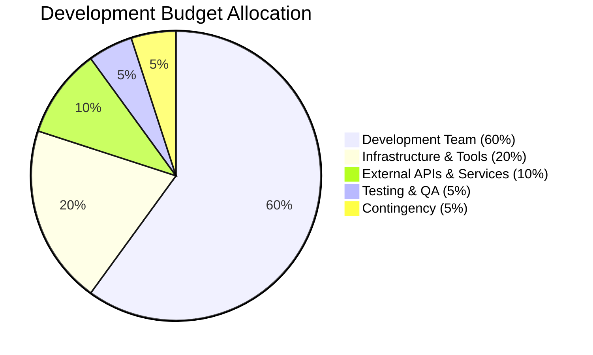

## 🚀 Launch Readiness Dashboard

### Go-Live Checklist Progress
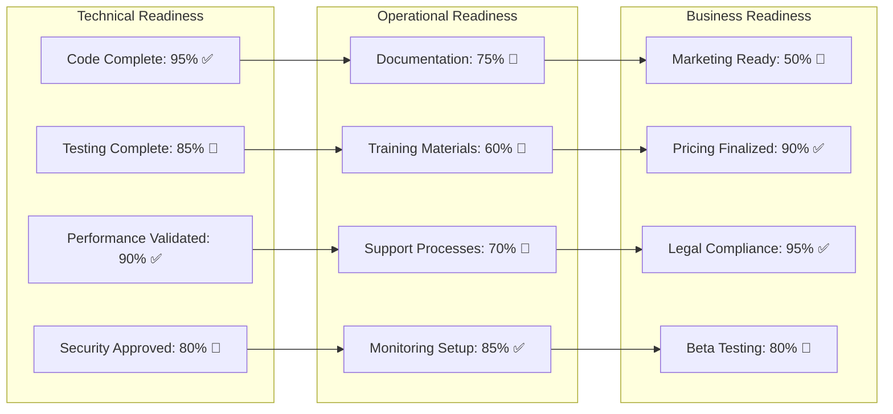

### Risk Assessment Matrix
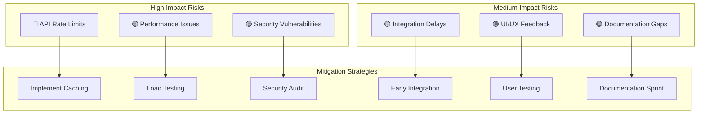

## 📱 Stakeholder Communication Dashboard

### Stakeholder Engagement Map
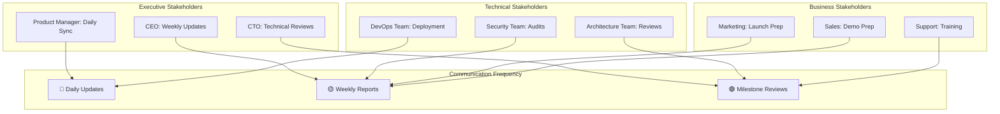

### Communication Timeline
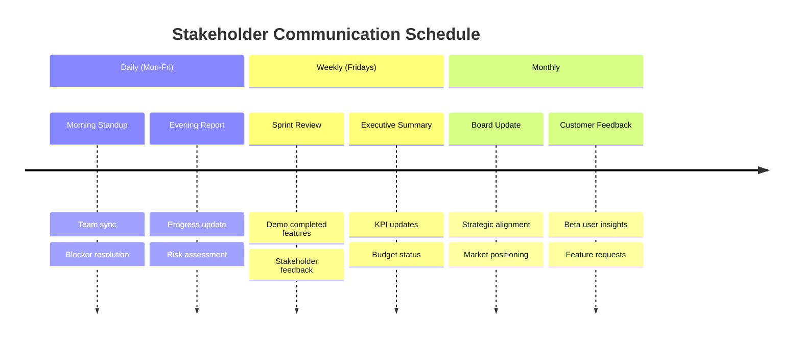

## 🎮 Interactive Performance Metrics

### Real-Time System Health
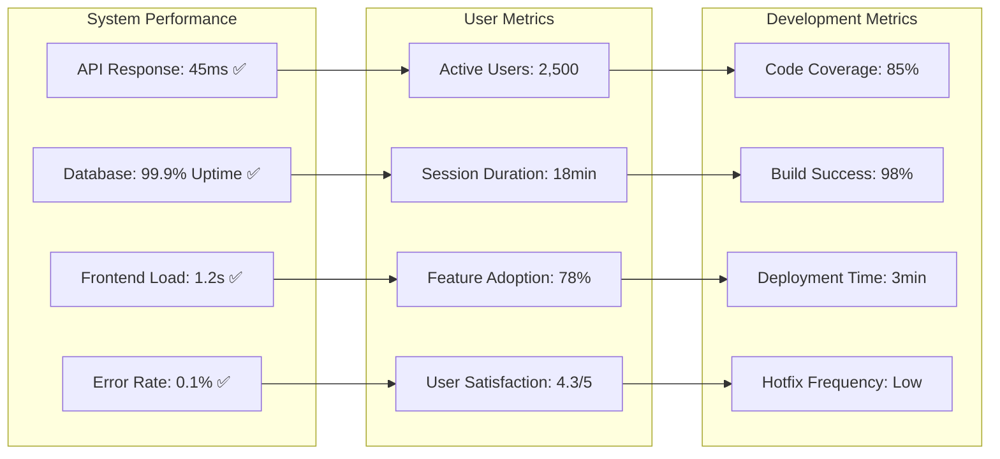

### Burndown vs Burnup Analysis
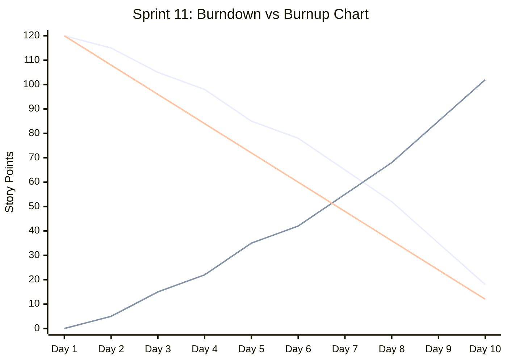

## 🎯 Success Metrics Visualization

### Platform Adoption Funnel
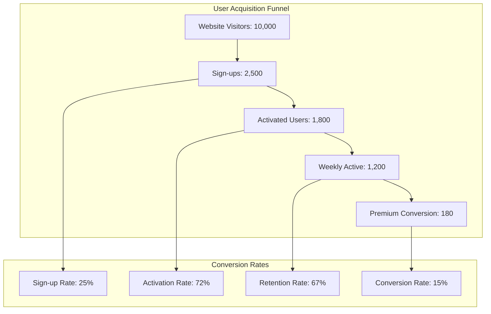

### Feature Usage Heatmap
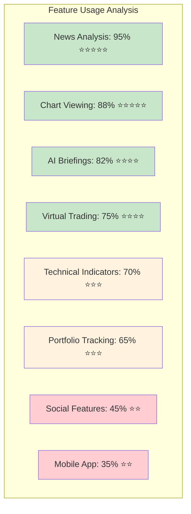

### Revenue Growth Projection
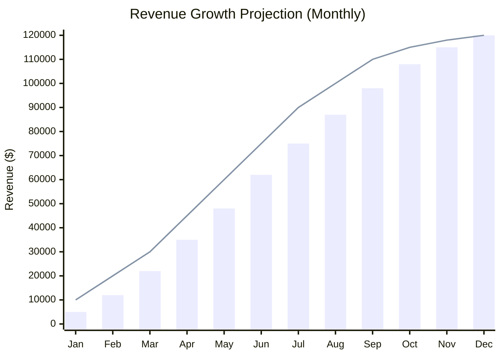

## 🔄 Continuous Improvement Dashboard

### Retrospective Action Items
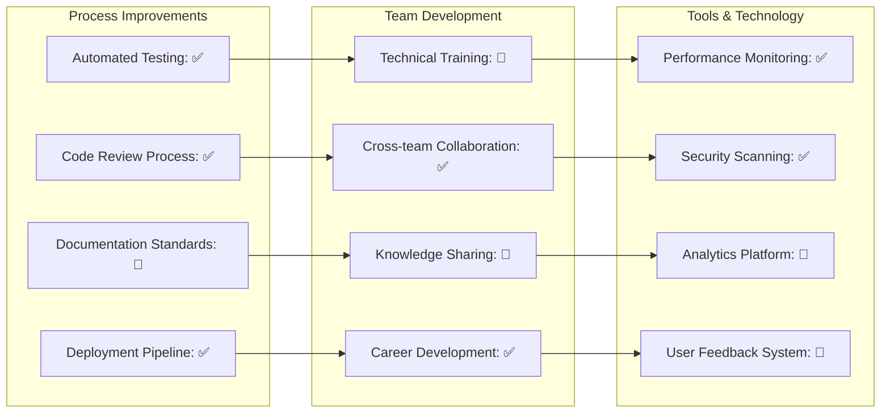

### Innovation Pipeline
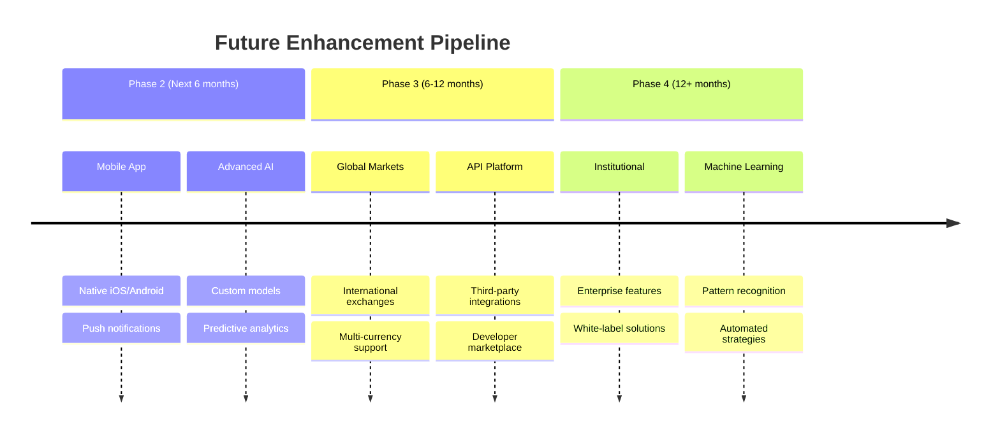