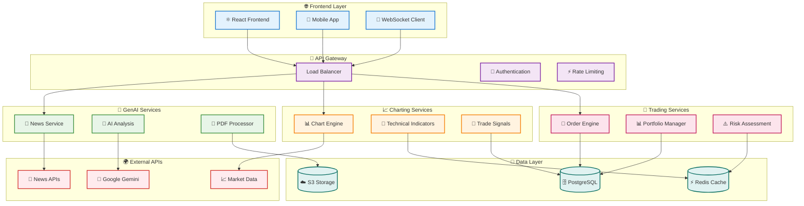
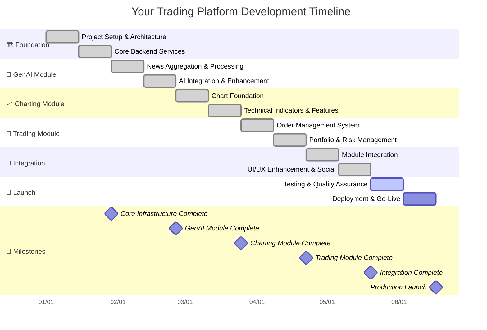
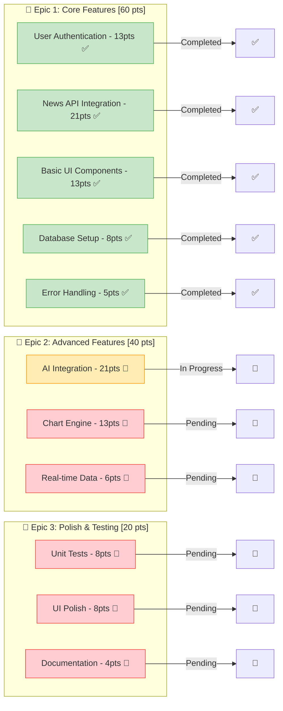
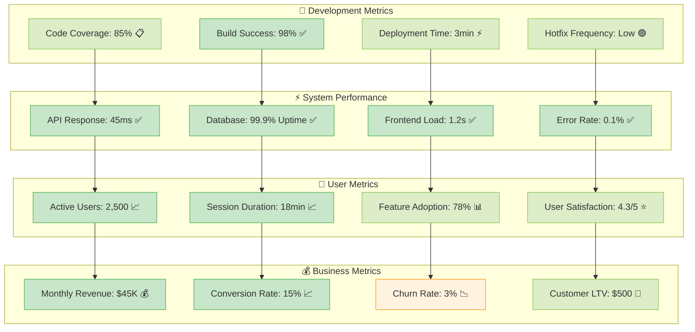
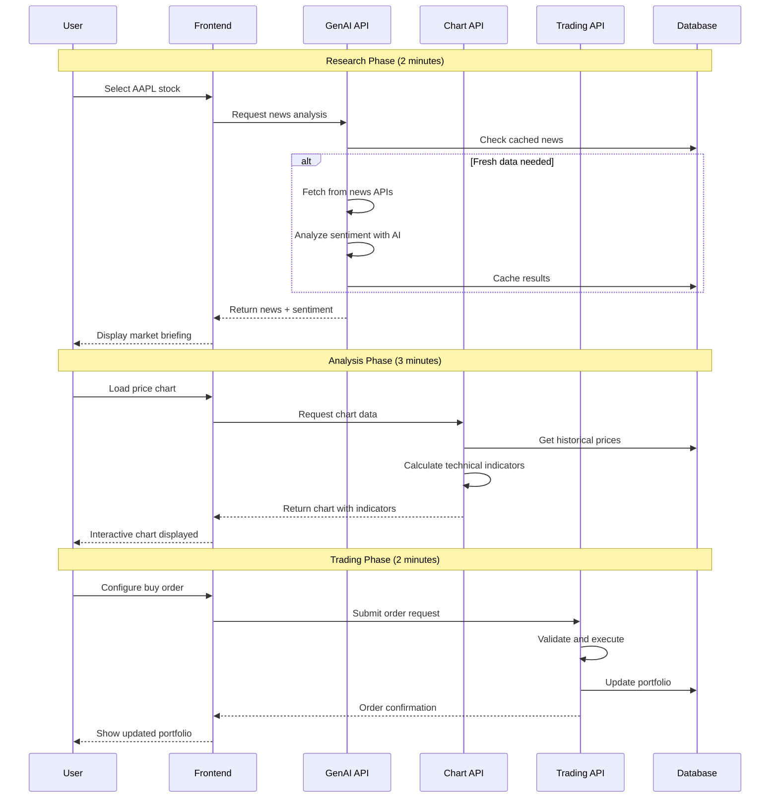
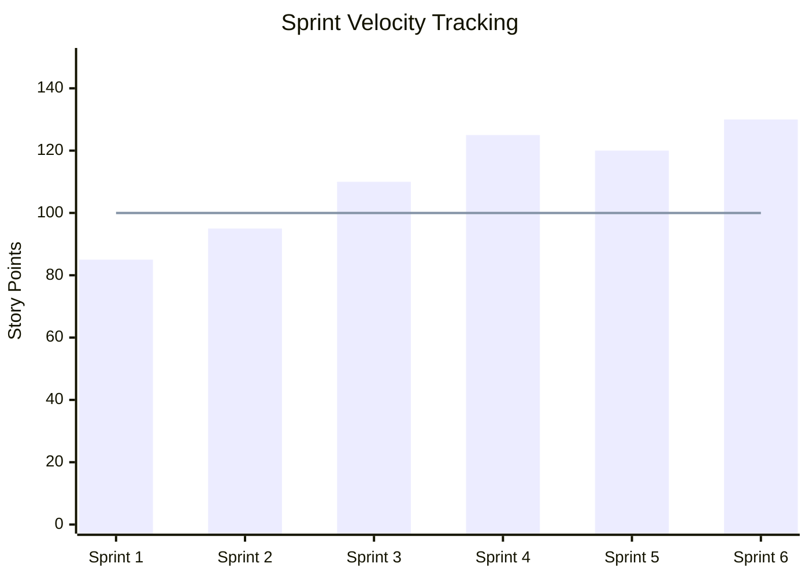
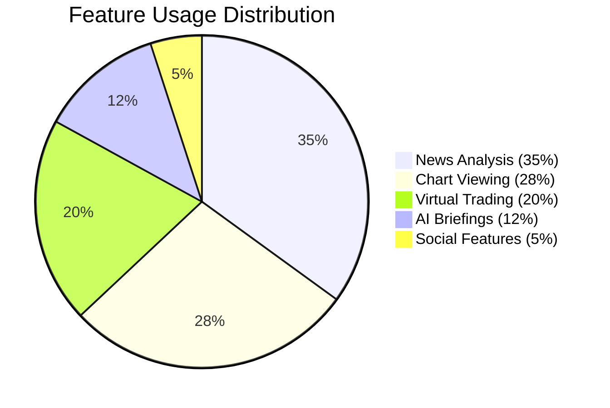
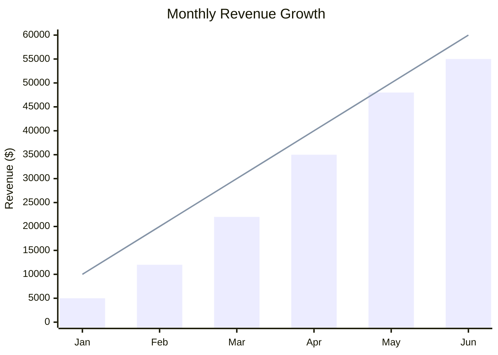

# 🚀 Quick Start: Ready-to-Use Diagram Templates

## 📋 Copy-Paste Templates for Your Trading Platform

### 1. 🏗️ System Architecture Template

#### Template: Microservices Architecture


**How to customize:**
1. Replace service names with your actual services
2. Change emojis to match your branding
3. Adjust colors in the `classDef` section
4. Add/remove services as needed

---

### 2. 📅 Project Timeline Template

#### Template: 6-Phase Development Gantt


**How to customize:**
1. Update dates to match your actual timeline
2. Change phase names to match your project structure
3. Add/remove milestones as needed
4. Adjust task durations (change `14d` to your duration)

---

### 3. 🏃‍♂️ Sprint Planning Template

#### Template: Sprint Backlog Visualization


**How to customize:**
1. Replace epic names with your actual epics
2. Update story point values
3. Change task status (✅ 🔄 📅)
4. Adjust colors for your team's preferences

---

### 4. 📊 Performance Dashboard Template

#### Template: Real-Time Metrics


**How to customize:**
1. Update metric values with your actual data
2. Change metric names to match your KPIs
3. Adjust color coding based on your thresholds
4. Add/remove metric categories

---

### 5. 🔄 User Flow Template

#### Template: Trading Platform User Journey


**How to customize:**
1. Change participant names to match your services
2. Update timing notes for your workflow
3. Add/remove steps based on your user flow
4. Modify API calls to match your architecture

---

### 6. 📈 Chart Templates

#### Template: Sprint Velocity Chart


#### Template: Feature Usage Pie Chart


#### Template: Revenue Growth Chart


---

## 🎨 Color Scheme Templates

### Professional Blue Theme
```mermaid
%% Add this to any diagram for professional blue styling
classDef primary fill:#1976d2,stroke:#0d47a1,color:#fff
classDef secondary fill:#1565c0,stroke:#0277bd,color:#fff
classDef accent fill:#42a5f5,stroke:#1e88e5,color:#000
classDef success fill:#388e3c,stroke:#1b5e20,color:#fff
classDef warning fill:#f57c00,stroke:#e65100,color:#fff
classDef error fill:#d32f2f,stroke:#b71c1c,color:#fff
```

### Modern Green Theme
```mermaid
%% Add this to any diagram for modern green styling
classDef primary fill:#4caf50,stroke:#2e7d32,color:#fff
classDef secondary fill:#66bb6a,stroke:#388e3c,color:#fff
classDef accent fill:#81c784,stroke:#4caf50,color:#000
classDef neutral fill:#757575,stroke:#424242,color:#fff
classDef light fill:#e8f5e8,stroke:#4caf50,color:#000
```

### Startup Orange Theme
```mermaid
%% Add this to any diagram for startup orange styling
classDef primary fill:#ff9800,stroke:#e65100,color:#fff
classDef secondary fill:#ffa726,stroke:#f57c00,color:#fff
classDef accent fill:#ffb74d,stroke:#ff9800,color:#000
classDef complement fill:#2196f3,stroke:#1976d2,color:#fff
classDef neutral fill:#607d8b,stroke:#455a64,color:#fff
```

---

## 🚀 Quick Customization Guide

### 1. **Replace Placeholders**
- Change `[Your Service Name]` to actual service names
- Update dates to match your timeline
- Modify metrics to reflect your actual data

### 2. **Adjust Colors**
- Copy color scheme templates above
- Apply to your diagrams using `class NodeName themeName`
- Create custom colors: `fill:#colorcode,stroke:#bordercolor`

### 3. **Add Your Branding**
- Include your company colors
- Add relevant emojis for visual appeal
- Use consistent naming conventions

### 4. **Scale Complexity**
- Start with basic templates
- Add more details as needed
- Break complex diagrams into multiple simpler ones

### 5. **Export for Presentations**
1. Go to https://mermaid.live/
2. Paste your customized code
3. Click "Actions" → "Download SVG"
4. Import into PowerPoint/Google Slides

---

## 📋 Template Checklist

When using these templates, make sure to:

- [ ] Update all placeholder text
- [ ] Verify dates and timelines
- [ ] Check metric values and units
- [ ] Apply consistent color scheme
- [ ] Test diagram rendering
- [ ] Export in required format
- [ ] Include in documentation

Now you have professional, ready-to-use diagram templates that you can quickly customize for your trading platform presentation! 🎉