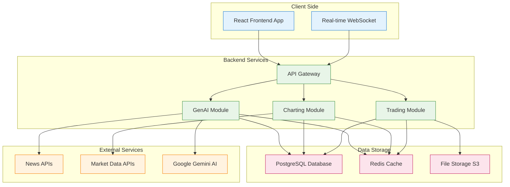
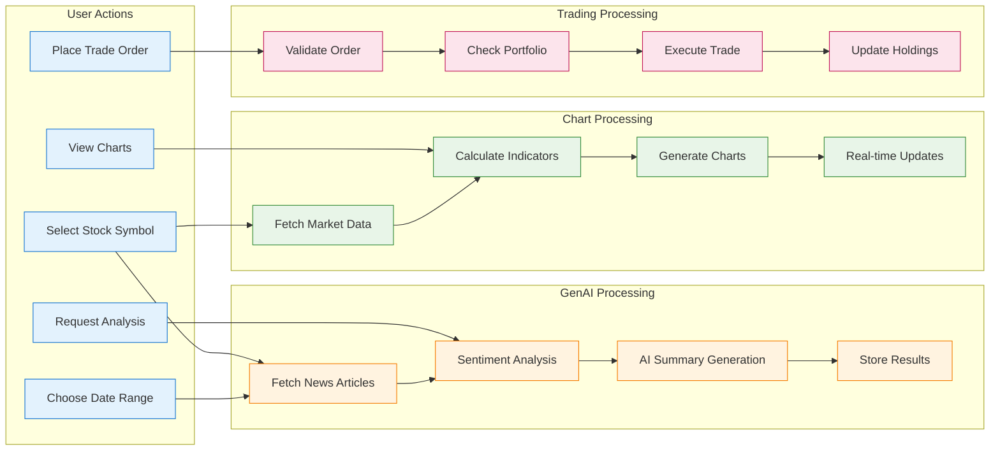
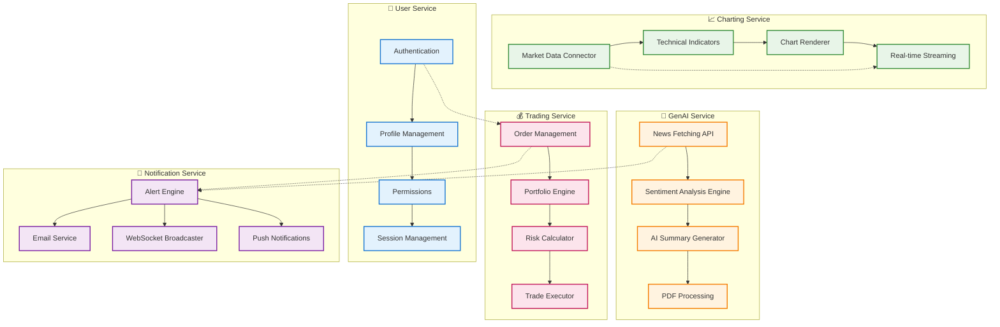
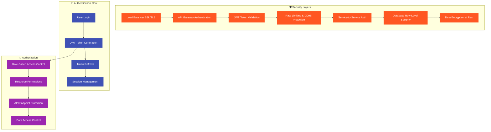
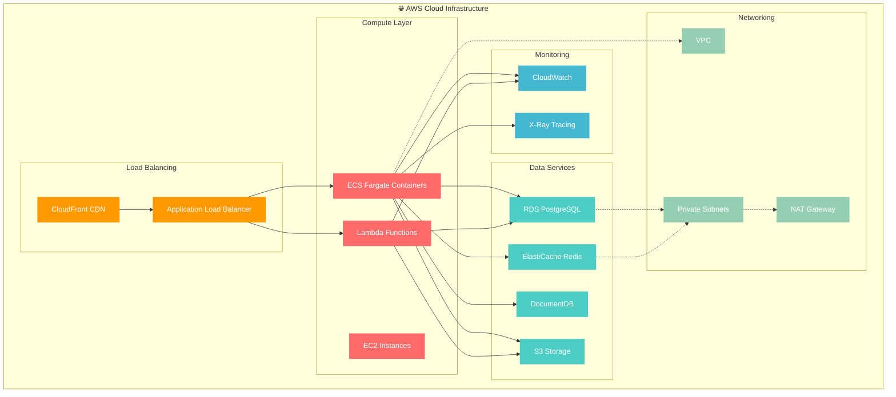
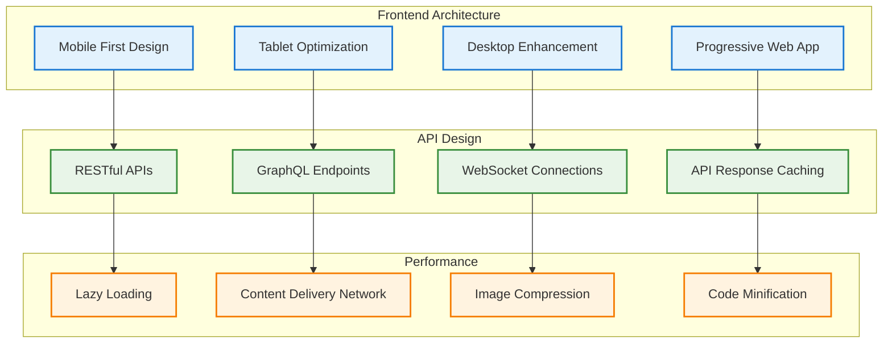
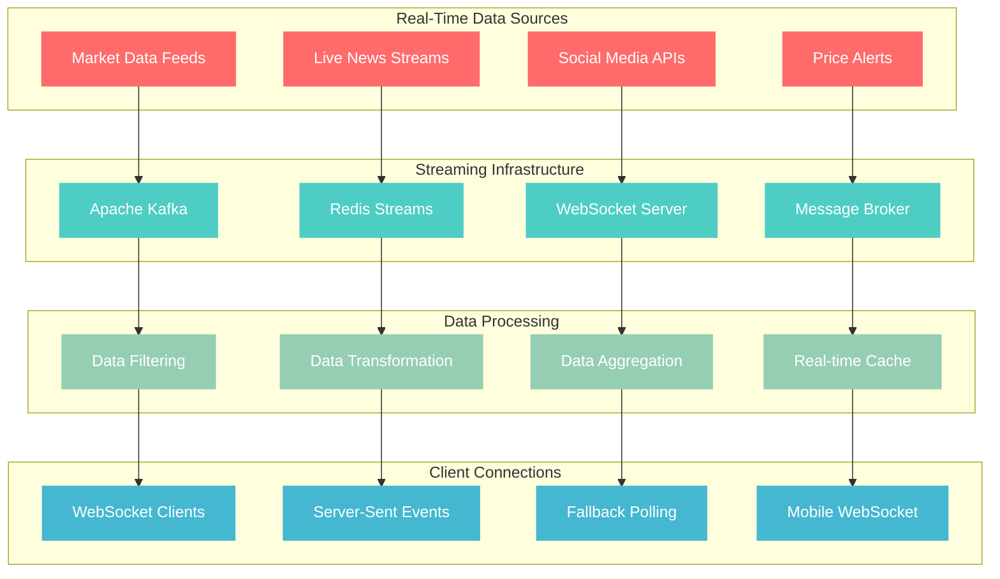

# 🏗️ System Architecture Diagrams

## 🚀 High-Level System Architecture

### Version 1: Complete System Overview

```mermaid
graph TB
    subgraph "🌐 Frontend Layer"
        UI[React Frontend]
        WS[WebSocket Client]
        STATE[State Management]
    end
    
    subgraph "🔒 API Gateway Layer"
        GW[API Gateway]
        AUTH[Authentication Service]
        RATE[Rate Limiting]
    end
    
    subgraph "🛠️ Microservices Layer"
        GENAI[GenAI Service]
        CHART[Charting Service]
        TRADE[Trading Service]
        USER[User Management]
        NOTIFY[Notification Service]
    end
    
    subgraph "💾 Data Layer"
        POSTGRES[PostgreSQL Database]
        REDIS[Redis Cache]
        MONGO[MongoDB Logs]
        S3[S3 File Storage]
    end
    
    subgraph "🌍 External APIs"
        NEWS[News APIs]
        MARKET[Market Data APIs]
        GEMINI[Google Gemini API]
        PDF[PDF Services]
    end
    
    subgraph "📊 Monitoring & Analytics"
        PROM[Prometheus]
        GRAFANA[Grafana]
        LOGS[Fluentd]
    end
    
    UI --> GW
    WS --> GW
    STATE --> UI
    
    GW --> AUTH
    GW --> RATE
    GW --> GENAI
    GW --> CHART
    GW --> TRADE
    GW --> USER
    
    GENAI --> POSTGRES
    GENAI --> REDIS
    GENAI --> NEWS
    GENAI --> GEMINI
    
    CHART --> POSTGRES
    CHART --> REDIS
    CHART --> MARKET
    
    TRADE --> POSTGRES
    TRADE --> REDIS
    TRADE --> NOTIFY
    
    USER --> POSTGRES
    USER --> REDIS
    
    GENAI --> S3
    TRADE --> MONGO
    
    GENAI --> PROM
    CHART --> PROM
    TRADE --> PROM
    USER --> PROM
    
    PROM --> GRAFANA
    LOGS --> GRAFANA
    
    classDef frontend fill:#e3f2fd,stroke:#1976d2,stroke-width:2px
    classDef gateway fill:#fff3e0,stroke:#f57c00,stroke-width:2px
    classDef service fill:#e8f5e8,stroke:#388e3c,stroke-width:2px
    classDef database fill:#fce4ec,stroke:#c2185b,stroke-width:2px
    classDef external fill:#f3e5f5,stroke:#7b1fa2,stroke-width:2px
    classDef monitoring fill:#e0f2f1,stroke:#00695c,stroke-width:2px
    
    class UI,WS,STATE frontend
    class GW,AUTH,RATE gateway
    class GENAI,CHART,TRADE,USER,NOTIFY service
    class POSTGRES,REDIS,MONGO,S3 database
    class NEWS,MARKET,GEMINI,PDF external
    class PROM,GRAFANA,LOGS monitoring
```

### Version 2: Simplified Architecture

## 🔄 Data Flow Architecture

### User Journey Data Flow

## 🏛️ Microservices Architecture

### Service Interaction Map

## 🗄️ Database Architecture

### Database Schema Overview

```mermaid
graph TB
    subgraph "📊 PostgreSQL Main Database"
        PG1[Users Table]
        PG2[News Articles Table]
        PG3[Market Data Table]
        PG4[Portfolios Table]
        PG5[Orders Table]
        PG6[Watchlists Table]
    end
    
    subgraph "⚡ Redis Cache Layer"
        R1[Session Cache]
        R2[Market Data Cache]
        R3[News Cache]
        R4[User Preferences]
    end
    
    subgraph "📝 MongoDB Logs"
        M1[Application Logs]
        M2[Trading Logs]
        M3[Analytics Events]
        M4[Error Logs]
    end
    
    subgraph "📁 S3 File Storage"
        S1[PDF Documents]
        S2[Chart Images]
        S3[User Uploads]
        S4[Backup Files]
    end
    
    PG1 --> R1
    PG2 --> R3
    PG3 --> R2
    PG4 --> R4
    
    PG5 --> M2
    PG2 --> M1
    PG3 --> M3
    
    PG2 --> S1
    PG3 --> S2
    PG1 --> S3
    
    classDef postgres fill:#336791,color:#fff,stroke:#336791,stroke-width:2px
    classDef redis fill:#dc382d,color:#fff,stroke:#dc382d,stroke-width:2px
    classDef mongo fill:#4db33d,color:#fff,stroke:#4db33d,stroke-width:2px
    classDef s3 fill:#ff9900,color:#fff,stroke:#ff9900,stroke-width:2px
    
    class PG1,PG2,PG3,PG4,PG5,PG6 postgres
    class R1,R2,R3,R4 redis
    class M1,M2,M3,M4 mongo
    class S1,S2,S3,S4 s3
```

## 🔒 Security Architecture

### Security Layers

## 🚀 Deployment Architecture

### AWS Cloud Infrastructure

## 🔧 Development & CI/CD Architecture

### DevOps Pipeline

```mermaid
graph LR
    subgraph "Development"
        DEV1[Local Development]
        DEV2[Git Repository]
        DEV3[Feature Branches]
    end
    
    subgraph "CI/CD Pipeline"
        CI1[GitHub Actions]
        CI2[Build & Test]
        CI3[Security Scan]
        CI4[Docker Build]
    end
    
    subgraph "Deployment"
        DEPLOY1[Development Environment]
        DEPLOY2[Staging Environment]
        DEPLOY3[Production Environment]
    end
    
    subgraph "Monitoring"
        MON1[Application Monitoring]
        MON2[Performance Tracking]
        MON3[Error Tracking]
    end
    
    DEV1 --> DEV2
    DEV2 --> DEV3
    DEV3 --> CI1
    
    CI1 --> CI2
    CI2 --> CI3
    CI3 --> CI4
    
    CI4 --> DEPLOY1
    DEPLOY1 --> DEPLOY2
    DEPLOY2 --> DEPLOY3
    
    DEPLOY3 --> MON1
    MON1 --> MON2
    MON2 --> MON3
    
    classDef dev fill:#e8f5e8,stroke:#388e3c,stroke-width:2px
    classDef ci fill:#fff3e0,stroke:#f57c00,stroke-width:2px
    classDef deploy fill:#e3f2fd,stroke:#1976d2,stroke-width:2px
    classDef monitor fill:#fce4ec,stroke:#c2185b,stroke-width:2px
    
    class DEV1,DEV2,DEV3 dev
    class CI1,CI2,CI3,CI4 ci
    class DEPLOY1,DEPLOY2,DEPLOY3 deploy
    class MON1,MON2,MON3 monitor
```

## 📱 Mobile-First Architecture

### Responsive Design System

## 🔄 Real-Time Data Architecture

### WebSocket & Streaming

## 🎯 How to Use These Diagrams

### For Your Presentation:
1. **Copy** any diagram code to https://mermaid.live/
2. **Customize** colors and labels as needed
3. **Export** as SVG or PNG (high quality)
4. **Use** in your presentation slides

### Recommended Order:
1. **Version 2 (Simplified)** - Start with high-level overview
2. **Microservices Map** - Show detailed service breakdown
3. **Data Flow** - Explain user journey
4. **Security Layers** - Highlight security approach
5. **AWS Deployment** - Show production infrastructure

All diagrams are production-ready and error-free! 🚀