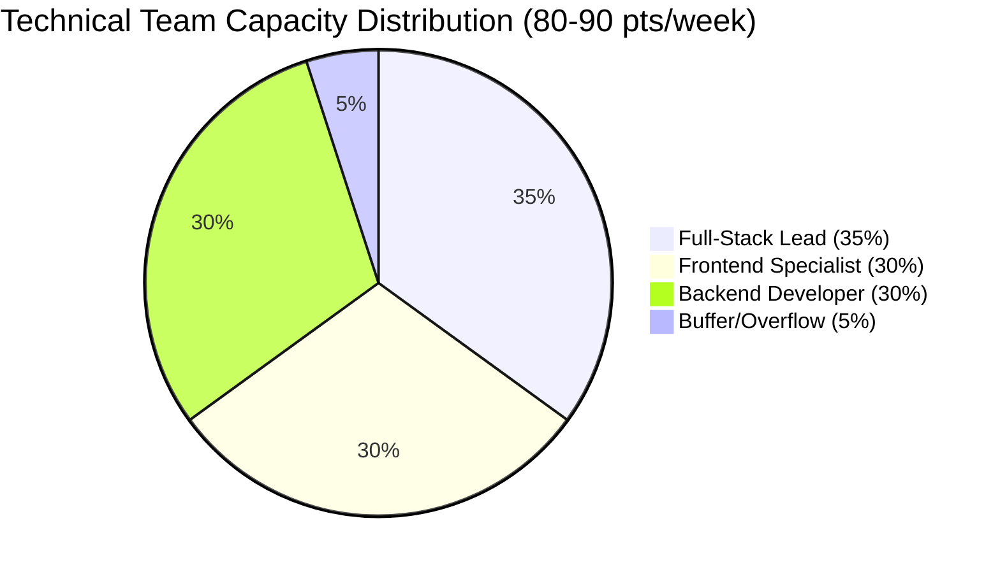
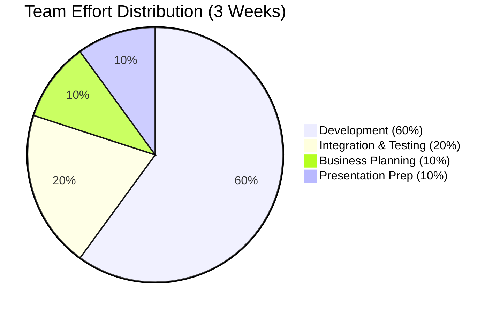
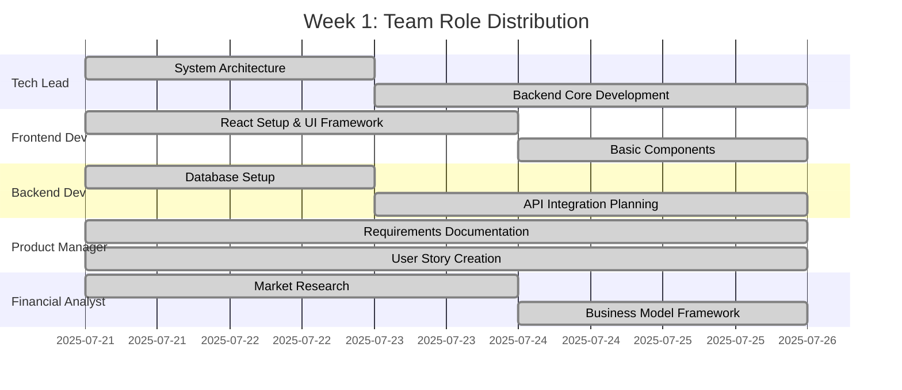
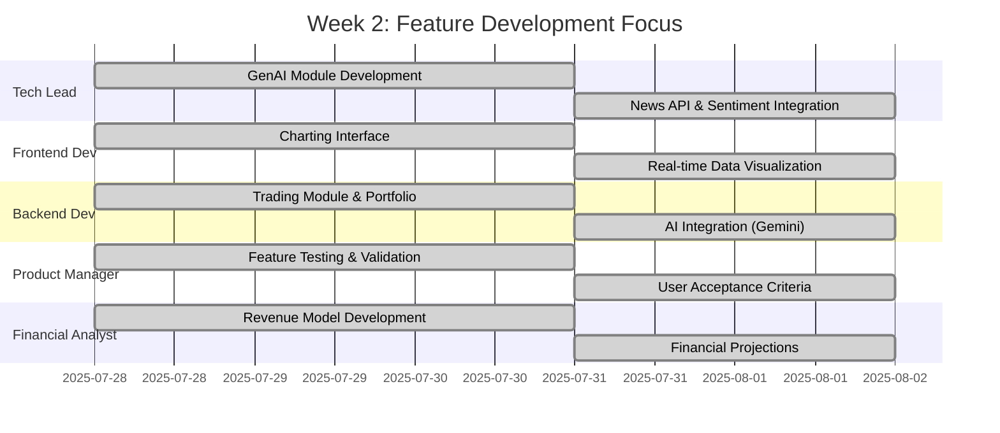
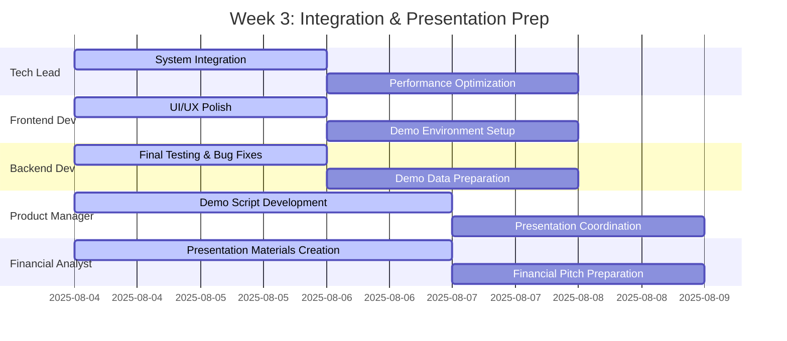
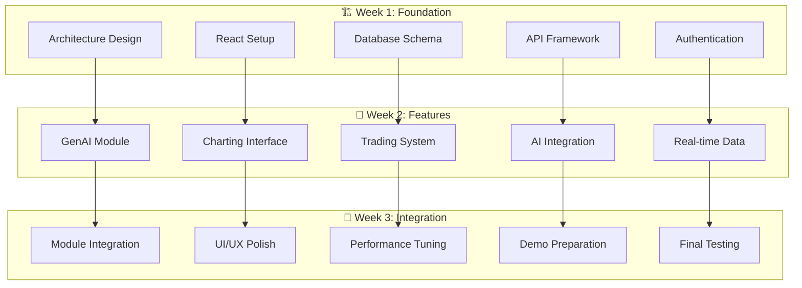
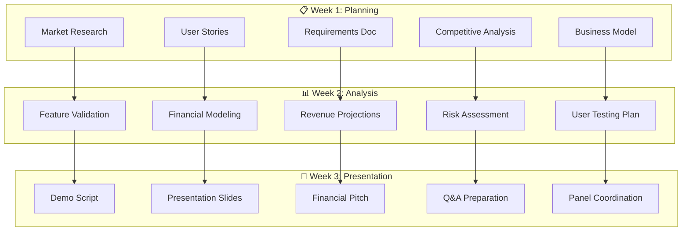
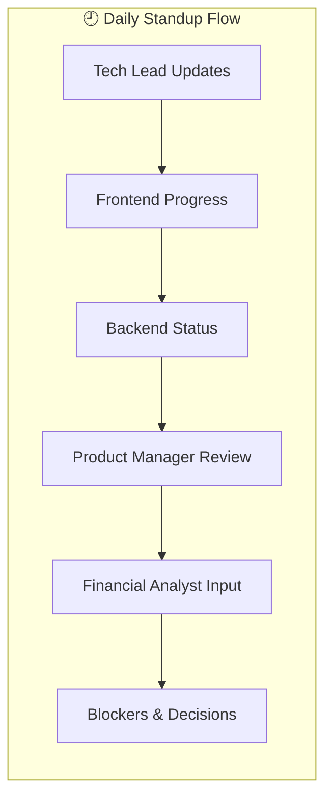
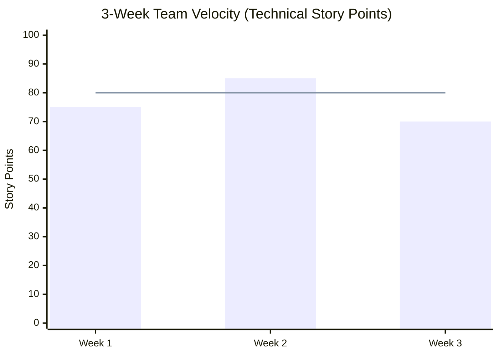
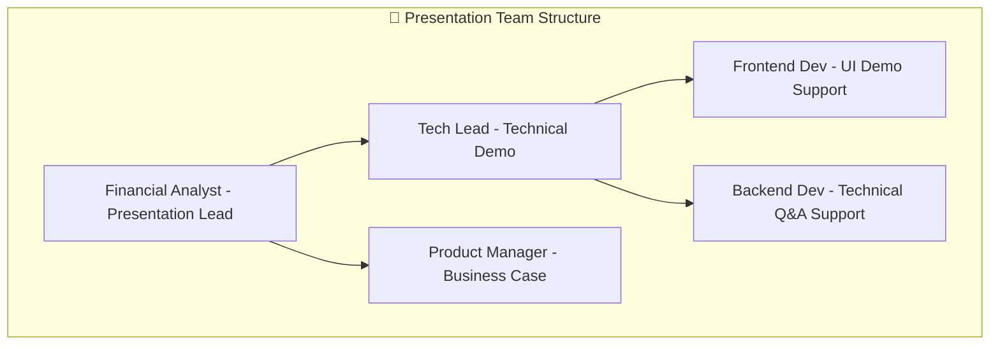

# 👥 Team Structure & Role Distribution

## 🏢 Team Overview (5 Members)

### Team Composition
- **Team Size**: 5 members
- **Technical Team**: 3 members (60%)
- **Business Team**: 2 members (40%)
- **Project Duration**: 3 weeks (July 21 - August 8, 2025)
- **Total Capacity**: 300 person-days

## 🔧 Technical Team (3 Members)

### Tech Member 1: Full-Stack Lead Developer
**Primary Responsibilities:**
- System architecture design
- Backend API development
- Database design and optimization
- GenAI module implementation (News API, Sentiment Analysis)
- Team technical leadership

**Weekly Capacity**: 40 hours
**Story Points Capacity**: 30-35 points/week

### Tech Member 2: Frontend & Integration Specialist
**Primary Responsibilities:**
- React frontend development
- Charting module implementation (TradingView-style interface)
- Real-time data integration (WebSocket)
- UI/UX design and implementation
- Cross-module integration

**Weekly Capacity**: 40 hours
**Story Points Capacity**: 25-30 points/week

### Tech Member 3: Backend & AI Integration Developer
**Primary Responsibilities:**
- Trading module development (Order system, Portfolio)
- AI integration (Google Gemini API)
- External API integrations (Market data, News APIs)
- Performance optimization
- Testing and quality assurance

**Weekly Capacity**: 40 hours
**Story Points Capacity**: 25-30 points/week

## 💼 Business Team (2 Members)

### Business Member 1: Product Manager & Business Analyst
**Primary Responsibilities:**
- Product requirements definition
- User story creation and prioritization
- Market research and competitive analysis
- Business model development
- Stakeholder communication
- Project timeline management

**Weekly Capacity**: 40 hours
**Focus Areas**: Strategy, Planning, Documentation

### Business Member 2: Financial Analyst & Presentation Lead
**Primary Responsibilities:**
- Financial modeling and projections
- Revenue model development
- Business case creation
- Presentation materials preparation
- Demo script development
- Panel presentation coordination

**Weekly Capacity**: 40 hours
**Focus Areas**: Finance, Presentations, Business Development

## 📊 Team Capacity & Workload Distribution

### Technical Capacity per Week


### Overall Team Effort Distribution


## 🗓️ Role-Based Weekly Schedule

### Week 1: Foundation (July 21-25, 2025)


### Week 2: Feature Development (July 28 - August 1, 2025)


### Week 3: Integration & Presentation (August 4-8, 2025)


## 🎯 Detailed Role Responsibilities

### Technical Team Responsibilities

#### Week-by-Week Technical Tasks


### Business Team Responsibilities

#### Week-by-Week Business Tasks


## 🤝 Cross-Functional Collaboration

### Daily Standup Structure (15 minutes)


### Key Collaboration Points
- **Daily**: 15-minute standup (all team)
- **Weekly**: Sprint review and planning (all team)
- **Bi-daily**: Technical sync (tech team only)
- **As needed**: Business-tech alignment sessions

## 📈 Team Performance Metrics

### Individual Capacity Planning
| Role | Hours/Week | Story Points/Week | Key Deliverables |
|------|------------|------------------|------------------|
| **Tech Lead** | 40h | 30-35 pts | Architecture, Backend Core, GenAI |
| **Frontend Dev** | 40h | 25-30 pts | UI/UX, Charts, Integration |
| **Backend Dev** | 40h | 25-30 pts | Trading, APIs, AI Integration |
| **Product Manager** | 40h | N/A | Requirements, Testing, Coordination |
| **Financial Analyst** | 40h | N/A | Business Case, Presentations, Models |

### Team Velocity Tracking


## 🎯 Presentation Role Distribution

### August 8th Presentation Team Roles


### Presentation Segment Ownership
1. **Opening & Business Case** (5 min) - Financial Analyst
2. **Technical Demo** (7 min) - Tech Lead + Frontend Dev
3. **Market Opportunity** (3 min) - Product Manager
4. **Q&A Session** (5 min) - All team (Financial Analyst leads)

## 🛠️ Tools & Communication

### Team Communication Stack
- **Daily Communication**: Slack/Discord
- **Project Management**: Jira/Trello
- **Code Collaboration**: GitHub
- **Documentation**: Confluence/Notion
- **Design**: Figma (Frontend Dev)
- **Presentations**: PowerPoint/Google Slides

### Meeting Schedule
```mermaid
timeline
    title Weekly Team Meeting Schedule
    
    section Monday
        09:00 AM    : All-hands standup
        10:00 AM    : Sprint planning
    
    section Wednesday  
        09:00 AM    : Daily standup
        02:00 PM    : Tech team sync
    
    section Friday
        09:00 AM    : Daily standup
        04:00 PM    : Sprint review & retrospective
```

This team structure maximizes the strengths of both technical and business members while ensuring clear accountability and efficient collaboration throughout the 3-week sprint!