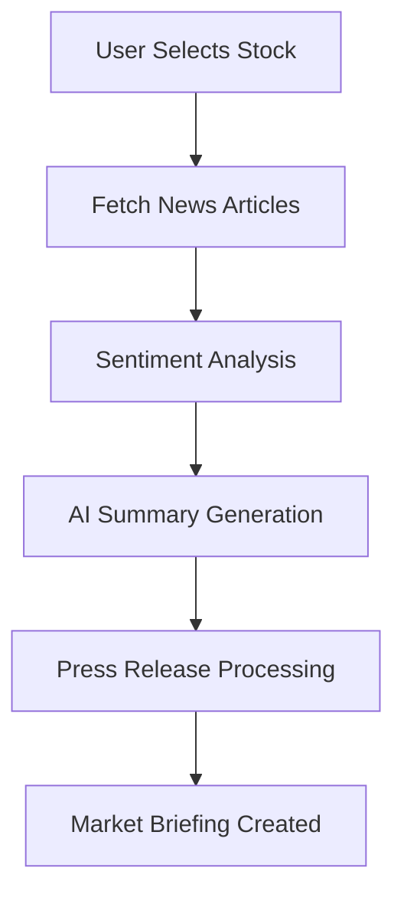
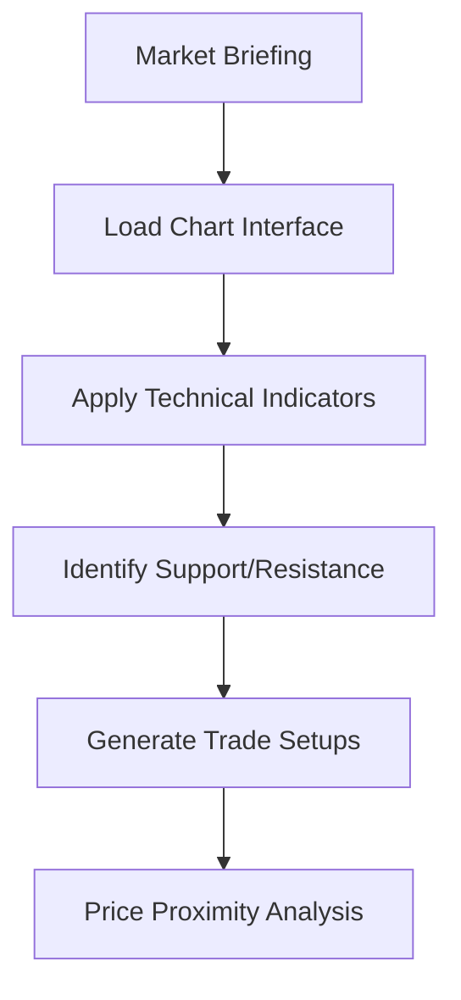
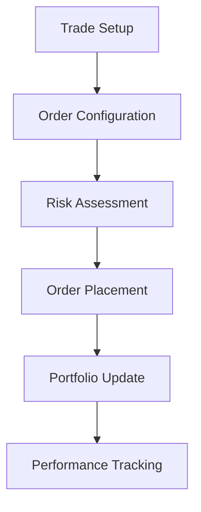

# Technical Workflow Documentation

## 🔄 End-to-End User Journey

### Phase 1: Research & Analysis

**Technical Flow:**
1. **Stock Selection**: User inputs ticker symbol and date range
2. **News Aggregation**: System fetches relevant articles with relevance scoring
3. **Sentiment Processing**: Each headline analyzed for bullish/bearish/neutral sentiment
4. **Weighted Analysis**: Relevance × Sentiment scores calculated
5. **AI Processing**: Gemini API generates structured market briefing
6. **PDF Processing**: Quarterly reports extracted and summarized

### Phase 2: Technical Analysis

**Technical Flow:**
1. **Chart Loading**: Real-time price data visualization
2. **Indicator Application**: 7 technical indicators with customizable parameters
3. **Pattern Recognition**: Support/resistance level identification
4. **Trade Setup Generation**: 
   - Bounce Buy (at support)
   - Breakdown Sell (below support)
   - Breakout Buy (above resistance)
   - Rejection Sell (at resistance)
5. **Proximity Alerts**: Configurable threshold-based notifications

### Phase 3: Order Execution

**Technical Flow:**
1. **Order Types**: Market, limit, stop-loss configuration
2. **Position Sizing**: Risk-based calculation
3. **Virtual Execution**: Simulated order processing
4. **Portfolio Integration**: Real-time P&L calculation
5. **Performance Analytics**: Trade history and metrics

## 🔗 API Integration Points

### Data Sources
- **News APIs**: Multiple providers for comprehensive coverage
- **Market Data**: Real-time price feeds with market hours logic
- **AI Services**: Google Gemini for natural language processing

### Internal APIs
- **Sentiment Service**: RESTful API for sentiment scores
- **Chart Service**: WebSocket for real-time updates
- **Trading Service**: Order management and portfolio APIs

## 🛡️ Data Flow Security
- **API Rate Limiting**: Prevents service overload
- **Data Validation**: Input sanitization at all entry points
- **Caching Strategy**: Optimized for performance and cost
- **Error Handling**: Graceful degradation for service failures

## ⚡ Performance Optimizations
- **Lazy Loading**: Charts and indicators loaded on demand
- **Data Compression**: Efficient historical data storage
- **Real-time Updates**: WebSocket connections for live data
- **Intelligent Caching**: News and sentiment data cached appropriately