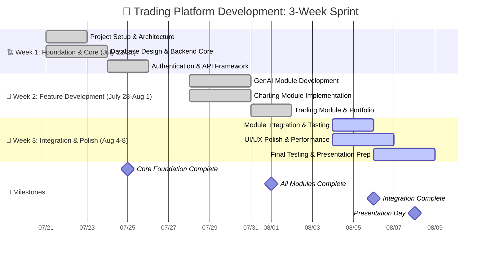
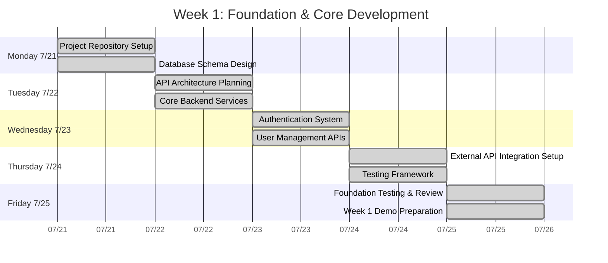
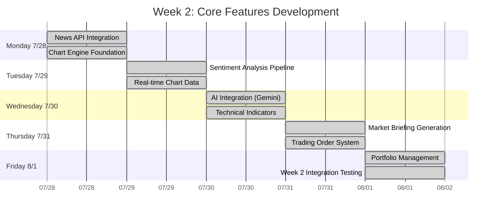
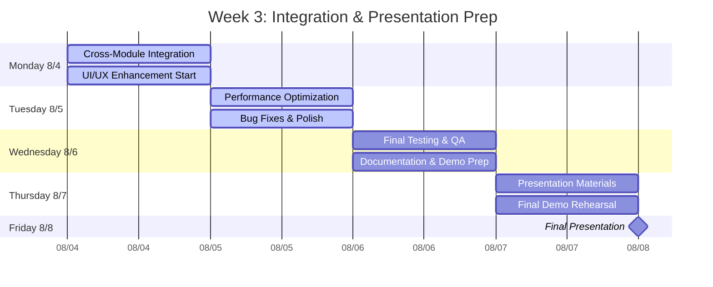
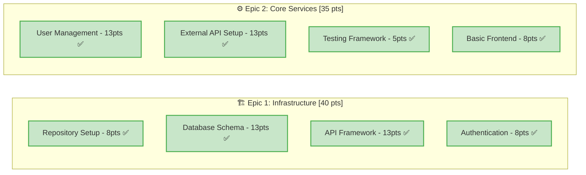
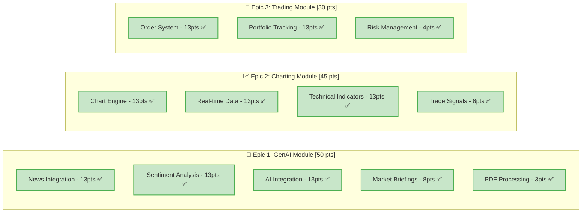
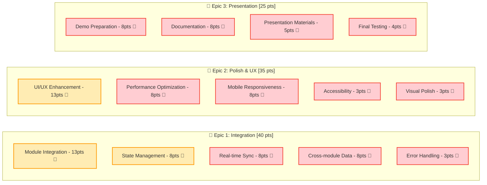
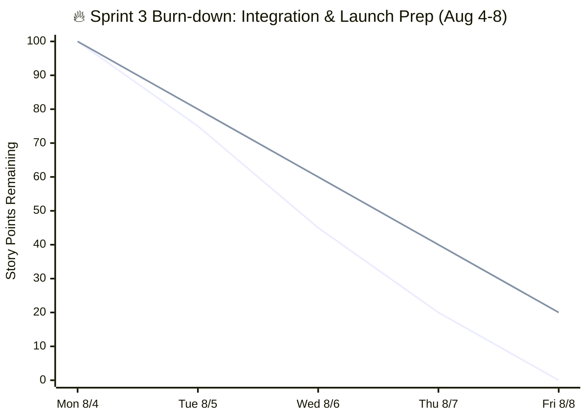
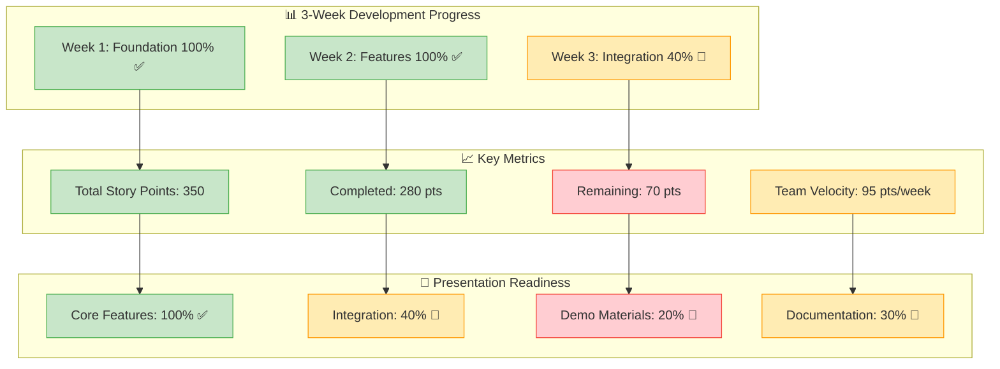
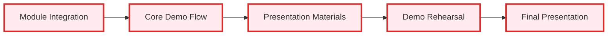

# 🚀 Updated Project Timeline: July 21 - August 8, 2025

## 📅 Actual Project Schedule (3 Weeks)

### Project Overview
- **Start Date**: July 21, 2025 (Monday)
- **Presentation Date**: August 8, 2025 (Friday)
- **Total Duration**: 18 days (3 weeks)
- **Working Days**: 15 days (excluding weekends)

## 🗓️ Master Project Timeline

### Updated Gantt Chart for Real Timeline


## 📊 Daily Breakdown Schedule

### Week 1: Foundation (July 21-25, 2025)


### Week 2: Feature Development (July 28-Aug 1, 2025)


### Week 3: Integration & Polish (August 4-8, 2025)


## 🎯 Sprint Structure for 3 Weeks

### Sprint 1: Foundation (Week 1 - July 21-25)
**Goal**: Establish solid foundation and core architecture

**Sprint Backlog:**


### Sprint 2: Feature Development (Week 2 - July 28-Aug 1)
**Goal**: Implement all three core modules

**Sprint Backlog:**


### Sprint 3: Integration & Launch (Week 3 - August 4-8)
**Goal**: Integrate everything and prepare for presentation

**Current Sprint Backlog:**


## 🔥 Current Status (Week 3 - Day 1: August 4, 2025)

### Daily Burn-down Chart


### Weekly Progress Overview


## 🎯 Presentation Day Timeline (August 8, 2025)

### Final Day Schedule
```mermaid
timeline
    title 🎤 Presentation Day: August 8, 2025
    
    section Morning Prep
        09:00-10:00    : Final system check
                      : Demo environment setup
        
        10:00-11:00    : Team rehearsal
                      : Presentation walkthrough
    
    section Pre-Presentation
        11:00-12:00    : Equipment setup
                      : Backup preparations
        
        12:00-13:00    : Lunch & mental prep
                      : Final slide review
    
    section Presentation
        13:00-13:30    : Setup & sound check
                      : Panel introduction
        
        13:30-14:30    : Main presentation
                      : Live demo
                      : Q&A session
    
    section Follow-up
        14:30-15:00    : Panel feedback
                      : Documentation handover
```

## 📋 Critical Path & Risk Management

### Critical Path Items (Must Complete)


### Risk Mitigation (Remaining Days)
- **Integration Issues**: Daily integration testing
- **Demo Failures**: Multiple backup scenarios prepared
- **Time Constraints**: Focus on core features only
- **Technical Debt**: Document known issues for future

## 🏆 Success Metrics for Presentation

### What to Demonstrate
1. **Complete User Workflow** (7 minutes)
   - Research → Analysis → Trading
   - All three modules working together
   - Real-time data and AI integration

2. **Technical Excellence** (3 minutes)
   - Architecture overview
   - Performance metrics
   - Code quality demonstration

3. **Business Value** (3 minutes)
   - Problem solved
   - Market opportunity
   - Future roadmap

### Backup Plans
- **Plan A**: Full live demo with real APIs
- **Plan B**: Recorded demo with live narration
- **Plan C**: Slide-based walkthrough with screenshots

This updated timeline reflects your actual 3-week intensive development sprint leading to your August 8th presentation!