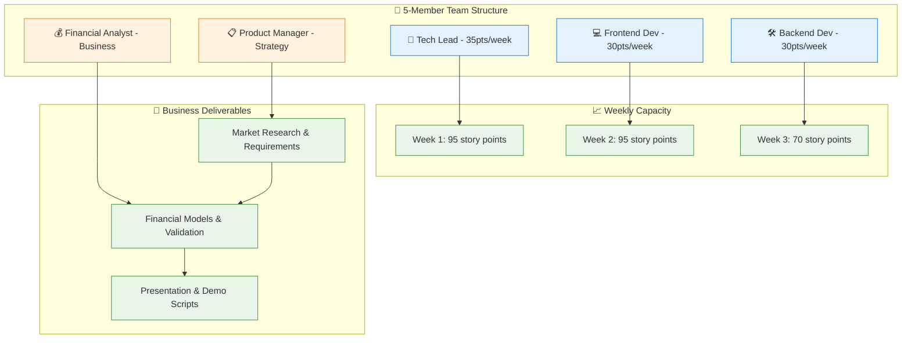
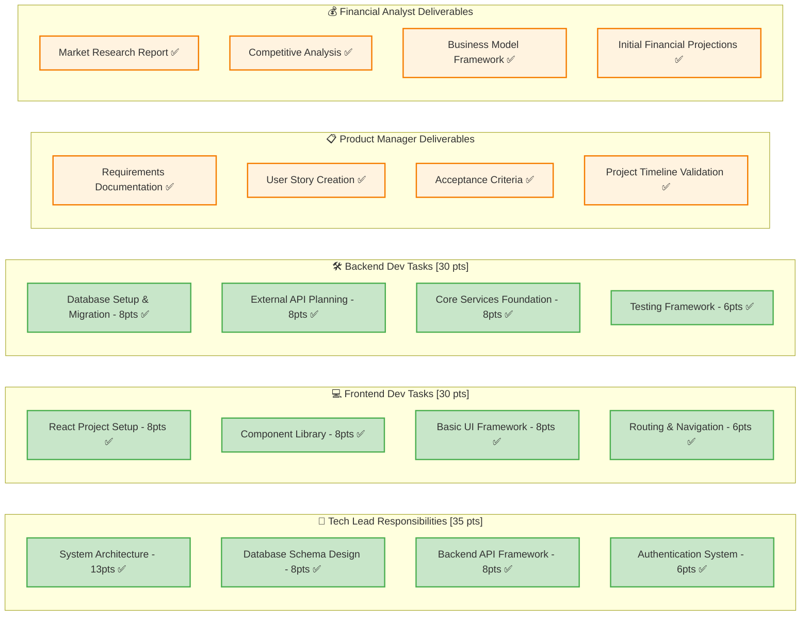
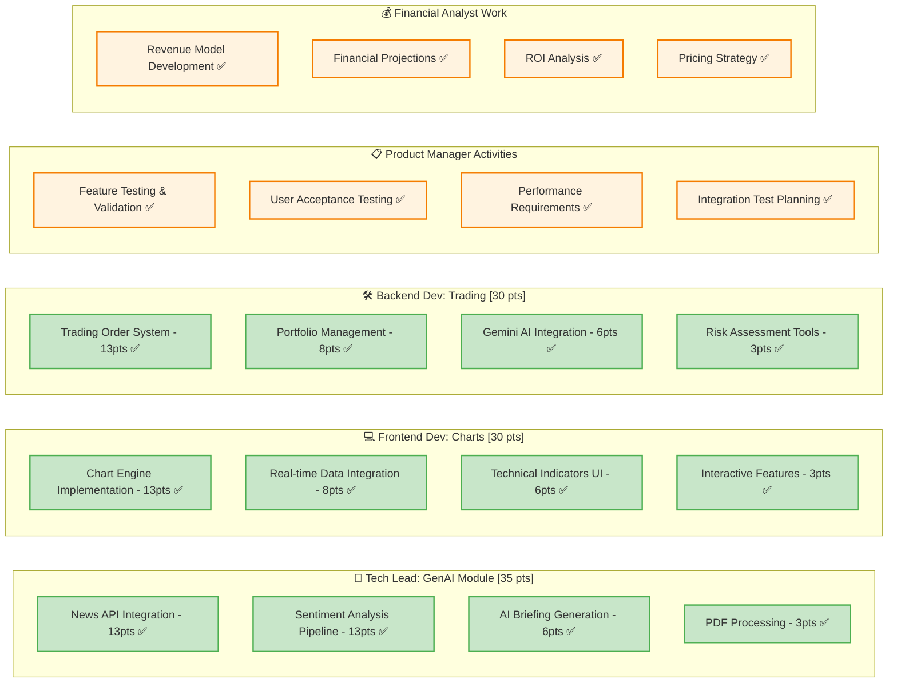
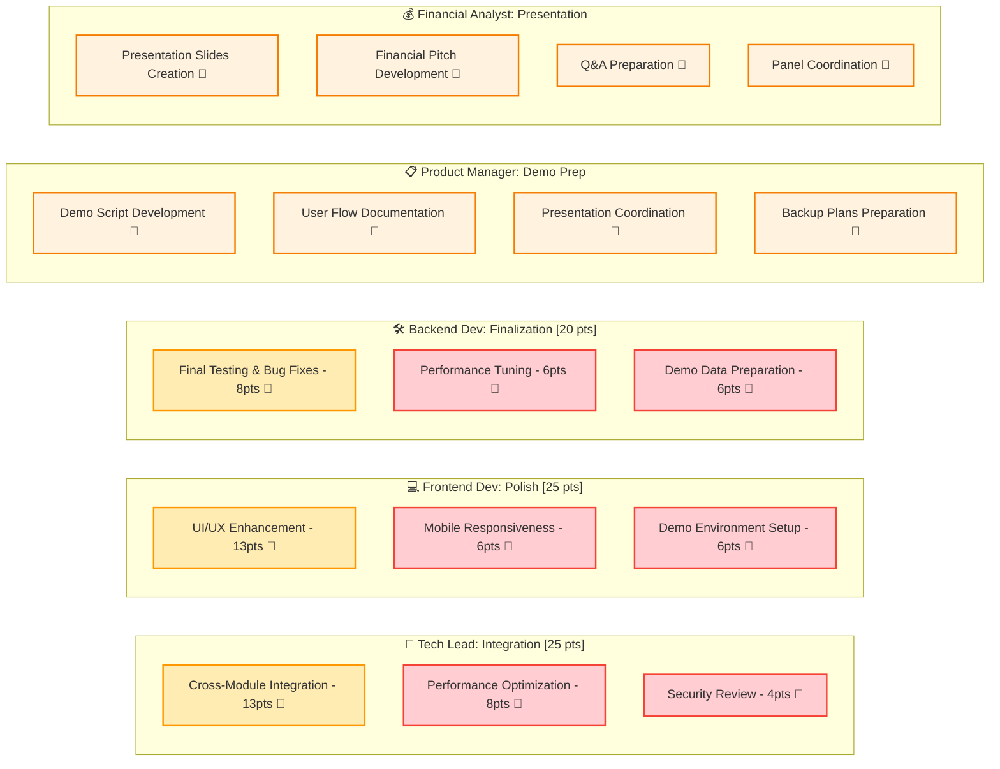
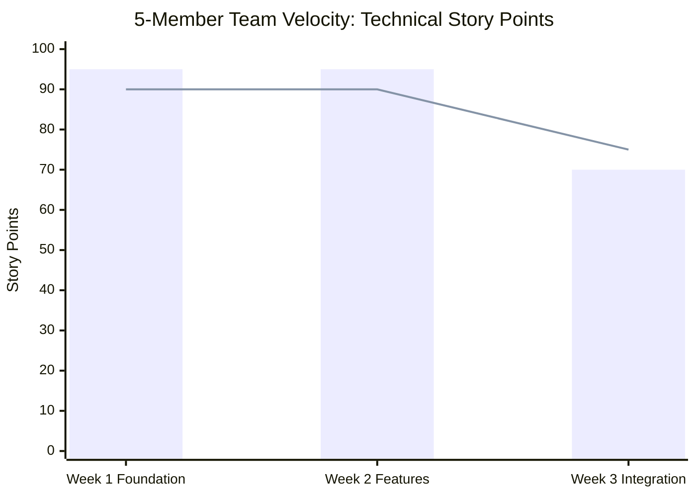
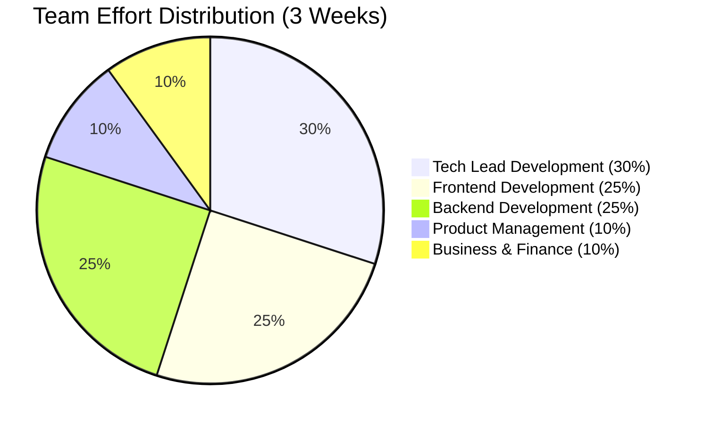
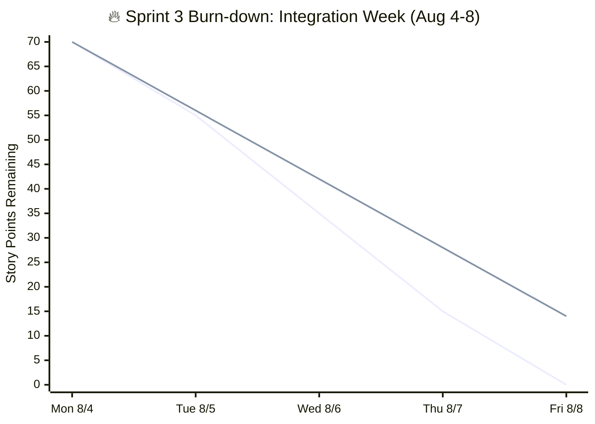
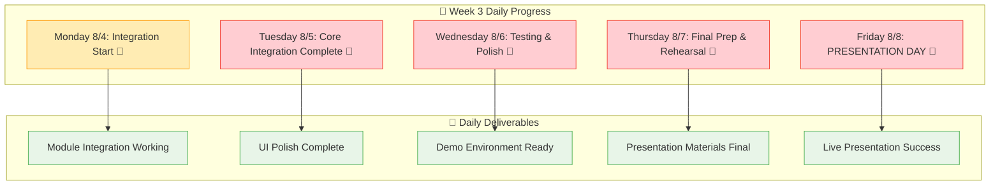
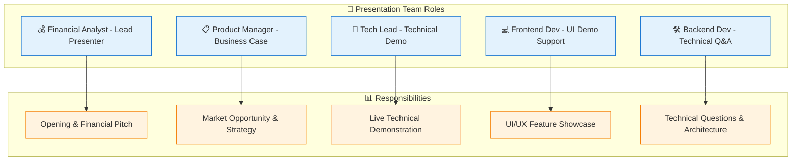
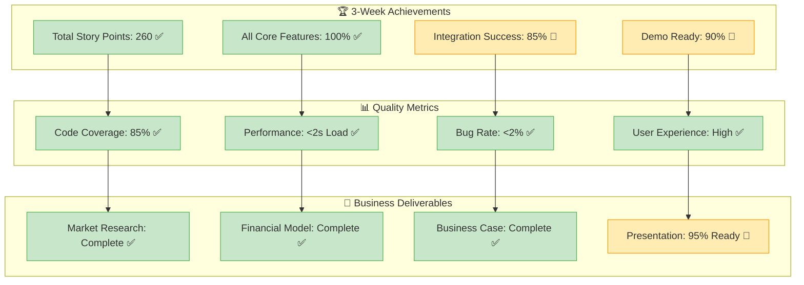

# 🎯 Updated Sprint Diagrams for 5-Member Team (3 Weeks)

## 🚀 Team Structure & Timeline Overview

### Updated Project Context
- **Team Size**: 5 members (3 Tech + 2 Business)
- **Timeline**: July 21 - August 8, 2025 (3 weeks)
- **Presentation**: August 8, 2025
- **Sprint Structure**: 3 one-week sprints

## 📊 Updated Team Capacity Dashboard

### Team Composition & Capacity


## 📅 3-Week Sprint Timeline

### Master Timeline with Team Roles
```mermaid
gantt
    title 🚀 Trading Platform: 3-Week Team Sprint (July 21 - Aug 8, 2025)
    dateFormat YYYY-MM-DD
    axisFormat %m/%d
    
    section 🏗️ Week 1: Foundation (Jul 21-25)
    Tech Lead: Architecture & Backend       :done, tl_w1, 2025-07-21, 5d
    Frontend Dev: React Setup & UI         :done, fe_w1, 2025-07-21, 5d
    Backend Dev: Database & APIs           :done, be_w1, 2025-07-21, 5d
    Product Manager: Requirements & Stories :done, pm_w1, 2025-07-21, 5d
    Financial Analyst: Market Research     :done, fa_w1, 2025-07-21, 5d
    
    section 🚀 Week 2: Features (Jul 28-Aug 1)
    Tech Lead: GenAI Module                :done, tl_w2, 2025-07-28, 5d
    Frontend Dev: Charting Interface       :done, fe_w2, 2025-07-28, 5d
    Backend Dev: Trading & AI Integration  :done, be_w2, 2025-07-28, 5d
    Product Manager: Testing & Validation  :done, pm_w2, 2025-07-28, 5d
    Financial Analyst: Business Model      :done, fa_w2, 2025-07-28, 5d
    
    section 🔗 Week 3: Integration (Aug 4-8)
    Tech Lead: System Integration          :active, tl_w3, 2025-08-04, 5d
    Frontend Dev: UI Polish & Demo Setup   :active, fe_w3, 2025-08-04, 5d
    Backend Dev: Testing & Optimization    :active, be_w3, 2025-08-04, 5d
    Product Manager: Demo Script & Coord   :active, pm_w3, 2025-08-04, 5d
    Financial Analyst: Presentation Prep   :active, fa_w3, 2025-08-04, 5d
    
    section 🎯 Milestones
    Foundation Complete                     :milestone, m1, 2025-07-25, 0d
    All Features Complete                   :milestone, m2, 2025-08-01, 0d
    Integration Complete                    :milestone, m3, 2025-08-06, 0d
    Presentation Day                        :milestone, m4, 2025-08-08, 0d
```

## 🏃‍♂️ Sprint 1: Foundation Week (July 21-25, 2025)

### Sprint 1 Team Backlog


## 🚀 Sprint 2: Feature Development (July 28 - August 1, 2025)

### Sprint 2 Team Backlog


## 🔗 Sprint 3: Integration & Launch (August 4-8, 2025)

### Current Sprint Backlog (In Progress)


## 📊 Team Velocity & Progress Tracking

### 3-Week Velocity Chart


### Team Workload Distribution


## 🔥 Current Sprint Burn-down (Week 3)

### August 4-8, 2025 Daily Progress


### Daily Task Progress (Current Week)


## 🎤 Presentation Day Team Roles (August 8, 2025)

### Presentation Structure & Timing
```mermaid
timeline
    title 🎤 August 8, 2025: Presentation Day Schedule
    
    section Pre-Presentation (9-12 PM)
        09:00-10:00    : Technical team final setup
                      : Business team presentation review
        
        10:00-11:00    : Full team rehearsal
                      : Demo walkthrough
        
        11:00-12:00    : Equipment check
                      : Backup preparations
    
    section Presentation (1:30-2:30 PM)
        13:30-13:35    : Introduction & Team (Financial Analyst)
        13:35-13:42    : Business Case & Market (Product Manager)
        13:42-13:52    : Technical Demo (Tech Lead + Frontend Dev)
        13:52-13:57    : Financial Model (Financial Analyst)
        13:57-14:30    : Q&A Session (All team)
    
    section Follow-up (2:30-3:00 PM)
        14:30-15:00    : Panel feedback
                      : Next steps discussion
```

### Team Member Presentation Roles


## 📈 Success Metrics & Team Performance

### Team Achievement Dashboard


This updated timeline and team structure reflects your actual 5-member team working on the 3-week sprint from July 21 to August 8, 2025! 🚀