# 📊 Visual Project Diagrams

## 🏗️ Graphical Workflow Architecture

### System Architecture Overview
```mermaid
graph TB
    %% User Interface Layer
    subgraph "Frontend Layer"
        UI[React Frontend]
        WS[WebSocket Client]
        STATE[State Management]
    end
    
    %% API Gateway
    subgraph "API Gateway"
        GATEWAY[Load Balancer]
        AUTH[Authentication]
        RATE[Rate Limiting]
    end
    
    %% Microservices
    subgraph "GenAI Services"
        NEWS[News Service]
        AI[AI Analysis Service]
        PDF[PDF Processor]
    end
    
    subgraph "Charting Services"
        CHART[Chart Engine]
        TECH[Technical Indicators]
        SIGNAL[Trade Signals]
    end
    
    subgraph "Trading Services"
        ORDER[Order Engine]
        PORT[Portfolio Manager]
        RISK[Risk Assessment]
    end
    
    subgraph "User Services"
        USER[User Management]
        PREF[Preferences]
        SOCIAL[Social Features]
    end
    
    %% External APIs
    subgraph "External APIs"
        NEWSAPI[News APIs]
        GEMINI[Google Gemini]
        MARKET[Market Data]
    end
    
    %% Data Layer
    subgraph "Data Layer"
        POSTGRES[(PostgreSQL)]
        REDIS[(Redis Cache)]
        MONGO[(MongoDB Logs)]
        S3[(S3 Storage)]
    end
    
    %% Connections
    UI --> GATEWAY
    WS --> GATEWAY
    STATE --> GATEWAY
    
    GATEWAY --> NEWS
    GATEWAY --> CHART
    GATEWAY --> ORDER
    GATEWAY --> USER
    
    NEWS --> NEWSAPI
    AI --> GEMINI
    PDF --> S3
    
    CHART --> MARKET
    TECH --> REDIS
    SIGNAL --> POSTGRES
    
    ORDER --> POSTGRES
    PORT --> POSTGRES
    RISK --> REDIS
    
    USER --> POSTGRES
    PREF --> REDIS
    SOCIAL --> MONGO
    
    %% Styling
    classDef frontend fill:#e1f5fe
    classDef gateway fill:#f3e5f5
    classDef genai fill:#e8f5e8
    classDef charting fill:#fff3e0
    classDef trading fill:#fce4ec
    classDef user fill:#f1f8e9
    classDef external fill:#ffebee
    classDef data fill:#e0f2f1
    
    class UI,WS,STATE frontend
    class GATEWAY,AUTH,RATE gateway
    class NEWS,AI,PDF genai
    class CHART,TECH,SIGNAL charting
    class ORDER,PORT,RISK trading
    class USER,PREF,SOCIAL user
    class NEWSAPI,GEMINI,MARKET external
    class POSTGRES,REDIS,MONGO,S3 data
```

### Data Flow Architecture
```mermaid
graph LR
    %% User Actions
    USER[👤 User] --> RESEARCH[🔍 Research Phase]
    USER --> ANALYSIS[📈 Analysis Phase]
    USER --> EXECUTION[💼 Execution Phase]
    
    %% Research Flow
    RESEARCH --> NEWS_INPUT[Stock Symbol + Date Range]
    NEWS_INPUT --> NEWS_FETCH[Fetch News Articles]
    NEWS_FETCH --> SENTIMENT[Sentiment Analysis]
    SENTIMENT --> AI_BRIEF[AI Market Briefing]
    AI_BRIEF --> PDF_PROC[PDF Processing]
    
    %% Analysis Flow
    ANALYSIS --> CHART_LOAD[Load Price Chart]
    CHART_LOAD --> INDICATORS[Apply Tech Indicators]
    INDICATORS --> SUPPORT_RES[Identify Support/Resistance]
    SUPPORT_RES --> TRADE_SETUP[Generate Trade Setups]
    TRADE_SETUP --> ALERTS[Price Proximity Alerts]
    
    %% Execution Flow
    EXECUTION --> ORDER_CONFIG[Configure Order]
    ORDER_CONFIG --> RISK_ASSESS[Risk Assessment]
    RISK_ASSESS --> ORDER_PLACE[Place Virtual Order]
    ORDER_PLACE --> PORTFOLIO[Update Portfolio]
    PORTFOLIO --> PERFORMANCE[Track Performance]
    
    %% Data Integration
    AI_BRIEF -.-> CHART_LOAD
    TRADE_SETUP -.-> ORDER_CONFIG
    PERFORMANCE -.-> RESEARCH
    
    %% Styling
    classDef user fill:#e3f2fd
    classDef research fill:#e8f5e8
    classDef analysis fill:#fff3e0
    classDef execution fill:#fce4ec
    classDef integration fill:#f3e5f5,stroke-dasharray: 5 5
    
    class USER user
    class RESEARCH,NEWS_INPUT,NEWS_FETCH,SENTIMENT,AI_BRIEF,PDF_PROC research
    class ANALYSIS,CHART_LOAD,INDICATORS,SUPPORT_RES,TRADE_SETUP,ALERTS analysis
    class EXECUTION,ORDER_CONFIG,RISK_ASSESS,ORDER_PLACE,PORTFOLIO,PERFORMANCE execution
```

### Component Integration Flow
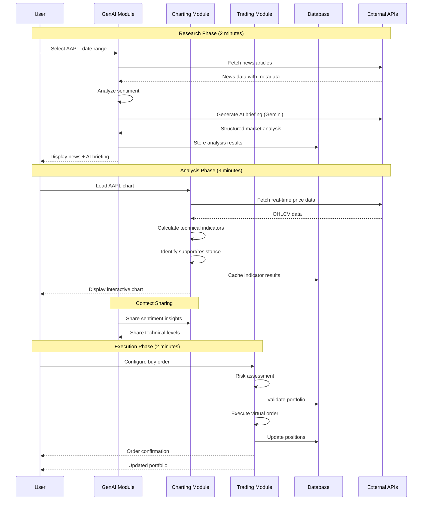

## 📅 Project Gantt Chart

### Master Project Timeline (24 Weeks)
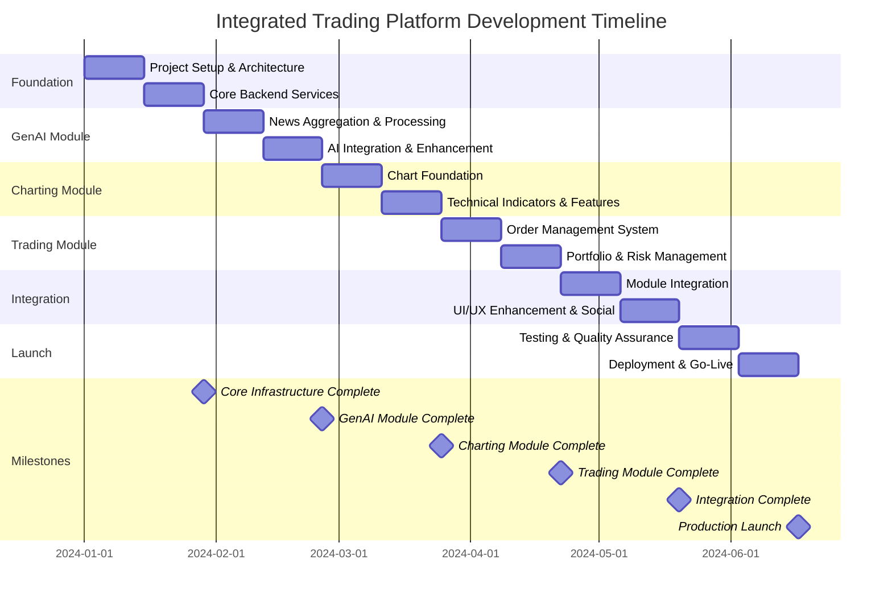

### Weekly Deliverables Breakdown
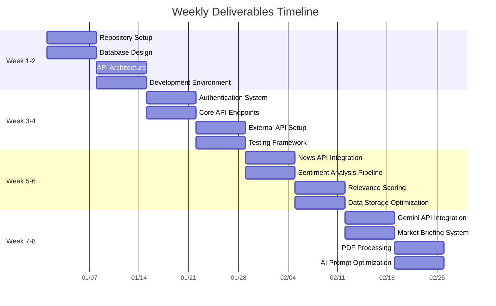

## 🏃‍♂️ Sprint Visualization

### Sprint Overview Dashboard
```mermaid
graph TB
    subgraph "Sprint 1-2: Foundation (Weeks 1-4)"
        S1[Infrastructure Setup]
        S2[Authentication System]
        S3[Core API Development]
        S1 --> S2 --> S3
    end
    
    subgraph "Sprint 3-4: GenAI Module (Weeks 5-8)"
        S4[News Processing]
        S5[Sentiment Analysis]
        S6[AI Integration]
        S4 --> S5 --> S6
    end
    
    subgraph "Sprint 5-6: Charting Module (Weeks 9-12)"
        S7[Real-time Charts]
        S8[Technical Indicators]
        S9[Trade Analysis]
        S7 --> S8 --> S9
    end
    
    subgraph "Sprint 7-8: Trading Module (Weeks 13-16)"
        S10[Order System]
        S11[Portfolio Management]
        S12[Risk Tools]
        S10 --> S11 --> S12
    end
    
    subgraph "Sprint 9-10: Integration (Weeks 17-20)"
        S13[Module Connectivity]
        S14[UX Enhancement]
        S15[Social Features]
        S13 --> S14 --> S15
    end
    
    subgraph "Sprint 11-12: Launch (Weeks 21-24)"
        S16[Testing & QA]
        S17[Performance Optimization]
        S18[Deployment]
        S16 --> S17 --> S18
    end
    
    %% Sprint Dependencies
    S3 -.-> S4
    S6 -.-> S7
    S9 -.-> S10
    S12 -.-> S13
    S15 -.-> S16
    
    %% Styling
    classDef foundation fill:#e3f2fd
    classDef genai fill:#e8f5e8
    classDef charting fill:#fff3e0
    classDef trading fill:#fce4ec
    classDef integration fill:#f3e5f5
    classDef launch fill:#ffebee
    
    class S1,S2,S3 foundation
    class S4,S5,S6 genai
    class S7,S8,S9 charting
    class S10,S11,S12 trading
    class S13,S14,S15 integration
    class S16,S17,S18 launch
```

### Sprint Velocity Chart
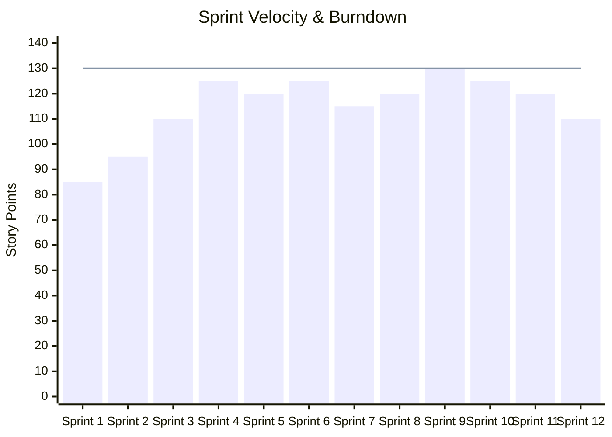

### Current Sprint Backlog (Sprint 11)
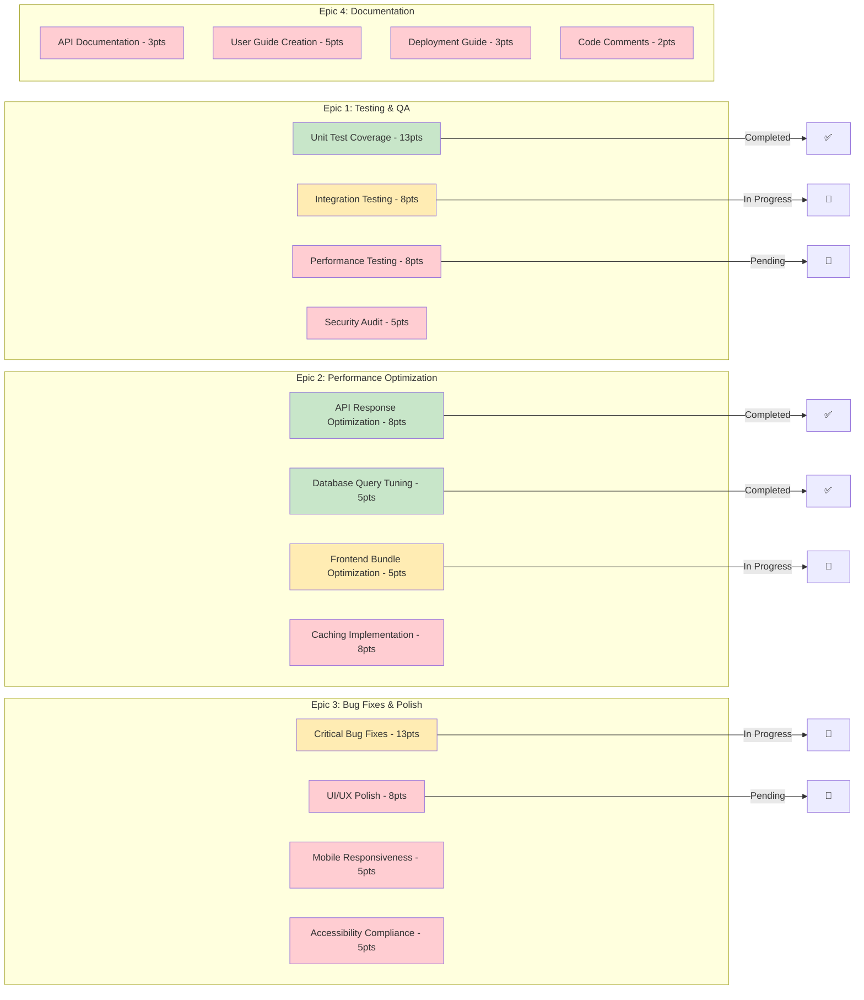

## 📊 Resource Allocation

### Team Capacity Distribution
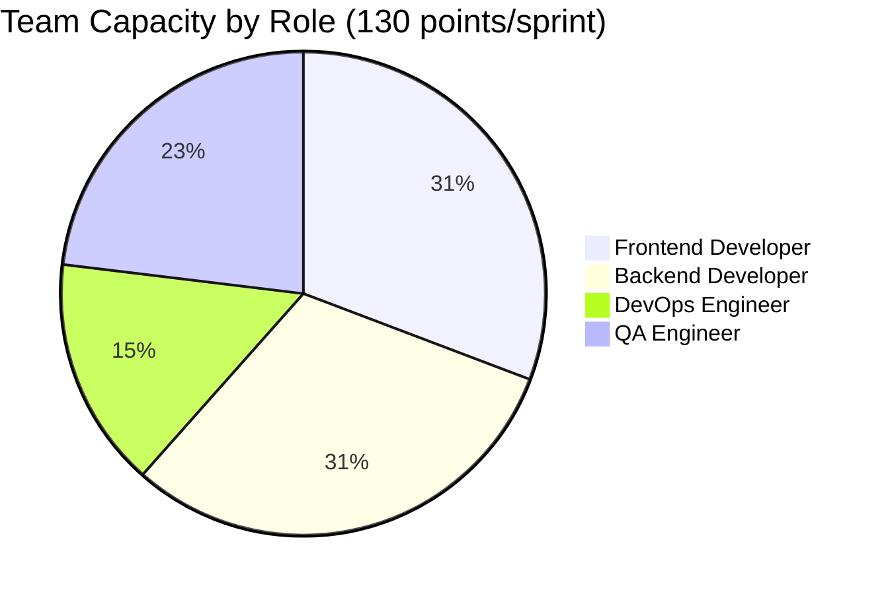

### Feature Development Timeline
```mermaid
timeline
    title Feature Development Progression
    
    section Phase 1: Foundation
        Week 1-2    : Project Setup
                    : Database Design
                    : API Architecture
        
        Week 3-4    : Authentication
                    : Core APIs
                    : Testing Framework
    
    section Phase 2: GenAI Module
        Week 5-6    : News Integration
                    : Sentiment Analysis
                    : Data Processing
        
        Week 7-8    : AI Integration
                    : Market Briefings
                    : PDF Processing
    
    section Phase 3: Charting Module
        Week 9-10   : Chart Engine
                    : Real-time Data
                    : Interactive Features
        
        Week 11-12  : Technical Indicators
                    : Trade Setups
                    : Alert System
    
    section Phase 4: Trading Module
        Week 13-14  : Order Engine
                    : Order Types
                    : Execution Logic
        
        Week 15-16  : Portfolio Tracking
                    : Risk Management
                    : Performance Analytics
    
    section Phase 5: Integration
        Week 17-18  : Cross-module Sync
                    : State Management
                    : Workflow Integration
        
        Week 19-20  : UI/UX Polish
                    : Social Features
                    : Mobile Optimization
    
    section Phase 6: Launch
        Week 21-22  : Testing & QA
                    : Performance Tuning
                    : Security Audit
        
        Week 23-24  : Deployment Setup
                    : Production Launch
                    : Monitoring Setup
```

### Risk Assessment Matrix
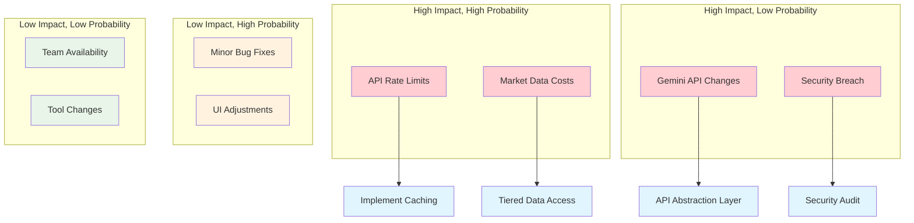

## 🎯 Success Metrics Dashboard

### Key Performance Indicators
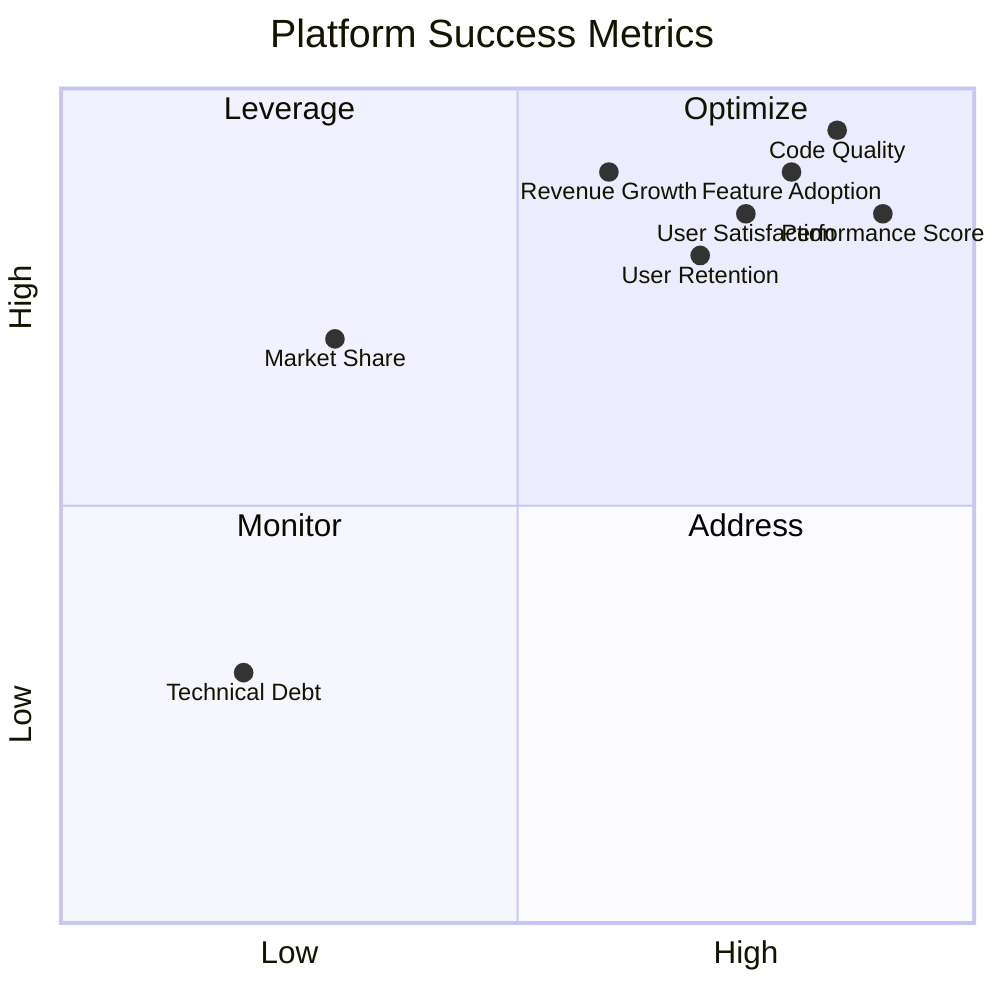

### Development Progress Tracking
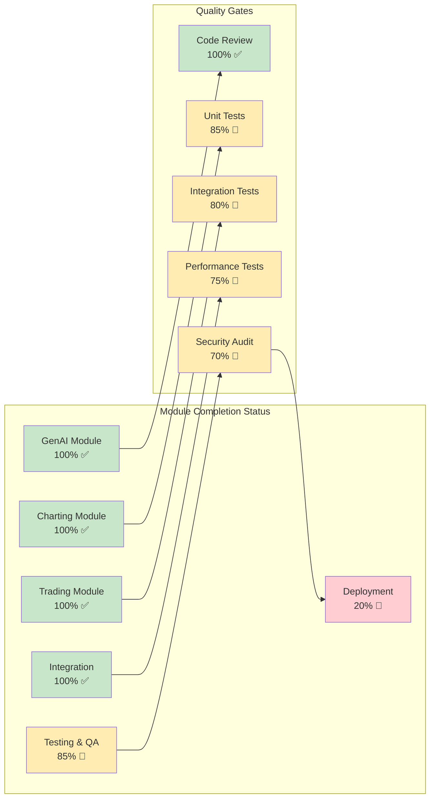