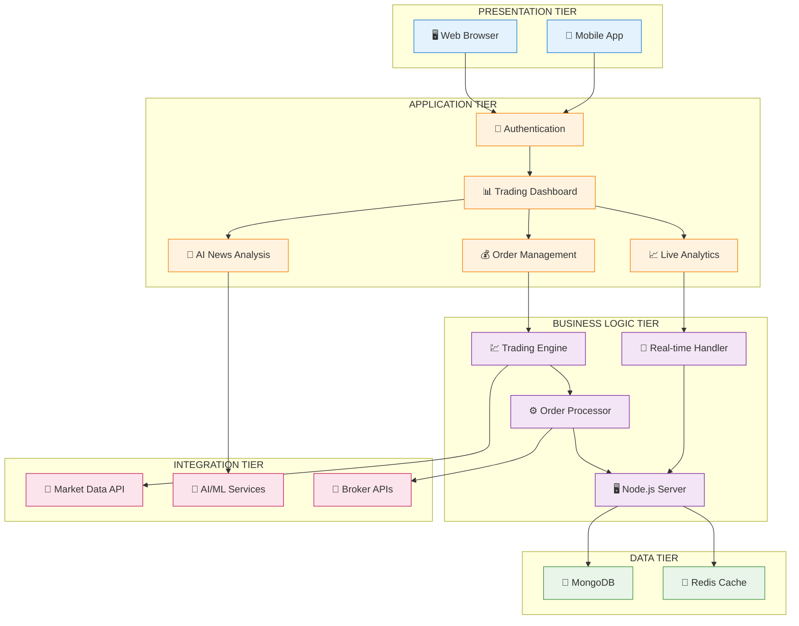
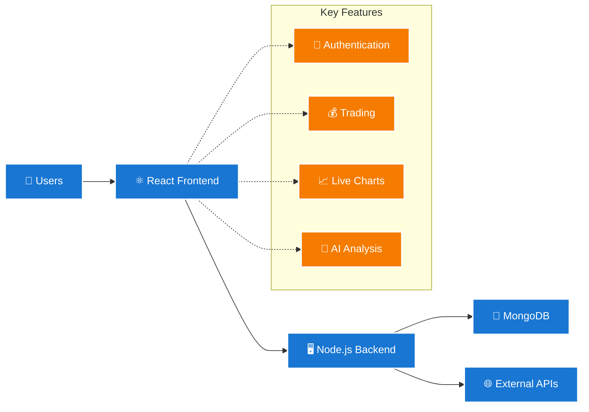

# Compact Trading Platform Architecture

## Version 1: Vertical Layout (PPT-Friendly)

```mermaid
graph TD
    %% Client Layer
    subgraph "🖥️ CLIENT"
        BROWSER[Web Browser]
        MOBILE[Mobile App]
    end

    %% Frontend Layer
    subgraph "⚛️ REACT FRONTEND"
        AUTH[🔐 Auth]
        DASH[📊 Dashboard]
        
        subgraph "Trading Features"
            TRADE[💰 Trade]
            AUTO[🔄 Auto Exit]
            LIMIT[📋 Limit Orders]
            SCHED[⏰ Scheduled]
        end
        
        subgraph "Analysis & Charts"
            CHART[📈 Live Charts]
            ORDER[📋 Orders]
            NEWS[🤖 News AI]
        end
    end

    %% Backend Layer
    subgraph "🖥️ NODE.JS BACKEND"
        SERVER[🖥️ server.js]
        
        subgraph "Core Services"
            AUTH_SVC[🔑 Auth Service]
            TRADE_API[💹 Trading API]
            ORDER_ENG[⚙️ Order Engine]
        end
        
        subgraph "Data Services"
            PRICE_SVC[💰 Price Service]
            AI_SVC[🤖 AI Service]
            WS[🔄 WebSocket]
        end
    end

    %% Database Layer
    subgraph "🍃 MONGODB"
        USERS[(👤 Users)]
        ORDERS[(📋 Orders)]
        TRADES[(💰 Trades)]
        NEWS_DB[(📰 News)]
        STOCK[(📡 Stock Data)]
    end

    %% External Services
    subgraph "🌐 EXTERNAL APIs"
        PRICE_FEED[💰 Price Feed]
        NEWS_API[📰 News API]
        AI_MODEL[🧠 GenAI]
        BROKER[🏦 Broker]
    end

    %% Main Flow
    BROWSER --> AUTH
    MOBILE --> AUTH
    AUTH --> DASH
    
    %% Dashboard connections
    DASH --> TRADE
    DASH --> AUTO
    DASH --> LIMIT
    DASH --> SCHED
    DASH --> CHART
    DASH --> ORDER
    DASH --> NEWS

    %% Backend connections
    AUTH --> AUTH_SVC
    TRADE --> TRADE_API
    AUTO --> ORDER_ENG
    LIMIT --> ORDER_ENG
    SCHED --> ORDER_ENG
    CHART --> WS
    ORDER --> TRADE_API
    NEWS --> AI_SVC

    %% Server coordination
    SERVER --> AUTH_SVC
    SERVER --> TRADE_API
    SERVER --> ORDER_ENG
    SERVER --> PRICE_SVC
    SERVER --> AI_SVC
    SERVER --> WS

    %% Database connections
    AUTH_SVC --> USERS
    TRADE_API --> TRADES
    ORDER_ENG --> ORDERS
    AI_SVC --> NEWS_DB
    PRICE_SVC --> STOCK

    %% External API connections
    PRICE_SVC --> PRICE_FEED
    AI_SVC --> NEWS_API
    AI_SVC --> AI_MODEL
    TRADE_API --> BROKER

    %% Styling
    classDef client fill:#e3f2fd,stroke:#1976d2,stroke-width:2px
    classDef frontend fill:#fff3e0,stroke:#f57c00,stroke-width:2px
    classDef backend fill:#f3e5f5,stroke:#7b1fa2,stroke-width:2px
    classDef database fill:#e8f5e8,stroke:#388e3c,stroke-width:2px
    classDef external fill:#fce4ec,stroke:#c2185b,stroke-width:2px

    class BROWSER,MOBILE client
    class AUTH,DASH,TRADE,AUTO,LIMIT,SCHED,CHART,ORDER,NEWS frontend
    class SERVER,AUTH_SVC,TRADE_API,ORDER_ENG,PRICE_SVC,AI_SVC,WS backend
    class USERS,ORDERS,TRADES,NEWS_DB,STOCK database
    class PRICE_FEED,NEWS_API,AI_MODEL,BROKER external
```



## Version 2: Layered Architecture (Simplified)



## Version 3: PowerPoint-Ready (Super Compact)

```mermaid
flowchart TD
    subgraph "Frontend"
        UI[React App<br/>🔐 Auth | 📊 Dashboard<br/>💰 Trading | 📈 Charts<br/>🤖 AI News]
    end
    
    subgraph "Backend"
        API[Node.js Server<br/>🔑 Auth Service<br/>💹 Trading API<br/>⚙️ Order Engine<br/>🔄 WebSocket]
    end
    
    subgraph "Database"
        DB[MongoDB<br/>👤 Users | 📋 Orders<br/>💰 Trades | 📰 News<br/>📡 Stock Data]
    end
    
    subgraph "External"
        EXT[APIs<br/>💰 Price Feed<br/>📰 News API<br/>🧠 GenAI<br/>🏦 Broker]
    end

    UI <--> API
    API <--> DB
    API <--> EXT
    
    classDef frontend fill:#e1f5fe,stroke:#01579b,stroke-width:3px
    classDef backend fill:#f3e5f5,stroke:#4a148c,stroke-width:3px
    classDef database fill:#e8f5e8,stroke:#1b5e20,stroke-width:3px
    classDef external fill:#fce4ec,stroke:#880e4f,stroke-width:3px
    
    class UI frontend
    class API backend
    class DB database
    class EXT external
```

## Version 4: High-Level Overview (Executive Summary)



## PowerPoint Integration Tips:

### For PPT Use:
1. **Copy Version 3** - Most compact and clear
2. **Use Version 2** - For detailed technical presentation
3. **Use Version 4** - For executive/business overview
4. **Export as SVG** - Best quality for scaling in PPT

### PPT Layout Suggestions:
- **Slide 1**: Version 4 (High-level overview)
- **Slide 2**: Version 3 (System components)
- **Slide 3**: Version 2 (Detailed architecture)
- **Slide 4**: Version 1 (Technical implementation)

### Color Coding:
- 🔵 **Blue**: Frontend/Client Layer
- 🟠 **Orange**: Application Layer  
- 🟣 **Purple**: Backend Services
- 🟢 **Green**: Database Layer
- 🔴 **Red**: External Services

These versions are much more readable and PPT-friendly while maintaining all the essential information about your trading platform architecture!