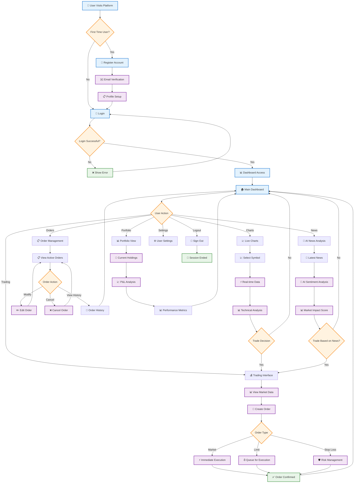
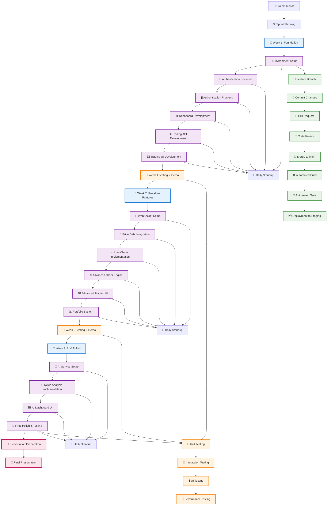
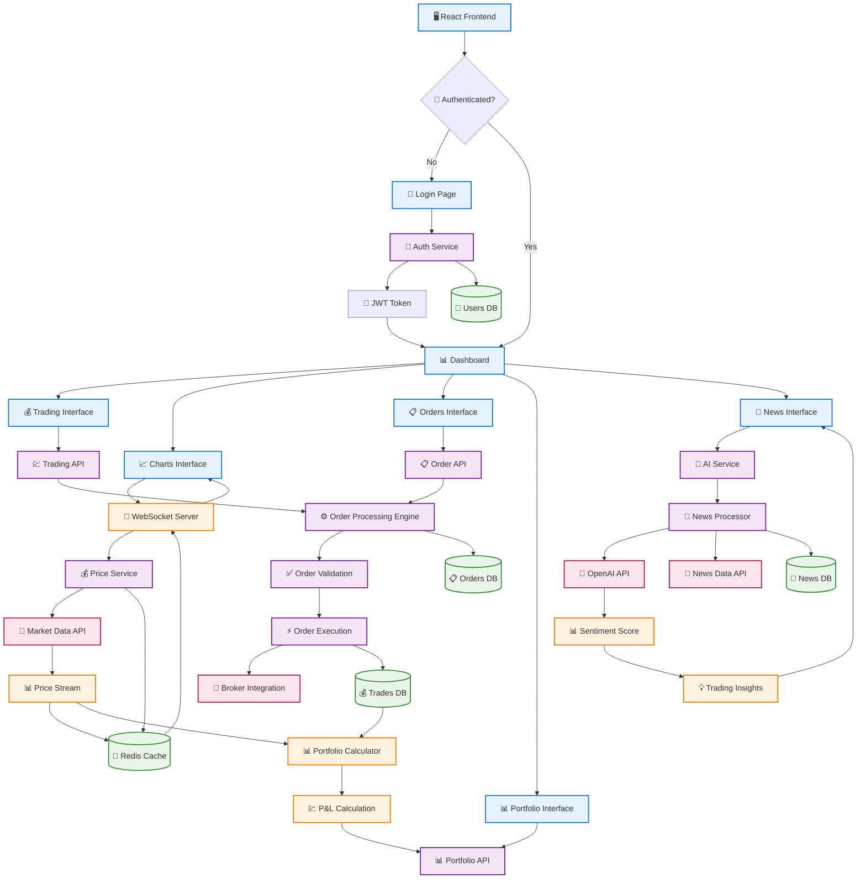
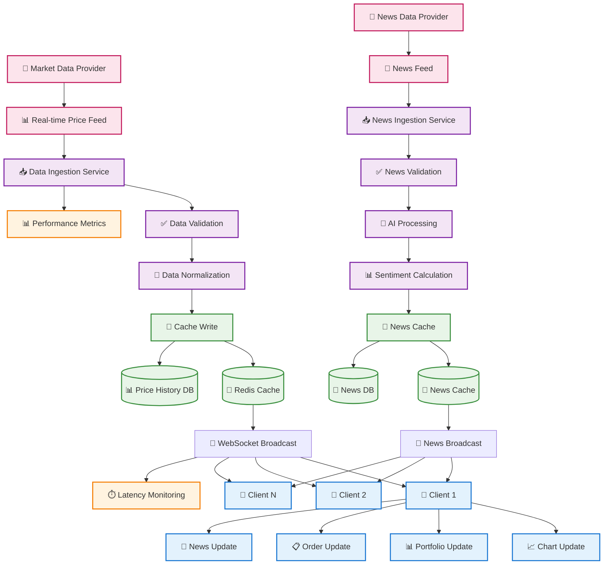
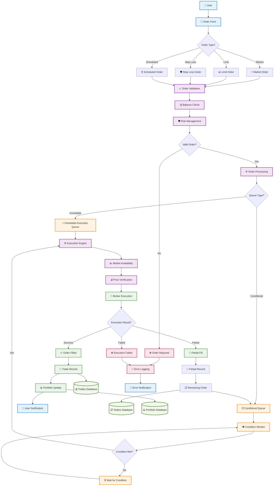
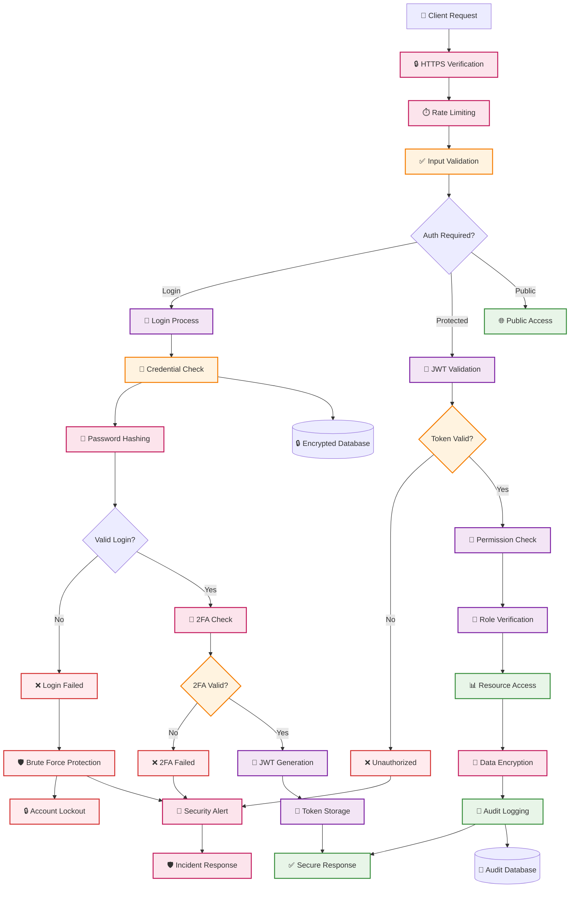

# Trading Platform Project Workflows

## 🔄 **1. User Journey Workflow**

### **Complete User Experience Flow**

## 🛠️ **2. Development Workflow**

### **3-Week Development Process**

## 🏗️ **3. System Architecture Workflow**

### **Data Flow Through System Components**

## ⚡ **4. Real-time Data Workflow**

### **Live Data Processing Pipeline**

## 🔄 **5. Order Processing Workflow**

### **Trading Order Lifecycle**

## 🔒 **6. Security & Authentication Workflow**

### **Security Pipeline**

These comprehensive workflow diagrams provide a complete view of your trading platform project from user experience to technical implementation, security, and development processes! 🚀