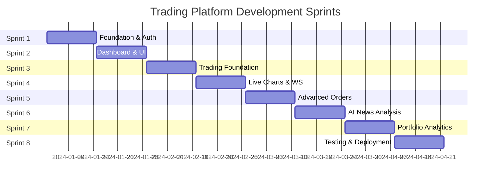
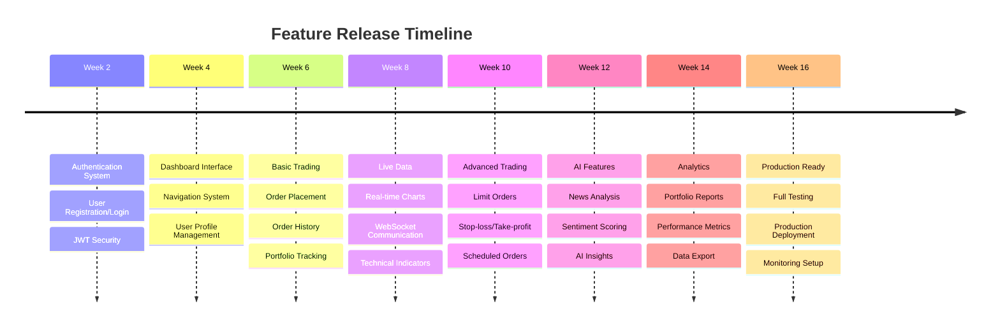
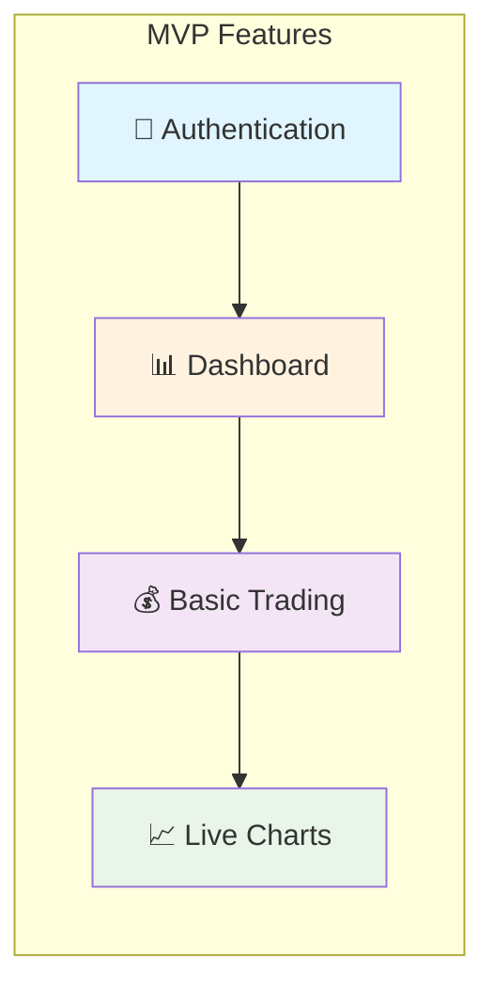
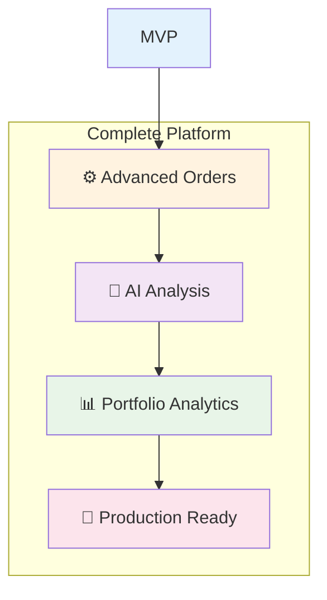
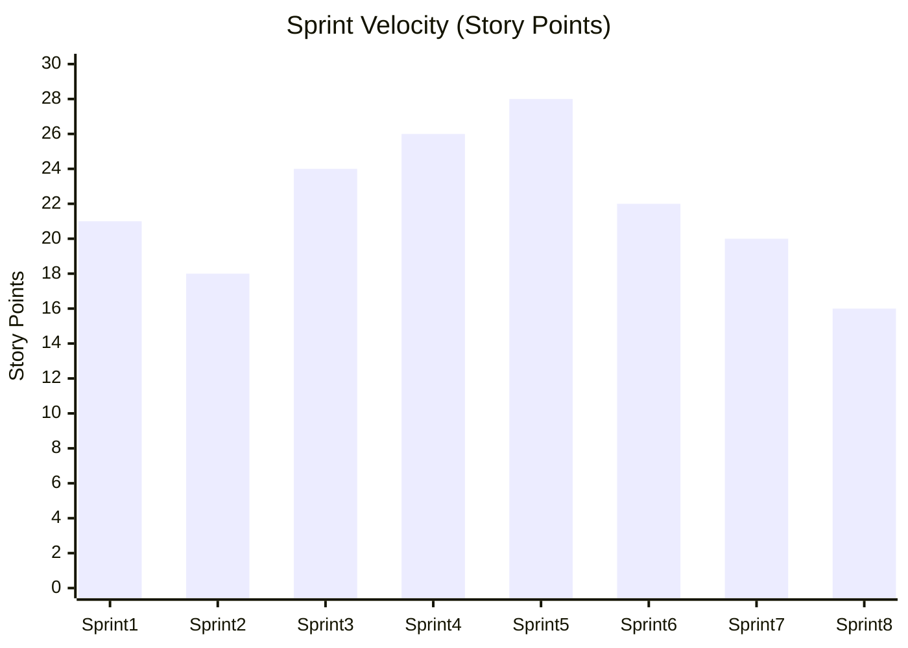
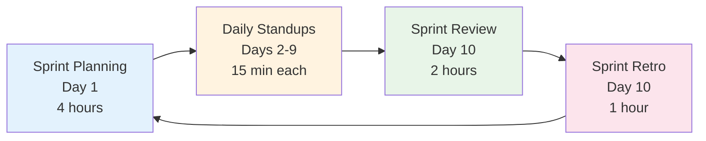

# Sprint Timeline - Trading Platform Development

## 🗓️ **16-Week Development Timeline**



## 📊 **Sprint Summary for Presentations**

### **Sprint Overview**

| Sprint | Duration | Focus Area | Key Deliverables | Story Points |
|--------|----------|------------|------------------|--------------|
| **Sprint 1** | Weeks 1-2 | 🔐 **Foundation** | Auth System, Project Setup | 21 pts |
| **Sprint 2** | Weeks 3-4 | 🖥️ **Dashboard** | UI Components, Navigation | 18 pts |
| **Sprint 3** | Weeks 5-6 | 💰 **Trading Core** | Order Management, Trading API | 24 pts |
| **Sprint 4** | Weeks 7-8 | 📈 **Real-time** | Live Charts, WebSocket | 26 pts |
| **Sprint 5** | Weeks 9-10 | ⚙️ **Advanced Orders** | Limit, Stop-loss, Scheduled | 28 pts |
| **Sprint 6** | Weeks 11-12 | 🤖 **AI Integration** | News Analysis, Sentiment | 22 pts |
| **Sprint 7** | Weeks 13-14 | 📊 **Analytics** | Portfolio, Reports, P&L | 20 pts |
| **Sprint 8** | Weeks 15-16 | 🚀 **Production** | Testing, Deploy, Monitor | 16 pts |

### **Feature Release Timeline**



## 🎯 **MVP vs Full Feature Timeline**

### **MVP Release (End of Sprint 4 - Week 8)**


### **Full Platform (End of Sprint 8 - Week 16)**


## 📈 **Development Velocity Chart**



## 🎨 **PowerPoint Ready - Sprint Cards**

### **Sprint 1 Card**
```
┌─────────────────────────────────────┐
│ 🔐 SPRINT 1: FOUNDATION & AUTH      │
├─────────────────────────────────────┤
│ Duration: 2 weeks                   │
│ Story Points: 21                    │
│                                     │
│ ✅ Deliverables:                    │
│ • User Registration & Login         │
│ • JWT Authentication               │
│ • Project Setup                    │
│ • MongoDB Integration              │
│                                     │
│ 🎯 Goal: Secure foundation         │
└─────────────────────────────────────┘
```

### **Sprint 2 Card**
```
┌─────────────────────────────────────┐
│ 🖥️ SPRINT 2: DASHBOARD & UI        │
├─────────────────────────────────────┤
│ Duration: 2 weeks                   │
│ Story Points: 18                    │
│                                     │
│ ✅ Deliverables:                    │
│ • Main Dashboard                   │
│ • Navigation System                │
│ • UI Component Library            │
│ • Responsive Design               │
│                                     │
│ 🎯 Goal: User-friendly interface   │
└─────────────────────────────────────┘
```

### **Sprint 3 Card**
```
┌─────────────────────────────────────┐
│ 💰 SPRINT 3: TRADING FOUNDATION     │
├─────────────────────────────────────┤
│ Duration: 2 weeks                   │
│ Story Points: 24                    │
│                                     │
│ ✅ Deliverables:                    │
│ • Order Placement System           │
│ • Trading API                      │
│ • Order History                    │
│ • Portfolio Tracking              │
│                                     │
│ 🎯 Goal: Core trading features     │
└─────────────────────────────────────┘
```

### **Sprint 4 Card**
```
┌─────────────────────────────────────┐
│ 📈 SPRINT 4: LIVE CHARTS & DATA     │
├─────────────────────────────────────┤
│ Duration: 2 weeks                   │
│ Story Points: 26                    │
│                                     │
│ ✅ Deliverables:                    │
│ • Real-time Price Charts           │
│ • WebSocket Integration            │
│ • Technical Indicators             │
│ • Live Data Feeds                  │
│                                     │
│ 🎯 Goal: Real-time trading         │
└─────────────────────────────────────┘
```

## 🔄 **Agile Ceremonies Schedule**

### **Daily Ceremonies**
- **Daily Standups**: 9:00 AM (15 minutes)
- **Duration**: Every workday
- **Format**: What did you do yesterday? What will you do today? Any blockers?

### **Sprint Ceremonies**


## 📋 **Risk Management & Mitigation**

### **High-Risk Areas & Solutions**

| Risk | Probability | Impact | Mitigation Strategy |
|------|-------------|--------|-------------------|
| **API Integration Delays** | Medium | High | • Have backup data sources<br/>• Start integration early |
| **Performance Issues** | Medium | Medium | • Regular load testing<br/>• Optimize queries early |
| **Security Vulnerabilities** | Low | High | • Security review each sprint<br/>• Use security best practices |
| **Scope Creep** | High | Medium | • Strict change control<br/>• Document requirements clearly |

## 🎯 **Success Metrics**

### **Sprint Success Criteria**
- ✅ **Velocity**: Maintain 20-25 story points per sprint
- ✅ **Quality**: <5 bugs per sprint
- ✅ **Coverage**: 80%+ test coverage
- ✅ **Performance**: <2 second load times

### **Overall Project Success**
- ✅ **On-time Delivery**: Complete by Week 16
- ✅ **Feature Complete**: All user stories delivered
- ✅ **Production Ready**: Deployed and monitored
- ✅ **User Satisfaction**: Positive user feedback

This comprehensive sprint plan provides clear structure for your 16-week trading platform development! 🚀