# System Architecture Diagram

## Overview
This document outlines the system architecture for the Stock Trading Platform with Blockchain Integration.

## Architecture Diagram

```mermaid
graph TB
    %% External Users
    subgraph "CLIENT LAYER"
        BROWSER[🖥️ Web Browser]
        MOBILE[📱 Mobile Device]
    end

    %% Load Balancer/Gateway
    subgraph "GATEWAY LAYER"
        LB[⚖️ Load Balancer/Reverse Proxy]
    end

    %% Frontend Services
    subgraph "FRONTEND SERVICES"
        direction TB
        REACT[⚛️ React App]
        SIDEBAR[📊 Sidebar Component]
        CHART[📈 Chart Container]
        WATCHLIST[👁️ Watchlist Panel]
        STATS[📋 Stats Panel]
        INDICATORS[🔢 Technical Indicators]
    end

    %% Backend Services
    subgraph "BACKEND SERVICES"
        direction TB
        API[🔗 REST API Server]
        WS[🔄 WebSocket Service]
        STOCK_SVC[📈 Stock Data Service]
        CHART_LIB[📊 Chart Library]
        DATA_FORMATTER[🔄 Data Formatter]
    end

    %% Blockchain Layer
    subgraph "BLOCKCHAIN LAYER"
        direction TB
        HARDHAT[⛑️ Hardhat Network]
        SIGNATURE[🔐 Signature Verifier Contract]
        LOCK[🔒 Lock Contract]
        WEB3[🌐 Web3 Provider]
    end

    %% Data Layer
    subgraph "DATA SERVICES"
        direction TB
        HIST_DATA[📚 Historical Data<br/>CSV Files]
        SIM_DATA[🎯 Simulated Data<br/>CSV Files]
        CACHE[💾 In-Memory Cache]
    end

    %% External Services
    subgraph "EXTERNAL SERVICES"
        direction TB
        MARKET_API[📡 Market Data API]
        PRICE_FEED[💰 Price Feed Service]
        NEWS_API[📰 News API]
    end

    %% Monitoring & DevOps
    subgraph "MONITORING & DEVOPS"
        direction TB
        LOGS[📝 Application Logs]
        METRICS[📊 Performance Metrics]
        ALERTS[🚨 Alert System]
    end

    %% Connections
    BROWSER --> LB
    MOBILE --> LB
    LB --> REACT

    REACT --> SIDEBAR
    REACT --> CHART
    REACT --> WATCHLIST
    REACT --> STATS
    CHART --> INDICATORS

    REACT -.->|HTTP/HTTPS| API
    REACT -.->|WebSocket| WS
    
    API --> STOCK_SVC
    WS --> STOCK_SVC
    STOCK_SVC --> HIST_DATA
    STOCK_SVC --> SIM_DATA
    STOCK_SVC --> CACHE

    CHART --> CHART_LIB
    STOCK_SVC --> DATA_FORMATTER

    %% Blockchain connections
    API -.->|Web3| WEB3
    WEB3 --> HARDHAT
    HARDHAT --> SIGNATURE
    HARDHAT --> LOCK

    %% External data
    STOCK_SVC -.->|API Calls| MARKET_API
    STOCK_SVC -.->|Real-time| PRICE_FEED
    API -.->|News Data| NEWS_API

    %% Monitoring
    API --> LOGS
    WS --> LOGS
    STOCK_SVC --> METRICS
    METRICS --> ALERTS

    %% Styling
    classDef frontend fill:#e1f5fe,stroke:#01579b,stroke-width:2px
    classDef backend fill:#f3e5f5,stroke:#4a148c,stroke-width:2px
    classDef blockchain fill:#fff3e0,stroke:#e65100,stroke-width:2px
    classDef data fill:#e8f5e8,stroke:#1b5e20,stroke-width:2px
    classDef external fill:#fce4ec,stroke:#880e4f,stroke-width:2px
    classDef monitoring fill:#f1f8e9,stroke:#33691e,stroke-width:2px

    class BROWSER,MOBILE,REACT,SIDEBAR,CHART,WATCHLIST,STATS,INDICATORS frontend
    class LB,API,WS,STOCK_SVC,CHART_LIB,DATA_FORMATTER backend
    class HARDHAT,SIGNATURE,LOCK,WEB3 blockchain
    class HIST_DATA,SIM_DATA,CACHE data
    class MARKET_API,PRICE_FEED,NEWS_API external
    class LOGS,METRICS,ALERTS monitoring
```

## Component Description

### Client Layer
- **Web Browser**: Primary interface for desktop users
- **Mobile Device**: Mobile-responsive interface

### Frontend Services
- **React App**: Main application built with React.js
- **Chart Container**: Real-time stock chart visualization
- **Sidebar**: Navigation and tool selection
- **Watchlist Panel**: Stock tracking and selection
- **Stats Panel**: Real-time stock statistics
- **Technical Indicators**: Chart analysis tools

### Backend Services
- **REST API Server**: HTTP endpoints for data retrieval
- **WebSocket Service**: Real-time data streaming
- **Stock Data Service**: Core data processing logic
- **Chart Library**: Chart rendering utilities
- **Data Formatter**: Data transformation utilities

### Blockchain Layer
- **Hardhat Network**: Local blockchain development environment
- **Signature Verifier Contract**: Smart contract for signature validation
- **Lock Contract**: Smart contract for secure operations
- **Web3 Provider**: Blockchain interaction interface

### Data Services
- **Historical Data**: CSV files containing historical stock data
- **Simulated Data**: CSV files with simulated market data
- **In-Memory Cache**: Performance optimization layer

### External Services
- **Market Data API**: Real-time market data feed
- **Price Feed Service**: Live price information
- **News API**: Financial news integration

### Monitoring & DevOps
- **Application Logs**: System logging and debugging
- **Performance Metrics**: System performance monitoring
- **Alert System**: Automated alerting for issues

## Data Flow

1. **User Interaction**: Users interact through web browser or mobile device
2. **Load Balancing**: Traffic is distributed through load balancer
3. **Frontend Processing**: React app handles UI logic and user interactions
4. **API Communication**: Frontend communicates with backend via REST API and WebSocket
5. **Data Processing**: Backend services process requests and fetch data
6. **Blockchain Integration**: Smart contracts handle signature verification and secure operations
7. **Data Storage**: Historical and simulated data stored in CSV format with caching
8. **External Integration**: Real-time market data from external APIs
9. **Monitoring**: Comprehensive logging and monitoring across all layers

## Technology Stack

- **Frontend**: React.js, JavaScript, CSS
- **Backend**: Node.js, Express.js, WebSocket
- **Blockchain**: Hardhat, Solidity, Web3.js
- **Data**: CSV files, In-memory caching
- **Testing**: Chai, Hardhat testing framework
- **Development**: npm, Git

## Security Considerations

- Signature verification through blockchain smart contracts
- Secure WebSocket connections
- Input validation and sanitization
- Smart contract security auditing
- API rate limiting and authentication