# Trading Platform System Architecture

## Overview
This document outlines the system architecture for the Advanced Trading Platform with React Frontend, Node.js Backend, MongoDB Database, and AI-powered News Analysis.

## Architecture Diagram

```mermaid
graph TB
    %% External Users
    subgraph "CLIENT LAYER"
        BROWSER[🖥️ Web Browser]
        MOBILE[📱 Mobile Device]
    end

    %% Load Balancer/Gateway
    subgraph "GATEWAY LAYER"
        LB[⚖️ Load Balancer/Reverse Proxy]
    end

    %% Frontend Services
    subgraph "REACT FRONTEND"
        direction TB
        AUTH[🔐 Authentication Page]
        DASHBOARD[📊 Dashboard]
        TRADE[💰 Trade Interface]
        AUTO_EXIT[🔄 Auto Exit Orders]
        LIMIT_ORDERS[📋 Limit Orders]
        SCHEDULED[⏰ Scheduled Orders]
        LIVE_CHART[📈 Live Price Charts]
        ORDER_MGMT[📋 Orders Management]
        NEWS_AI[🤖 News Analysis AI]
        SIGNOUT[🚪 Sign Out]
    end

    %% Backend Services
    subgraph "NODE.JS BACKEND"
        direction TB
        SERVER[🖥️ server.js]
        AUTH_SVC[🔑 Authentication Service]
        TRADING_API[💹 Trading API]
        ORDER_ENGINE[⚙️ Order Processing Engine]
        PRICE_SVC[💰 Live Price Service]
        AI_SERVICE[🤖 GenAI News Service]
        WS_SERVER[🔄 WebSocket Server]
    end

    %% Database Layer
    subgraph "DATABASE LAYER"
        direction TB
        MONGODB[🍃 MongoDB Database]
        USER_DB[(👤 Users Collection)]
        ORDERS_DB[(📋 Orders Collection)]
        TRADES_DB[(💰 Trades Collection)]
        NEWS_DB[(📰 News Collection)]
        CACHE_DB[💾 Redis Cache]
    end

    %% External Services
    subgraph "EXTERNAL SERVICES"
        direction TB
        MARKET_API[📡 Market Data API]
        PRICE_FEED[💰 Real-time Price Feed]
        NEWS_API[📰 News API]
        AI_MODEL[🧠 GenAI Model - OpenAI]
        BROKER_API[🏦 Broker Integration]
    end

    %% Monitoring & Security
    subgraph "MONITORING & SECURITY"
        direction TB
        LOGS[📝 Application Logs]
        METRICS[📊 Performance Metrics]
        ALERTS[🚨 Alert System]
        JWT[🔒 JWT Security]
    end

    %% Connections
    BROWSER --> LB
    MOBILE --> LB
    LB --> AUTH

    %% Frontend Flow
    AUTH -->|Login Success| DASHBOARD
    DASHBOARD --> TRADE
    DASHBOARD --> AUTO_EXIT
    DASHBOARD --> LIMIT_ORDERS
    DASHBOARD --> SCHEDULED
    DASHBOARD --> LIVE_CHART
    DASHBOARD --> ORDER_MGMT
    DASHBOARD --> NEWS_AI
    DASHBOARD --> SIGNOUT

    %% Frontend to Backend
    AUTH -.->|HTTP/HTTPS| AUTH_SVC
    TRADE -.->|HTTP/HTTPS| TRADING_API
    AUTO_EXIT -.->|HTTP/HTTPS| ORDER_ENGINE
    LIMIT_ORDERS -.->|HTTP/HTTPS| ORDER_ENGINE
    SCHEDULED -.->|HTTP/HTTPS| ORDER_ENGINE
    LIVE_CHART -.->|WebSocket| WS_SERVER
    ORDER_MGMT -.->|HTTP/HTTPS| TRADING_API
    NEWS_AI -.->|HTTP/HTTPS| AI_SERVICE

    %% Backend Internal
    SERVER --> AUTH_SVC
    SERVER --> TRADING_API
    SERVER --> ORDER_ENGINE
    SERVER --> PRICE_SVC
    SERVER --> AI_SERVICE
    SERVER --> WS_SERVER

    %% Database Connections
    AUTH_SVC --> USER_DB
    TRADING_API --> TRADES_DB
    ORDER_ENGINE --> ORDERS_DB
    AI_SERVICE --> NEWS_DB
    PRICE_SVC --> CACHE_DB
    
    MONGODB --> USER_DB
    MONGODB --> ORDERS_DB
    MONGODB --> TRADES_DB
    MONGODB --> NEWS_DB

    %% External API Connections
    PRICE_SVC -.->|Real-time Data| PRICE_FEED
    AI_SERVICE -.->|News Data| NEWS_API
    AI_SERVICE -.->|AI Processing| AI_MODEL
    TRADING_API -.->|Market Data| MARKET_API
    ORDER_ENGINE -.->|Order Execution| BROKER_API

    %% Security & Monitoring
    AUTH_SVC --> JWT
    SERVER --> LOGS
    TRADING_API --> METRICS
    ORDER_ENGINE --> ALERTS

    %% Styling
    classDef frontend fill:#e1f5fe,stroke:#01579b,stroke-width:2px
    classDef backend fill:#f3e5f5,stroke:#4a148c,stroke-width:2px
    classDef database fill:#e8f5e8,stroke:#1b5e20,stroke-width:2px
    classDef external fill:#fce4ec,stroke:#880e4f,stroke-width:2px
    classDef monitoring fill:#f1f8e9,stroke:#33691e,stroke-width:2px

    class BROWSER,MOBILE,AUTH,DASHBOARD,TRADE,AUTO_EXIT,LIMIT_ORDERS,SCHEDULED,LIVE_CHART,ORDER_MGMT,NEWS_AI,SIGNOUT frontend
    class LB,SERVER,AUTH_SVC,TRADING_API,ORDER_ENGINE,PRICE_SVC,AI_SERVICE,WS_SERVER backend
    class MONGODB,USER_DB,ORDERS_DB,TRADES_DB,NEWS_DB,CACHE_DB database
    class MARKET_API,PRICE_FEED,NEWS_API,AI_MODEL,BROKER_API external
    class LOGS,METRICS,ALERTS,JWT monitoring
```

## Component Description

### Client Layer
- **Web Browser**: Primary interface for desktop users
- **Mobile Device**: Mobile-responsive interface for trading on-the-go

### React Frontend
- **Authentication Page**: Secure login/signup with JWT authentication
- **Dashboard**: Main trading dashboard with portfolio overview
- **Trade Interface**: Real-time trading execution interface
- **Auto Exit Orders**: Automated stop-loss and take-profit management
- **Limit Orders**: Price-based conditional order management
- **Scheduled Orders**: Time-based automated trading
- **Live Price Charts**: Real-time candlestick charts with technical indicators
- **Orders Management**: View, modify, and cancel existing orders
- **News Analysis AI**: GenAI-powered financial news sentiment analysis
- **Sign Out**: Secure session termination

### Node.js Backend
- **server.js**: Main Express.js application server
- **Authentication Service**: JWT-based user authentication and authorization
- **Trading API**: Core trading operations and portfolio management
- **Order Processing Engine**: High-performance order matching and execution
- **Live Price Service**: Real-time market data processing
- **GenAI News Service**: AI-powered news analysis and sentiment scoring
- **WebSocket Server**: Real-time data streaming for live prices and updates

### Database Layer
- **MongoDB Database**: Primary NoSQL database for all application data
- **Users Collection**: User profiles, authentication, and preferences
- **Orders Collection**: Active and historical order data
- **Trades Collection**: Executed trade history and performance metrics
- **News Collection**: Processed news articles with AI sentiment analysis
- **Redis Cache**: High-speed caching for real-time price data and sessions

### External Services
- **Market Data API**: Real-time stock/crypto price feeds
- **Real-time Price Feed**: Live market data streaming
- **News API**: Financial news data aggregation
- **GenAI Model**: OpenAI/other AI service for news analysis
- **Broker Integration**: Third-party broker APIs for order execution

### Monitoring & Security
- **Application Logs**: Comprehensive system logging and debugging
- **Performance Metrics**: Real-time monitoring of system performance
- **Alert System**: Automated alerts for system issues and trading anomalies
- **JWT Security**: Token-based authentication and session management

## Data Flow

1. **User Authentication**: Users access through authentication page with JWT token validation
2. **Dashboard Access**: Authenticated users access the main trading dashboard
3. **Trading Operations**: Users execute trades, set orders (limit, auto-exit, scheduled) through React interface
4. **Real-time Data**: Live price charts receive real-time market data via WebSocket connections
5. **Order Processing**: Trading API processes orders through the order engine
6. **Database Operations**: All user data, orders, and trades stored in MongoDB collections
7. **AI News Analysis**: GenAI service analyzes news articles and provides sentiment scores
8. **External Integration**: Real-time market data from broker APIs and news feeds
9. **Monitoring & Alerts**: Comprehensive logging and real-time performance monitoring

## Technology Stack

- **Frontend**: React.js, JavaScript, CSS, WebSocket Client
- **Backend**: Node.js, Express.js, WebSocket Server
- **Database**: MongoDB (Primary), Redis (Caching)
- **Authentication**: JWT (JSON Web Tokens)
- **AI/ML**: GenAI Integration (OpenAI/Custom Models)
- **Real-time**: WebSocket connections for live data
- **Development**: npm, Git, MongoDB Compass

## Security Considerations

- JWT-based authentication and session management
- Secure WebSocket connections with authentication
- Input validation and sanitization on all endpoints
- Rate limiting on trading APIs to prevent abuse
- Encrypted database connections
- Secure API key management for external services
- Role-based access control for different user types