# Trading Platform Process Flowchart

```mermaid
flowchart TD
    Start([🚀 User Starts Trading Session]) --> Login{🔐 User Authenticated?}
    
    Login -->|No| Auth[📝 Authentication Process]
    Auth --> VerifySignature{🔍 Verify Digital Signature?}
    VerifySignature -->|Invalid| AuthError[❌ Authentication Failed]
    AuthError --> End([🛑 Session Terminated])
    VerifySignature -->|Valid| Dashboard
    
    Login -->|Yes| Dashboard[📊 Load Trading Dashboard]
    
    Dashboard --> LoadData[📥 Fetch Market Data]
    LoadData --> DataSource{📋 Select Data Source}
    
    DataSource -->|Historical| HistoricalData[(📊 Load Historical CSV)]
    DataSource -->|Live| LiveData[(📡 Connect to WebSocket)]
    DataSource -->|Simulated| SimulatedData[(🔄 Load Simulated CSV)]
    
    HistoricalData --> CombineData[🔄 Combine Data Sources]
    LiveData --> CombineData
    SimulatedData --> CombineData
    
    CombineData --> SelectStock{📈 User Selects Stock?}
    
    SelectStock -->|No| WaitSelection[⏳ Wait for Stock Selection]
    WaitSelection --> SelectStock
    
    SelectStock -->|Yes| ProcessStock[⚙️ Process Stock Data]
    
    ProcessStock --> TimeRange{⏰ Select Time Range?}
    TimeRange -->|1D| Filter1D[📅 Filter Last 24 Hours]
    TimeRange -->|1W| Filter1W[📅 Filter Last Week]
    TimeRange -->|1M| Filter1M[📅 Filter Last Month]
    TimeRange -->|3M| Filter3M[📅 Filter Last 3 Months]
    
    Filter1D --> ApplyIndicators
    Filter1W --> ApplyIndicators
    Filter1M --> ApplyIndicators
    Filter3M --> ApplyIndicators
    
    ApplyIndicators{📊 Apply Technical Indicators?} -->|Yes| SelectIndicators[🎯 Select Indicators]
    ApplyIndicators -->|No| RenderChart
    
    SelectIndicators --> CalculateSMA{📈 Calculate SMA?}
    CalculateSMA -->|Yes| ProcessSMA[📊 Simple Moving Average]
    CalculateSMA -->|No| CalculateEMA
    
    ProcessSMA --> CalculateEMA{📈 Calculate EMA?}
    CalculateEMA -->|Yes| ProcessEMA[📊 Exponential Moving Average]
    CalculateEMA -->|No| CalculateRSI
    
    ProcessEMA --> CalculateRSI{📈 Calculate RSI?}
    CalculateRSI -->|Yes| ProcessRSI[📊 Relative Strength Index]
    CalculateRSI -->|No| CalculateMACD
    
    ProcessRSI --> CalculateMACD{📈 Calculate MACD?}
    CalculateMACD -->|Yes| ProcessMACD[📊 MACD Calculation]
    CalculateMACD -->|No| CalculateVWAP
    
    ProcessMACD --> CalculateVWAP{📈 Calculate VWAP?}
    CalculateVWAP -->|Yes| ProcessVWAP[📊 Volume Weighted Average Price]
    CalculateVWAP -->|No| RenderChart
    
    ProcessVWAP --> RenderChart[🎨 Render Chart with Data]
    
    RenderChart --> DisplayChart[📈 Display Interactive Chart]
    
    DisplayChart --> RealTimeUpdates{🔄 Enable Real-time Updates?}
    
    RealTimeUpdates -->|Yes| WebSocketConnect[📡 Connect WebSocket]
    WebSocketConnect --> StreamData[📊 Stream Live Data]
    StreamData --> UpdateChart[🔄 Update Chart Display]
    UpdateChart --> CheckConnection{🔗 Connection Active?}
    CheckConnection -->|Yes| StreamData
    CheckConnection -->|No| WebSocketConnect
    
    RealTimeUpdates -->|No| StaticChart[📊 Display Static Chart]
    StaticChart --> UserActions
    
    UpdateChart --> UserActions{👤 User Action Required?}
    
    UserActions -->|Change Stock| SelectStock
    UserActions -->|Change Timeframe| TimeRange
    UserActions -->|Modify Indicators| ApplyIndicators
    UserActions -->|View Stats| ShowStats[📊 Display Stock Statistics]
    UserActions -->|Update Watchlist| UpdateWatchlist[📋 Modify Watchlist]
    UserActions -->|Exit| Logout
    
    ShowStats --> UserActions
    UpdateWatchlist --> UserActions
    
    Logout{🚪 Logout Requested?} -->|Yes| SaveSession[💾 Save Session Data]
    SaveSession --> End
    
    Logout -->|No| UserActions
    
    %% Styling
    classDef startEnd fill:#e8f5e8,stroke:#2e7d32,stroke-width:3px
    classDef process fill:#e3f2fd,stroke:#1976d2,stroke-width:2px
    classDef decision fill:#fff3e0,stroke:#f57c00,stroke-width:2px
    classDef data fill:#f3e5f5,stroke:#7b1fa2,stroke-width:2px
    classDef error fill:#ffebee,stroke:#d32f2f,stroke-width:2px
    
    class Start,End startEnd
    class Dashboard,LoadData,CombineData,ProcessStock,SelectIndicators,ProcessSMA,ProcessEMA,ProcessRSI,ProcessMACD,ProcessVWAP,RenderChart,DisplayChart,WebSocketConnect,StreamData,UpdateChart,StaticChart,ShowStats,UpdateWatchlist,SaveSession,Filter1D,Filter1W,Filter1M,Filter3M,WaitSelection,Auth process
    class Login,VerifySignature,DataSource,SelectStock,TimeRange,ApplyIndicators,CalculateSMA,CalculateEMA,CalculateRSI,CalculateMACD,CalculateVWAP,RealTimeUpdates,CheckConnection,UserActions,Logout decision
    class HistoricalData,LiveData,SimulatedData data
    class AuthError error
```

## Trading Platform Process Flow Description

### 🔄 **Complete Workflow Process**

#### **1. Session Initialization**
- User starts trading session
- Authentication with digital signature verification
- Dashboard loading upon successful authentication

#### **2. Data Acquisition**
- Fetch market data from multiple sources
- Choose between Historical CSV, Live WebSocket, or Simulated data
- Combine and process data sources

#### **3. Stock Selection & Analysis**
- User selects stock symbol from watchlist
- Choose time range (1D, 1W, 1M, 3M)
- Apply technical indicators (SMA, EMA, RSI, MACD, VWAP)

#### **4. Visualization & Real-time Updates**
- Render interactive charts with selected data
- Optional real-time streaming via WebSocket
- Dynamic chart updates with live market data

#### **5. User Interaction Loop**
- Continuous user actions (change stock, timeframe, indicators)
- View statistics and update watchlist
- Maintain session until logout

#### **6. Session Management**
- Save session data upon logout
- Proper session termination

### 📋 **Flowchart Symbols Used**
- **Ovals**: Start/End points
- **Rectangles**: Process steps
- **Diamonds**: Decision points
- **Cylinders**: Data storage/sources
- **Arrows**: Process flow direction

### 🎯 **Key Decision Points**
1. **Authentication**: Verify user credentials and digital signatures
2. **Data Source Selection**: Choose appropriate data feed
3. **Stock Selection**: Wait for user stock choice
4. **Technical Analysis**: Apply selected indicators
5. **Real-time Updates**: Enable live data streaming
6. **User Actions**: Handle various user interactions

This flowchart provides a comprehensive view of the trading platform's business process from initial user authentication through active trading session management.