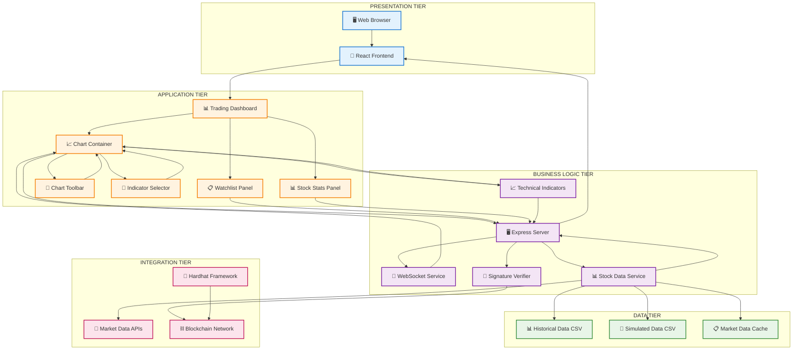

# Trading Platform Workflow - System Architecture

## Trading Platform Workflow Description

### 🖥️ **PRESENTATION TIER**
- **Web Browser**: User interface access point
- **React Frontend**: Main application interface with interactive components

### 📊 **APPLICATION TIER** 
- **Trading Dashboard**: Central hub for all trading activities
- **Chart Container**: Main charting interface for stock visualization
- **Watchlist Panel**: Stock selection and monitoring interface
- **Stock Stats Panel**: Real-time statistics and metrics display
- **Chart Toolbar**: Time range and chart configuration controls
- **Indicator Selector**: Technical analysis indicator selection

### ⚙️ **BUSINESS LOGIC TIER**
- **Express Server**: Main application server handling requests
- **WebSocket Service**: Real-time data streaming service
- **Stock Data Service**: Data aggregation and processing engine
- **Technical Indicators**: SMA, EMA, RSI, MACD, VWAP calculators
- **Signature Verifier**: Blockchain-based authentication system

### 💾 **DATA TIER**
- **Historical Data CSV**: Historical market data storage
- **Simulated Data CSV**: Generated trading simulation data
- **Market Data Cache**: In-memory data caching layer

### 🔗 **INTEGRATION TIER**
- **Market Data APIs**: External market data feed integration
- **Blockchain Network**: Smart contract deployment and interaction
- **Hardhat Framework**: Blockchain development and testing environment

## Key Workflow Patterns

1. **User Interaction Flow**: Browser → React Frontend → Trading Dashboard → Chart Components
2. **Data Request Flow**: Components → Express Server → Stock Data Service → Data Sources
3. **Real-time Updates**: WebSocket Service ↔ Chart Container (bidirectional streaming)
4. **Technical Analysis**: Chart Container ↔ Technical Indicators (dynamic calculations)
5. **Blockchain Integration**: Express Server → Signature Verifier → Blockchain Network