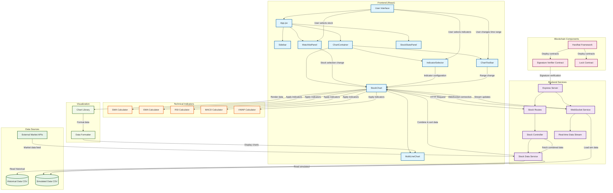

# Trading Platform Workflow Diagram

## System Architecture Overview

### User Workflow
1. **Stock Selection**: User selects a stock symbol from the watchlist
2. **Time Range**: User chooses time range (1D, 1W, 1M, 3M)
3. **Indicator Selection**: User selects technical indicators (SMA, EMA, RSI, MACD, VWAP)
4. **Real-time Updates**: System streams live data via WebSocket
5. **Chart Visualization**: Interactive charts display stock data with indicators

### Data Flow
1. **Historical Data**: Loads from CSV files in `/data/historical/`
2. **Simulated Data**: Loads from CSV files in `/data/simulated/`
3. **Combined Processing**: Merges and sorts data by timestamp
4. **Technical Analysis**: Applies selected indicators to price data
5. **Real-time Streaming**: WebSocket sends periodic updates
6. **Chart Rendering**: Visualizes data using chart library

### Key Components
- **Frontend**: React-based dashboard with modular components
- **Backend**: Express server with RESTful APIs and WebSocket support
- **Data Layer**: CSV-based historical and simulated market data
- **Technical Analysis**: Built-in indicator calculations
- **Blockchain**: Smart contracts for signature verification
- **Visualization**: Interactive charting with multiple timeframes

### Security Features
- Modular signature verification algorithm
- Smart contract integration for authentication
- Hardhat framework for blockchain development and testing