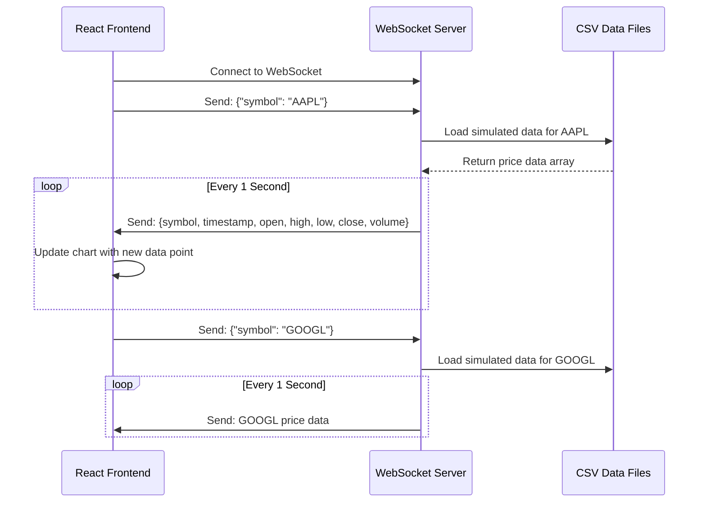

# WebSocket Technology in Trading Platform

## 🔌 **What is WebSocket Technology?**

### **Traditional HTTP vs WebSocket:**

| **HTTP (Traditional)** | **WebSocket** |
|------------------------|---------------|
| Request-Response only | **Bidirectional** communication |
| Client must ask for data | **Server can push** data anytime |
| New connection for each request | **Persistent connection** |
| Higher latency | **Lower latency** |
| Good for static content | **Perfect for real-time data** |

### **Why WebSocket for Trading?**
- **Real-time Updates**: Stock prices change every second
- **Low Latency**: Instant data delivery without polling
- **Efficient**: Single persistent connection vs multiple HTTP requests
- **Bidirectional**: Client can request specific stocks, server streams updates

---

## 🛠️ **Implementation in Our Trading Platform**

### **Server-Side Implementation (`websocketService.js`)**

```javascript
const WebSocket = require("ws");

module.exports = function (server) {
  // Create WebSocket server attached to HTTP server
  const wss = new WebSocket.Server({ server });

  // Handle new client connections
  wss.on("connection", async function (ws) {
    
    // Listen for messages from client
    ws.on("message", async (message) => {
      const { symbol } = JSON.parse(message);
      const simRows = await loadSimData(symbol);
      let idx = 0;

      // Stream data every 1 second
      const sendRow = () => {
        if (idx < simRows.length && ws.readyState === ws.OPEN) {
          ws.send(JSON.stringify({ symbol, ...simRows[idx] }));
          idx++;
          setTimeout(sendRow, 1000); // 1-second intervals
        }
      };
      sendRow();
    });
  });
};
```

### **How It Works:**

#### **1. Connection Establishment**
```javascript
// Server creates WebSocket server
const wss = new WebSocket.Server({ server });

// Client connects (would be in frontend)
const ws = new WebSocket('ws://localhost:3000');
```

#### **2. Client Requests Stock Data**
```javascript
// Client sends stock symbol
ws.send(JSON.stringify({ symbol: "AAPL" }));
```

#### **3. Server Streams Real-time Data**
```javascript
// Server responds with continuous data stream
const sendRow = () => {
  if (idx < simRows.length && ws.readyState === ws.OPEN) {
    ws.send(JSON.stringify({ 
      symbol: "AAPL",
      timestamp: "2024-01-01T10:00:00Z",
      open: 150.25,
      high: 152.80,
      low: 149.90,
      close: 151.45,
      volume: 1000000
    }));
    setTimeout(sendRow, 1000); // Next update in 1 second
  }
};
```

---

## 📊 **Data Flow Architecture**



---

## 🔧 **Technical Implementation Details**

### **1. Data Source Management**
```javascript
const loadedSims = {}; // Cache for loaded data

function loadSimData(symbol) {
  // Check cache first
  if (loadedSims[symbol]) return resolve(loadedSims[symbol]);
  
  // Load from CSV file
  const simFile = getSimFile(symbol);
  fs.createReadStream(simFile)
    .pipe(csv())
    .on("data", (data) => arr.push(data))
    .on("end", () => {
      loadedSims[symbol] = arr; // Cache the data
      resolve(arr);
    });
}
```

### **2. Connection State Management**
```javascript
// Check if connection is still open before sending
if (idx < simRows.length && ws.readyState === ws.OPEN) {
  ws.send(JSON.stringify({ symbol, ...simRows[idx] }));
}
```

### **3. Real-time Streaming Loop**
```javascript
const sendRow = () => {
  // Send current data point
  ws.send(JSON.stringify({ symbol, ...simRows[idx] }));
  idx++; // Move to next data point
  setTimeout(sendRow, 1000); // Schedule next update
};
```

---

## 🚀 **Benefits of This Implementation**

### **1. Performance Advantages**
- **1-second updates**: Much faster than traditional polling
- **Cached data**: Files loaded once, served multiple times
- **Persistent connection**: No connection overhead per update

### **2. Scalability Features**
- **Multiple clients**: Each client gets independent data stream
- **Symbol-specific**: Each client can request different stocks
- **Memory efficient**: Data cached and reused

### **3. User Experience**
- **Real-time**: Charts update immediately with new data
- **Smooth animations**: Continuous data flow enables smooth transitions
- **Interactive**: Users can switch stocks and get instant streams

---

## 💡 **Key Points for Presentation**

1. **"WebSocket enables bidirectional, real-time communication between client and server"**

2. **"Unlike HTTP polling, WebSocket pushes data instantly when available"**

3. **"Our implementation streams stock data every 1 second with persistent connections"**

4. **"Data is cached on server for efficiency and serves multiple concurrent users"**

5. **"This technology enables professional-grade real-time trading charts"**

---

## 🔄 **Future Enhancements**

- **Authentication**: Add user-specific access control
- **Rate Limiting**: Control update frequency per user
- **Error Handling**: Automatic reconnection on connection loss
- **Compression**: Optimize data transmission for high-frequency updates